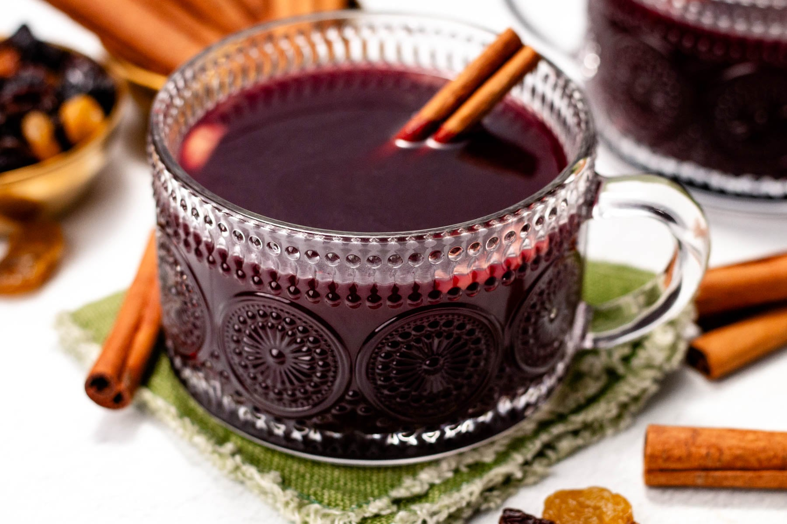

# Gløgg (Danish Mulled Wine)

*Denmark's Christmas mulled wine: red wine simmered with akvavit or dark rum, cinnamon, cloves, cardamom and orange peel, served piping hot with rum-soaked raisins and whole almonds at the bottom of the mug.*

**Serves:** 8

**Prep Time:** 15 minutes (plus optional 24-hour pre-infusion)

**Cook Time:** 20 minutes

## Overview
Gløgg is Denmark's Christmas mulled wine and a fixture of every Danish Advent gathering, julefrokost, Christmas market, and family pre-dinner drink from late November through Twelfth Night. The Danish version differs from the Swedish glögg (see [Swedish glögg](../../sweden/glogg.md)) in three ways: it's more cinnamon-forward (less cardamom), sharper and more wine-driven (lower sugar than Swedish), and frequently uses dark rum or brandy instead of akvavit for the spirit boost (giving warmer, less herbal notes). Otherwise the principle is the same: red wine warmed gently with sugar, a spirit boost, a bag of warming spices (cinnamon stick, cloves, cardamom, allspice, fresh ginger, orange peel), and served in small heat-safe mugs with plump rum-soaked raisins and whole blanched almonds in the bottom. Drunk with æbleskiver (Danish round pancake balls, dusted with icing sugar and served with jam): the traditional Danish Christmas gløgg-and-æbleskiver pairing.

## Ingredients

### Gløgg base
- 1.5 litres dry red wine (a robust dry red, Cabernet Sauvignon, Merlot, or any decent table red; saving the good wine for drinking neat)
- 300 ml dark rum OR brandy OR Aalborg akvavit (the Danish choice, dark rum is the most traditional Danish home version)
- 150 ml port (optional; for sweetness depth)
- 100 g caster sugar (less than Swedish, the Danish balance is drier)

### Spice mix
- 2 cinnamon sticks
- 8 whole cardamom pods (lightly crushed)
- 8 whole cloves
- 6 allspice berries
- 1 thumb (3 cm) fresh ginger (sliced thin)
- Peel of 1 large orange (no white pith)
- Peel of ½ lemon
- 1 star anise (optional)

### To serve (per glass)
- 1 tablespoon dark raisins (plumped in rum overnight if you're keen)
- 1 tablespoon blanched whole almonds (skinned)
- 1 small piece of orange peel (for the glass rim)

### Equipment
- A cheesecloth or muslin bag for the spices (or just add loose and strain at the end)
- Small heat-safe mugs or proper gløgg glasses (small, about 120 ml; you're sipping, not chugging)
- Small teaspoons for the raisins-and-almonds at the bottom of the cup

### To serve alongside
- Æbleskiver (Danish round pancake balls) dusted with icing sugar and served with raspberry or strawberry jam, the traditional pairing
- Pebernødder (small Danish Christmas spice biscuits)
- Klejner (Danish fried twist biscuits)
- Or just a plate of fika-style Christmas biscuits

## Method

### Stage 1 - Optional: pre-infuse the spices (24 hours ahead, for depth)
1. Place all spice ingredients in a small saucepan with 200ml of the wine and 100ml of the rum.
2. Bring to a bare simmer; cook 10 minutes.
3. Off heat; cover; let infuse overnight in the fridge.

### Stage 2 - Combine and warm
1. In a large saucepan, combine the wine (including any infusion liquid), rum, port (if using), sugar, and all spices.
2. Heat slowly over LOW heat (do not boil; boiling burns off the alcohol).
3. Stir occasionally to dissolve the sugar.
4. Bring just to a steam (about 70-75°C, the traditional gløgg temperature).
5. Hold at this temperature for 10-15 minutes for the spices to release into the wine.

### Stage 3 - Plump the raisins (optional)
1. While the gløgg infuses, place the raisins in a small bowl.
2. Pour over 4 tablespoons of dark rum; let plump 10 minutes.

### Stage 4 - Strain
1. Strain the gløgg through a fine sieve to remove the spices and peels.
2. Return to the pan; keep warm on the lowest heat.

### Stage 5 - Pour and serve
1. Place 1 tablespoon of plump raisins and 1 tablespoon of blanched almonds in the bottom of each small heat-safe mug or gløgg glass.
2. Add a small piece of orange peel for fragrance.
3. Ladle the warm gløgg over.
4. Each guest receives a small teaspoon for the raisins-and-almonds at the bottom.

### Stage 6 - The serving ritual
1. Serve with æbleskiver (Danish round pancake balls) on the side, the traditional pairing.
2. Hold the mug with both hands; sip slowly.
3. When you reach the bottom of the cup, spoon up the rum-soaked raisins and almonds.
4. A round of gløgg should last 20-30 minutes.

## Notes
- **Don't boil:** boiling burns off the alcohol and the spices turn bitter. Low heat, just steam.
- **Cinnamon-forward:** the Danish gløgg signature. More cinnamon than the Swedish glögg.
- **Dark rum is the Danish spirit choice:** more traditional than akvavit for gløgg. Brandy works too.
- **Raisins-and-almonds in the cup:** the Scandinavian ritual; eat with a teaspoon after drinking.
- **Drier than Swedish glögg:** the Danish balance has less sugar.

## Variations
**Vit gløgg (white gløgg):** swap red wine for a dry white wine (Riesling, Gewürztraminer); add a touch of elderflower cordial. A lighter modern variant.
**Bærgløgg (berry gløgg):** swap half the wine for cherry or elderberry juice; gives a less alcoholic Christmas-market version.
**Børnegløgg (children's gløgg):** non-alcoholic, swap the wine for red grape or cherry juice; same spices, same raisins-and-almonds.
**Aalborg-spiked:** use Aalborg Jubilæum (oak-aged akvavit) instead of rum for a herbal-akvavit Danish version.
**Aged gløgg:** make a double batch; bottle half and age 2 weeks before drinking. The spices marry beautifully.

## Serving
At every Danish Advent event from late November to Twelfth Night · at a Christmas market in Copenhagen, Aarhus, or any provincial Danish town · at a workplace Christmas party · at a candlelit dinner during Advent · at a small Christmas Eve gathering · at home with æbleskiver on a December afternoon.

## Storage
- Made gløgg refrigerates 2 weeks; reheat gently each time.
- Spice bag can be reused once for a milder second batch.
- The raisins-and-almonds combination keeps in a sealed jar at room temp 2 weeks.
- Gløgg only improves over the first few days as the spices marry.
