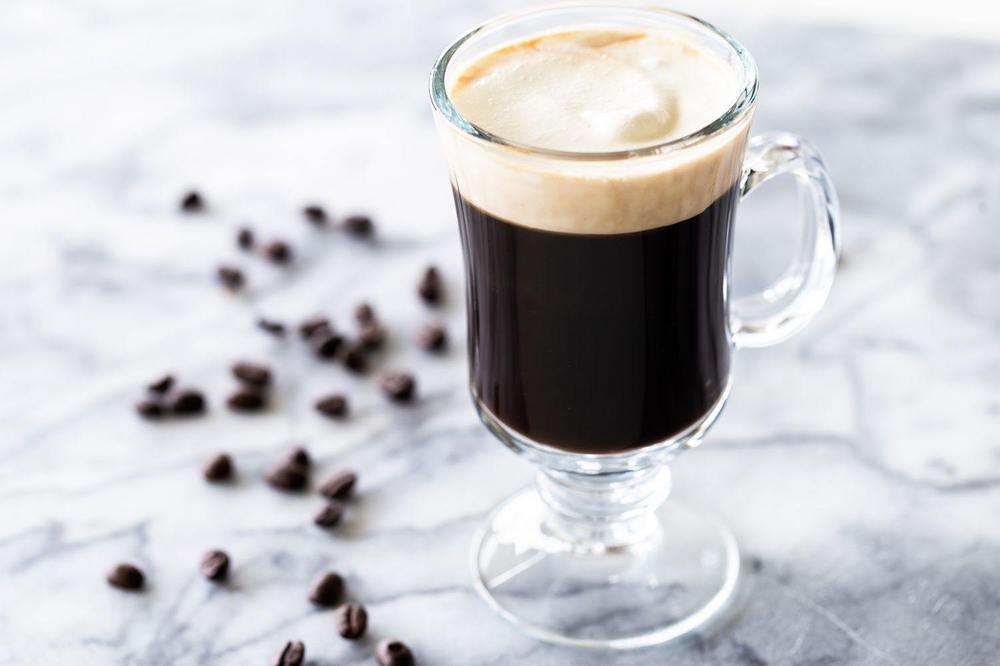

# Kaffepunch (Danish Coffee with Akvavit)

*Denmark's farmhouse coffee-and-aquavit ritual: strong black coffee with a generous splash of cold Aalborg akvavit, sometimes a sugar cube dissolved in. The traditional Danish farmer's afternoon warmer; the rural-Jutland version of an Irish coffee, more akvavit-forward, no cream. Drunk in a small cup with a snaps glass alongside.*

**Serves:** 4

**Prep Time:** 5 minutes

**Cook Time:** None (assumes hot coffee)

## Overview
Kaffepunch (also called "kaffe med skipper", coffee with a skipper) is one of Denmark's most rural drinking rituals, a farmhouse tradition still alive in Jutland villages and at country kros, though increasingly nostalgic in Copenhagen and the bigger Danish cities. The construction is simple. Strong black coffee pours into a heat-safe cup; a generous splash of cold akvavit goes in. Rural folklore says the coffee is properly built when "you can drop a coin into the cup and not see it"; meaning the coffee is just dark enough to camouflage a coin. A small sugar cube drops in to dissolve and balance. Drunk slowly in the afternoon, particularly in autumn and winter when the days are short and cold, sometimes alongside a separate small snaps glass of akvavit. Related to but distinct from the Norwegian karsk, which uses moonshine and is the truck-driver's coffee. Kaffepunch is the slightly more genteel Danish farmer's version.

## Ingredients

### Per serving
- 200 ml strong hot black coffee (freshly brewed; filter or French press; not weak American filter)
- 30-40 ml Aalborg Taffel Akvavit (the canonical Danish; see [Aalborg Akvavit recipe](aalborg-akvavit.md))
- 1 small sugar cube (or 1 teaspoon brown sugar)
- 1 small piece of orange peel (optional; for fragrance)
- A pinch of ground cinnamon or grated nutmeg (optional, less canonical)

### Equipment
- A small heat-safe coffee cup or mug (about 250ml)
- A small spoon

### To serve alongside (optional)
- A small separate snaps glass of cold akvavit (the "double" - for those who want extra warming)
- A small piece of Danish pebernødder (Christmas spice biscuit) or a piece of dark chocolate
- A small biscuit (pebernødder, brunkager, vaniljekranse) at Christmas

## Method

### Stage 1 - Brew strong coffee
1. Brew a strong French-press or filter coffee - about 7g coffee per 100ml water (slightly stronger than usual).
2. Don't use espresso (too small; the kaffepunch needs volume) or weak American filter (too thin).

### Stage 2 - Add the sugar
1. Drop a sugar cube into the hot coffee.
2. Stir to dissolve.
3. Some Danish farmers drop the sugar cube in with the akvavit and let it dissolve as they sip - adds a slight sweetness gradient.

### Stage 3 - Add the akvavit
1. Pour the cold akvavit into the hot coffee.
2. The temperature contrast is part of the ritual - the cold akvavit hitting the hot coffee gives a brief release of caraway aroma.
3. The "coin test": traditionally, the cup is filled to a level where, if you dropped a coin in, you could just barely see it (or not). This means the akvavit-to-coffee ratio is generous.
4. Add a piece of orange peel (if using).
5. Optional: a pinch of cinnamon on top.

### Stage 4 - The serving ritual
1. Place the cup on a small plate or napkin.
2. Optional: a separate small snaps glass alongside, with a thin pour of extra cold akvavit (the "kaffe med skipper" - coffee with a skipper-of-akvavit-alongside).
3. A small biscuit on the plate.

### Stage 5 - Drink slowly
1. Sip slowly; don't down.
2. The akvavit's caraway combines with the coffee's bitterness; the sugar's sweetness ties the two together.
3. A kaffepunch lasts 10-15 minutes; it's a warming ritual, not a shot.

## Notes
- **STRONG coffee:** weak coffee is overpowered by the akvavit. Brew strong.
- **Generous akvavit (the "coin" measure):** the canonical Danish farmhouse ratio. About 1 part akvavit to 5-6 parts coffee.
- **Cold akvavit + hot coffee:** the contrast is part of the experience.
- **Drink slowly:** not a shot. A warming ritual for cold afternoons.
- **Optional sugar:** some Danes drink it black + akvavit only, no sugar.

## Variations
**Kaffe med ister (coffee with ice cream):** swap the akvavit for a scoop of vanilla ice cream - a modern dessert-coffee variant.
**Karsk (Norwegian style):** swap the akvavit for moonshine (homebrew); the Norwegian truck-driver's stronger version.
**With Bailey's or cream liqueur:** less canonical, more modern (Irish coffee influence).
**With dark rum or brandy:** swap the akvavit for dark rum (Danish-rum-tradition version) or brandy.
**Iced kaffepunch (summer version):** chill the coffee, add akvavit and ice - a non-traditional summer cocktail variant.
**Skipperkaffe (large mug version):** a bigger pour; the "skipper" (sailor / farm-hand) version with extra akvavit.

## Serving
At a Danish countryside kro (inn) in the late afternoon · at a farmhouse table in Jutland after a hard day's work · after a Sunday roast as the dessert-time warmer · at a Danish Christmas afternoon · at home in winter with the curtains drawn and a book.

## Storage
- Best fresh.
- The akvavit and coffee should both be served at proper temperatures (cold and hot).
- Pre-mixed kaffepunch in a thermos is acceptable for a long walk or a winter outdoor activity, but loses the temperature-contrast magic.
