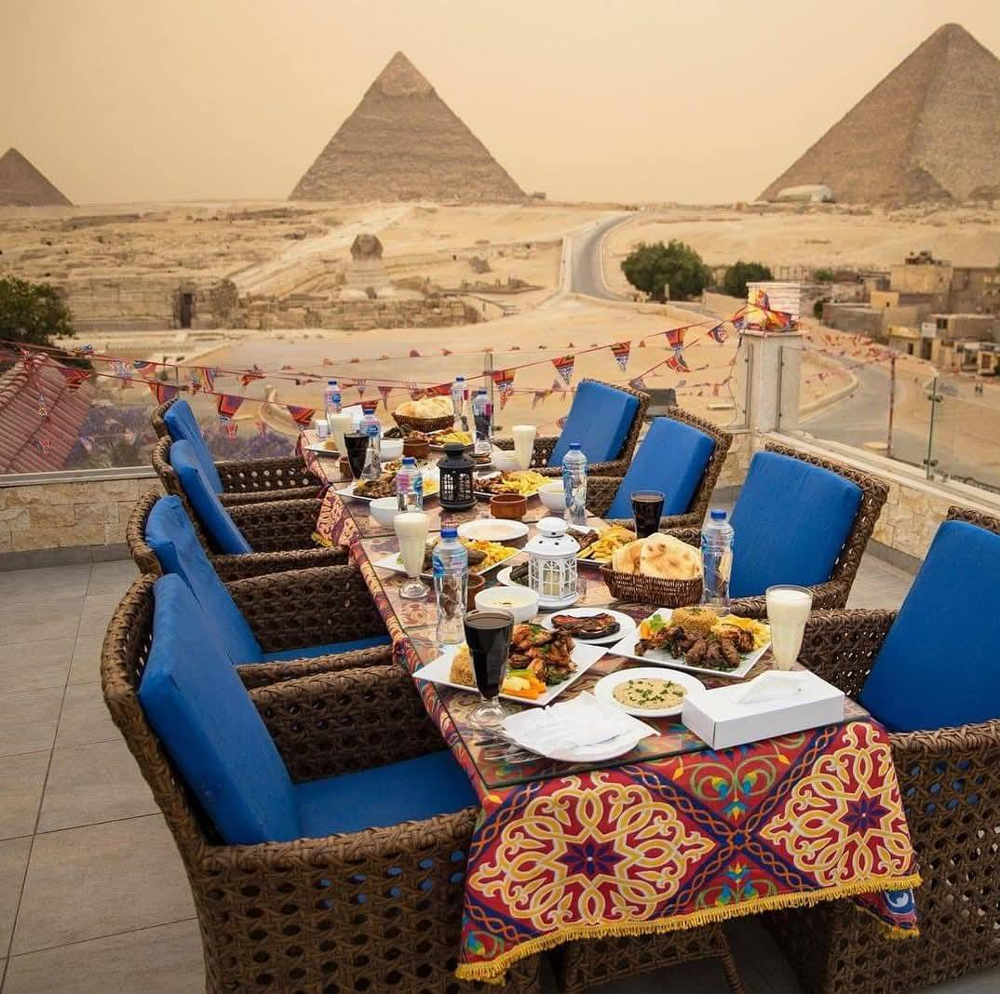

# Drinks of Egypt

Karkadeh, the deep-burgundy hibiscus tea drunk iced in summer and hot in winter; ahwa baladi (Egyptian-style coffee with cardamom); sahleb on a cold night (the thick orchid-root milk drink with cinnamon and crushed pistachios); qasab (sugarcane juice) from the streetside crushers.
