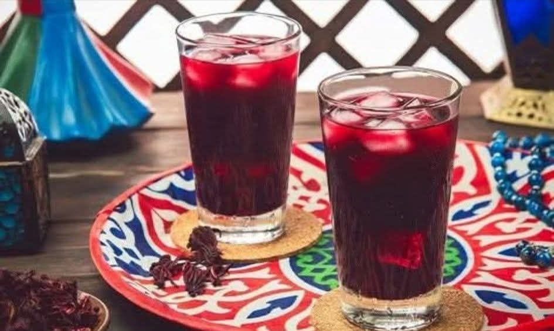

# Karkadeh

*Dried hibiscus flowers steeped to a deep crimson tea, sweetened heavily, served ice-cold in tall glasses at every Egyptian iftar and Nubian gathering.*

**Serves:** 6

**Prep Time:** 5 minutes

**Cook Time:** 15 minutes (plus 4 hours chilling)

## Overview
Karkadeh is Egypt's national soft drink and the unofficial colour of Egyptian summer: dried hibiscus calyces (sold by weight at every Cairo souk) steeped in hot water, sweetened heavily with sugar, sometimes a touch of lemon, then chilled and poured over ice into tall glasses. The flavour is sharp and tart, faintly cranberry-like, deep ruby-red. Drunk year-round but especially at iftar during Ramadan as the first sip to break the fast, and at weddings as a non-alcoholic celebration pour. The hot version (drunk in winter) tastes thinner and more medicinal; the cold version is what you want in the summer streets of Aswan or the Cairo souk.

## Ingredients

- 50 g dried hibiscus calyces (deep red, whole; from any Middle Eastern or African grocer)
- 1.5 litres water
- 150 g caster sugar (or to taste; karkadeh is properly sweet)
- 1 tablespoon fresh lemon juice (optional, brightens the flavour)
- A few mint sprigs (optional, for the iftar variant)

### To serve
- Plenty of ice cubes
- Lemon slices
- Mint sprigs

## Method

1. Bring the water to a boil in a saucepan; add the dried hibiscus.
1. Simmer for 10 minutes; the water turns a deep crimson.
1. Off the heat, stir in the sugar until completely dissolved.
1. Strain through a fine sieve into a jug; discard the flowers (or save them for a second weaker brew).
1. Stir in the lemon juice if using.
1. Cool to room temperature, then refrigerate at least 4 hours.
1. Pour over ice in tall glasses; garnish with a lemon slice and a sprig of mint.

## Notes
- **Quality dried hibiscus matters.** Look for deep ruby-red calyces, not faded brown ones. Egyptian or Sudanese hibiscus is the traditional choice.
- **Sweeten while warm.** Sugar dissolves cleanly into hot karkadeh; adding sugar to the cold drink leaves grit at the bottom of the glass.
- **Hot version exists too.** Same recipe, drunk warm with no ice. Common in Egyptian winter as a "tea" alternative.

## Storage
- Refrigerate up to 5 days in a sealed jug. The flavour deepens overnight.
