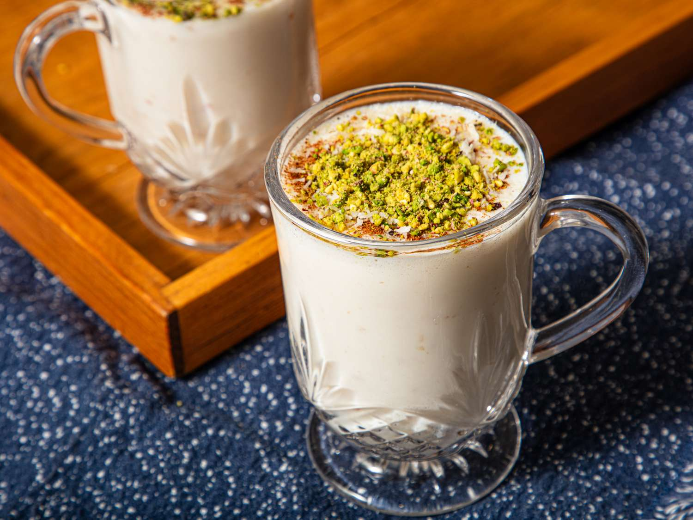

# Sahleb

*Hot, thick, milk-and-orchid-root drink perfumed with rose water, dusted with cinnamon, pistachios and coconut: Egypt's winter street drink, sold from steaming carts on Cairo street corners.*

**Serves:** 4

**Prep Time:** 5 minutes

**Cook Time:** 15 minutes

## Overview
Sahleb (also spelled salep) is the Egyptian winter drink: hot milk thickened with sahlab powder, historically from the dried tuber of wild orchids, now usually a cornflour-based substitute mixed with vanilla and orchid flavouring, sweetened with sugar, perfumed with rose water and cinnamon, served scalding hot in glass mugs with a heavy dusting of chopped pistachios, shredded coconut and crushed cinnamon on top. Texture is close to a thin custard or a creamy hot pudding you can drink. Sold from heated metal carts at every Cairo street corner on winter evenings; also a Turkish tradition (where it's salep) and Levantine (where the same name appears with regional variations).

## Ingredients

- 1 litre whole milk
- 4 tablespoons sahlab powder (the pre-mixed kind from any Middle Eastern grocer; OR substitute 4 tablespoons cornflour + 1 teaspoon vanilla extract + a tiny pinch of mastic powder if available)
- 4 to 6 tablespoons caster sugar (taste-dependent; sahleb is properly sweet)
- 1 tablespoon rose water
- ½ teaspoon ground cinnamon (for the milk)
- Pinch of fine salt

### To serve
- 4 tablespoons chopped pistachios
- 2 tablespoons unsweetened desiccated coconut (or grated fresh)
- 1 tablespoon ground cinnamon (for dusting)
- 2 tablespoons crushed walnuts or raisins (optional)

## Method

1. In a small bowl, whisk the sahlab powder (or cornflour substitute) with 200 ml of the cold milk until completely smooth.
1. Pour the remaining 800 ml of milk into a saucepan; add the sugar and salt. Warm over medium heat.
1. When the milk is steaming (not yet boiling), whisk in the sahlab slurry slowly and continuously.
1. Bring to a gentle simmer over low heat, whisking constantly, for 5 to 7 minutes. The milk thickens to a thin pourable custard.
1. Off the heat, stir in the rose water and the ½ teaspoon ground cinnamon.
1. Pour into glass mugs.
1. Top each with chopped pistachios, coconut, a generous dusting of cinnamon, and crushed walnuts or raisins if using.
1. Serve immediately while properly hot.

## Notes
- **Real sahlab is hard to find.** Authentic orchid-tuber sahlab is expensive and rare outside Turkey and Egypt. The pre-mixed boxed substitutes (any Middle Eastern grocery) work fine.
- **Whisk constantly.** Sahleb scorches if left unstirred; the cornflour also clumps. Keep whisking.
- **Serve scalding.** Sahleb cools fast and thickens further; serve from the pan into pre-warmed mugs.

## Storage
- Best within 30 minutes of cooking. Refrigerated leftovers turn solid; rewarm gently with a splash of milk to loosen.
