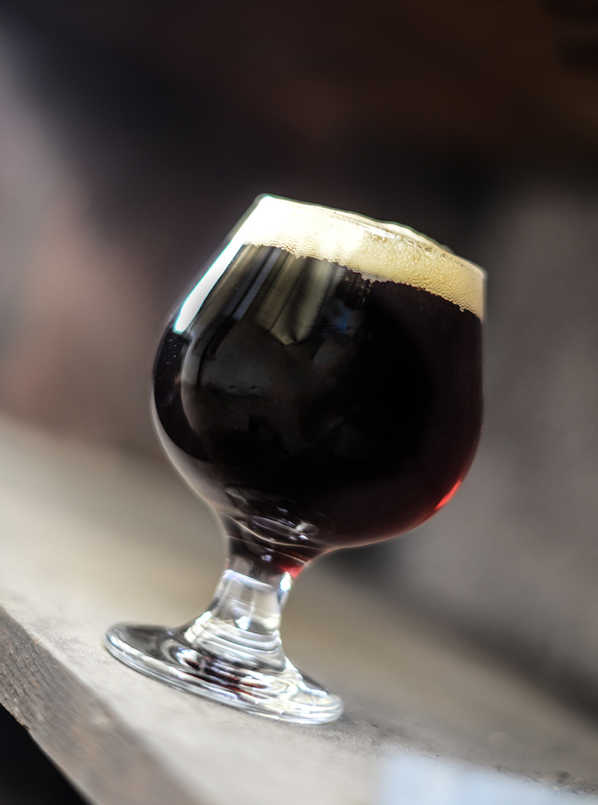

# Kali

*The Estonian summer kvass: dark rye bread, sugar and yeast lightly fermented into a tangy, gently fizzy, barely-alcoholic drink poured cold from every kiosk in Tallinn.*

**Serves:** Makes 2 litres

**Prep Time:** 20 minutes

**Fermenting Time:** 24-36 hours

**Chilling Time:** 4 hours

## Overview
Kali is Estonia's version of kvass, the lightly fermented rye-bread drink that has been a staple of Slavic and Baltic summers for centuries. Stale dark rye bread is toasted hard in the oven, then steeped in boiling water with sugar; once cool the liquid is strained, started with a small pinch of yeast and a few raisins, and left at room temperature for a day or two until faintly fizzy. The finished drink is dark, slightly sweet, slightly sour, and just barely alcoholic (less than 1%). It is the kiosk drink of every Estonian summer, sold from huge yellow plastic tanks on street corners and poured cold into half-litre cups.

## Ingredients

- 400 g stale dark rye bread (sourdough rye is ideal)
- 2.5 litres water
- 120 g sugar (light brown or caster), plus more to taste
- 2 g (1/2 tsp) instant dried yeast
- 1 tbsp raisins (no oil-coated dried fruit)
- Optional: 1 tbsp honey, or 1 tsp lemon juice, to finish

## Method

### Stage 1 - Toast the bread
1. Heat the oven to 180 C (160 C fan).
2. Slice the rye bread into 1.5 cm slices; lay on a baking sheet.
3. Toast for 25-30 minutes, turning halfway, until the slices are dark brown, dry and crisp through (almost burnt at the edges is correct).
4. Cool.

### Stage 2 - Steep
1. Break the toasted bread into rough chunks and place in a large heatproof jug or pot (4-litre capacity).
2. Bring the water to a boil; pour over the bread.
3. Cover and leave to steep 4-6 hours, or overnight, until the liquid is dark brown and smells of toasted rye.

### Stage 3 - Strain and sweeten
1. Strain the liquid through a sieve into a clean bowl or jug, pressing the bread gently to extract all the liquid (do not squeeze hard, that releases bitter sediment).
2. Stir in the sugar while still warm; let dissolve.
3. Cool to body temperature (around 30 C).

### Stage 4 - Ferment
1. Whisk the yeast into a tablespoon of the warm liquid; let it foam for 5 minutes.
2. Stir the yeast back into the main batch; add the raisins.
3. Cover loosely with a cloth or a loose lid (the gas must escape).
4. Stand at warm room temperature (20-24 C) for 24-36 hours. The kali is ready when small bubbles rise steadily and the raisins float on the surface.

### Stage 5 - Bottle and chill
1. Strain through a fine sieve into clean bottles (plastic with screw caps work; glass swing-tops are best). Leave at least 3 cm of headspace.
2. Add 2-3 raisins per bottle for a touch of secondary fizz if you like.
3. Refrigerate at least 4 hours before drinking. Fermentation slows almost to a stop in the fridge.
4. Open carefully (it can be lively); pour cold into glasses.

## Notes
- **Real dark rye:** A dense sourdough rye is the right bread. Light supermarket rye gives a thin, pale kali; pumpernickel is too sweet.
- **Toast hard:** The depth of colour and flavour comes from properly dark-toasted bread. Pale toast gives pale kali.
- **Fermentation watch:** In a warm kitchen the ferment can be ready in 18 hours; in a cool one it may take 48. Taste daily; it is ready when faintly tangy and lightly fizzy.
- **Mind the bottles:** Plastic is safer than glass for first-time kvass-makers. A glass bottle with too much sugar and too long a ferment can build dangerous pressure.

## Serving
Serve cold straight from the fridge in tall glasses. A slice of lemon or a sprig of mint is optional. Outdoors on a hot day with rye-bread sandwiches and a bowl of cold beetroot soup is the right setting.

## Storage
- Keeps 1 week refrigerated; flavour deepens then turns vinegary
- Does not freeze
- Open bottles will continue to fizz slowly; drink within 3 days of opening
