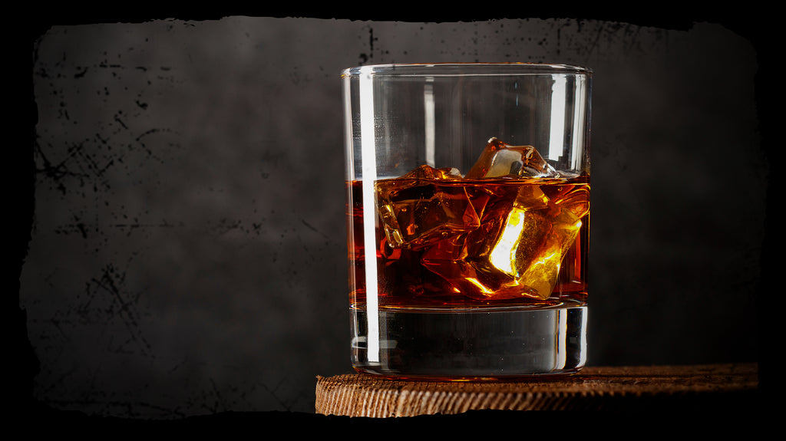

# Vana Tallinn

*The Estonian after-dinner liqueur: dark rum infused with citrus peel, cinnamon, vanilla and warm spices, poured neat over ice or stirred into hot coffee.*

**Serves:** Makes about 750 ml

**Prep Time:** 20 minutes

**Infusing Time:** 14 days

## Overview
Vana Tallinn ("Old Tallinn") is the rum-based dark spiced liqueur that has been Estonia's signature export since 1962. The original was created by a Soviet-era state distillery, took off as a soft-power gift through the Eastern Bloc, and has stayed in production since independence. The commercial bottle is a guarded blend, but the flavour profile is unmistakable: dark rum, sweet orange and lemon peel, vanilla, cinnamon and clove with a Jamaica-ginger lift. This home version puts the same spices into a bottle of decent dark rum, sweetens with a moderately heavy syrup, and rests for two weeks. The result is a warming, spiced after-dinner drink that holds up neat over ice, in espresso, or stirred into a cup of hot coffee on a winter night.

## Ingredients

- 700 ml dark rum (a mid-range Caribbean blend, around 40% ABV)
- Zest of 1 large orange (no white pith)
- Zest of 1 lemon (no white pith)
- 1 vanilla pod, split lengthways
- 1 cinnamon stick
- 4 whole cloves
- 4 cardamom pods, lightly crushed
- 1 small piece of fresh ginger (about 2 cm), thinly sliced
- 1 star anise

### For the syrup
- 250 g caster sugar
- 250 ml water

## Method

### Stage 1 - Build the infusion
1. Place the rum in a clean large jar (1.5 litres or larger).
2. Add the orange zest, lemon zest, vanilla pod, cinnamon, cloves, cardamom, ginger and star anise.
3. Seal and shake.

### Stage 2 - Infuse
1. Stand somewhere cool and dark for 10-14 days.
2. Shake gently every couple of days.
3. Taste after a week; the spices and citrus should be present but not aggressive. If the cloves are dominating, strain them out and continue the infusion without them.

### Stage 3 - Make the syrup
1. Combine the sugar and water in a small pan over medium heat.
2. Stir until the sugar dissolves; bring to a gentle simmer for 1 minute.
3. Cool completely.

### Stage 4 - Blend and bottle
1. Strain the infused rum through muslin into a clean jug, pressing the solids gently.
2. Stir in the cooled syrup gradually, tasting as you go. The traditional Vana Tallinn is generously sweet; aim for a syrupy, just-sweet-enough finish.
3. Funnel into clean dark bottles; seal.
4. Rest 3-5 days before drinking to let the flavours marry.

## Notes
- **Rum base:** A decent dark Caribbean blend works well. Avoid spiced rums (they fight the home spices). Avoid white rum (too thin).
- **Don't over-clove:** Cloves are powerful and can take over. Four is the upper limit; pull them at the one-week tasting if needed.
- **Sweetness is part of the identity:** Commercial Vana Tallinn is unambiguously a sweet liqueur. A less-sweet version is fine but is no longer recognisable as the original.
- **Strength:** This home version comes out around 30% ABV. The commercial 50% version exists; to match it use less syrup and stronger overproof rum.

## Serving
Serve in small glasses neat at room temperature, over ice with an orange twist, stirred into hot black coffee, or splashed over vanilla ice cream. A traditional Estonian after-dinner drink.

## Storage
- Keeps 1 year in a sealed bottle, dark and cool
- Does not need refrigeration; the alcohol preserves it
- Improves over the first 2-3 months in the bottle

