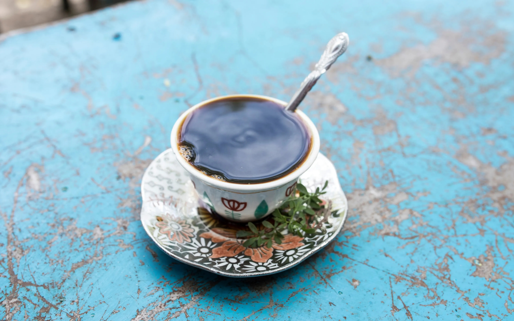

# Buna (Ethiopian Coffee)

*Green coffee beans roasted over coals in a flat clay pan, ground by hand and brewed three times in a jebena clay pot: the Ethiopian coffee ceremony, a 90-minute social ritual centred on three cups.*

**Serves:** 4 to 6 (for the full three-round ceremony)

**Prep Time:** 20 minutes

**Cook Time:** 30 minutes

## Overview
Buna is the Ethiopian coffee ceremony, and Ethiopia (where coffee was discovered) takes its coffee with more ritual than anywhere else. Green coffee beans roasted fresh over a small charcoal brazier in a wide flat clay pan called a menkeshkesh, crackling and turning from pale green to deep brown as the kitchen fills with the scent. The pan-passed-for-guests-to-smell moment is the traditional opening of the ceremony. Crushed with a wooden mortar and pestle (mukecha), brewed in a long-necked clay pot (jebena), poured from a tall height into small handleless cups: each detail is part of the ritual, and any shortcut taken loses the ceremony's character. The three rounds are the traditional structure (abol the strongest, tona the mellower second, bereka the weakest third, said to bring blessing); leaving after one cup is impolite. Frankincense burning on the side and popcorn served alongside the cups complete the setting. The 90-minute conversation that fills the ceremony is the actual purpose; buna is not a quick caffeine fix but the centre of Ethiopian social life.

## Ingredients

- 150 g green coffee beans (raw, unroasted; from any Ethiopian / Eritrean grocer or a specialist coffee supplier)
- 1.5 litres cold water (divided across three rounds)
- Caster sugar to taste (Ethiopian tradition: sugar in the cup, not in the pot)
- Salt (alternative to sugar in some regions; a pinch per cup)

### Equipment (traditional but optional)
- A clay coffee-roasting pan or a heavy steel pan
- A jebena (Ethiopian clay coffee pot) or a regular kettle
- Small handleless coffee cups (sini)
- A small bowl for serving popcorn

### To serve
- Plain popcorn (popped without butter or salt; the traditional accompaniment)
- A small saucer of incense (frankincense / etan, optional but traditional)

## Method

### Stage 1 - Wash and roast the beans
1. Rinse the green coffee beans in a sieve under cold water; drain.
1. Heat a heavy pan over medium-low heat. Add the green beans in a single layer.
1. Roast 8 to 12 minutes, stirring constantly with a wooden spoon, until the beans turn from pale green to medium-brown and start to crack. You want them aromatic and dark but NOT charred - Ethiopian roast is medium, never the dark French roast you'd see in espresso.
1. Tip the hot beans onto a flat plate to cool; the residual heat finishes the roast.

### Stage 2 - Crush the beans
1. Once the beans are cool enough to handle, crush them in a mortar and pestle to a coarse grind (or pulse in a coffee grinder, briefly - you want coarser than espresso, finer than French press).

### Stage 3 - Brew round 1 (abol)
1. Pour 500 ml of cold water into the jebena (or any kettle).
1. Bring to a boil.
1. Add 4 tablespoons of the ground coffee; stir briefly.
1. Return to the heat and bring to a foaming boil; remove from heat as it threatens to overflow.
1. Let stand 1 to 2 minutes for the grounds to settle.
1. Pour into small cups from a height of about 30 cm - the tall pour aerates the coffee and is part of the ritual.
1. Serve with sugar in the cup (1 to 2 teaspoons is standard).

### Stage 4 - Brew rounds 2 and 3 (tona, bereka)
1. Add another 500 ml of water to the jebena (with the grounds still in).
1. Repeat the boil, settle and pour for round 2 (tona).
1. Repeat once more for round 3 (bereka).
1. Each round is weaker than the last; the three rounds together are part of the social structure.

## Notes
- **Roast at home for the full ritual.** Pre-roasted Ethiopian beans work but skip the central ritual moment of fresh roasting. Green beans from any Ethiopian grocery or specialty coffee supplier.
- **Medium roast, not dark.** Ethiopian coffee is roasted to "first crack" or just past - beans are medium-brown with no oily sheen. Dark espresso roasts mask the fruity-floral character of Ethiopian coffee.
- **Tall pour matters.** The 30 cm pour height is the visual signature of buna. It also lets some of the grounds settle in the cup bottom.
- **Three rounds.** Refusing the second or third cup is impolite; the full ceremony is the social contract, not just the first pour.

## Storage
- Best in the moment. Re-brewed coffee from the jebena can be drunk later in the day but loses its character.
