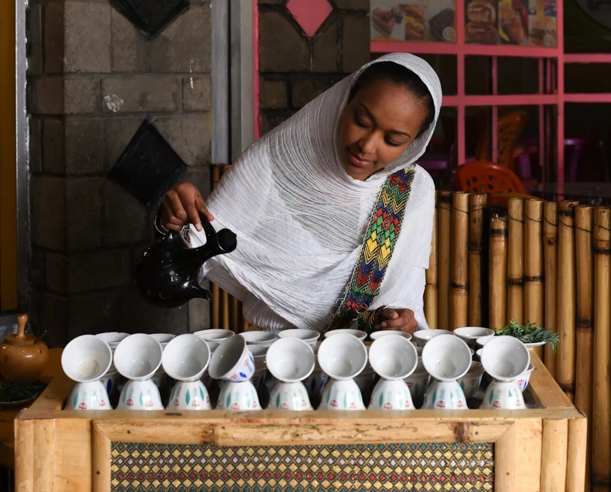

# Drinks of Ethiopia

Buna, the Ethiopian coffee ceremony where green beans are roasted in front of you, ground, and brewed three times from the same grounds in a clay jebena. Tej (honey wine), tella (the home-brewed sorghum beer), and spiced black tea with cardamom and cloves.
