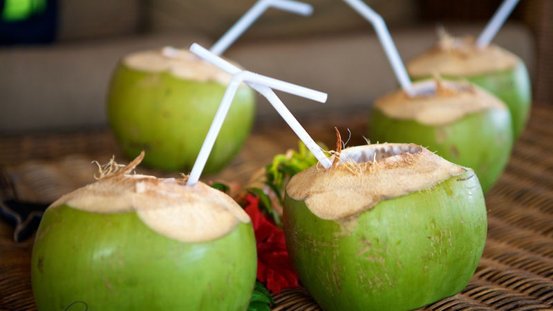

# Bu (Young Coconut Water)

*A young drinking coconut, the husk still green, chopped open with a single bush-knife stroke and drunk straight from the shell through a paper straw. The Fijian roadside thirst quencher and the most refreshing drink in the Pacific.*

**Serves:** 1

**Prep Time:** 2 minutes

**Cook Time:** None

## Overview
Bu is the Fijian word for the young drinking coconut: harvested at the stage where the shell is still soft, the flesh is a thin layer of jelly and the cavity is full of about 300 to 500 ml of cool, slightly sweet, faintly mineral water. Roadside stalls all across Fiji sell them stacked in pyramids: the seller takes one, gives the husk three or four practised cuts with a long cane knife to expose the top, slices a final small lid off the shell, and hands the whole thing over with a paper straw stuck into the opening. You drink the water cool from the shade of the coconut tree, then the seller halves the empty shell and gives you a strip of husk to scoop out the soft jelly inside. The version below is the home preparation for when you have a young coconut to hand.

## Ingredients

- 1 young (drinking) coconut, fresh
- Optional: 1-2 ice cubes
- Optional: a squeeze of fresh lime
- Optional: a paper straw

## Method

### Stage 1 - Open the coconut
1. Sit the young coconut steady on a chopping board, pointed end up.
2. With a heavy cleaver or short machete, give the top three or four firm cuts in a circle, slicing through the soft husk down to the shell.
3. Lift away the cut-off cone of husk to expose the top of the inner shell.
4. With the back corner of the cleaver, tap a small lid into the exposed shell to make a drinking opening (about 3 cm across).

### Stage 2 - Drink
1. Drop in the ice cube and lime if using.
2. Insert a paper straw.
3. Drink straight from the husk; the water is cool from the shade of the tree.

### Stage 3 - Eat the flesh (optional)
1. Once the water is finished, lay the coconut on its side.
2. Cut the husk in half with the cleaver.
3. Cut a thin strip from the outer husk and use it as a scoop.
4. Scoop the soft white jelly flesh out of the inside of the shell and eat.

## Notes
- **Use a young, green coconut:** the brown hairy coconut at the supermarket is the mature stage and the water is reduced and slightly sour. Young coconuts (often sold trimmed into a white cylinder in Asian supermarkets) are the right thing.
- **No knife skills required:** if the husk feels too risky to chop, ask the supermarket to open it for you, or buy the pre-trimmed white version which has a thin shell that punctures with a screwdriver and a tap of a hammer.
- **Drink within the day:** once opened, the water oxidises quickly and the freshness is lost. Whole unopened young coconuts keep a week in the fridge.

## Variations
- **With lime and a pinch of salt:** the Caribbean variation; lifts the sweetness and replaces the salts lost in tropical heat.
- **With a splash of pineapple juice:** the Fijian beach-bar serve.
- **Blended with the jelly:** scoop out the jelly, blend with the water and ice; a thicker, smoother coconut drink.
- **As mixer for rum:** a long pour of light rum into the open shell makes the holiday cocktail.
- **Chilled overnight:** the unopened coconut from the fridge gives the coldest possible serve.

## Serving
Serve cool from the shade · with a paper straw · with a wedge of lime on the side · alongside fresh fruit · at the beach · at a Fijian roadside stall · as the everyday hot-afternoon drink.

## Storage
- Whole unopened young coconuts keep 5-7 days refrigerated.
- Once opened, drink the same day; the water loses its character within hours of air contact.
- Do not freeze.

