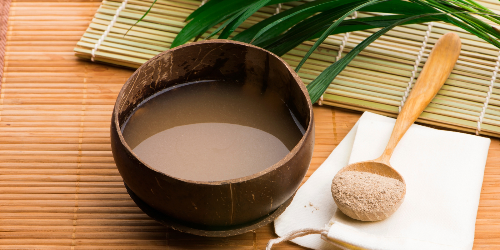

# Yaqona (Kava)

*Fijian kava ceremony: dried kava root powder mixed with cold water in a wooden tanoa bowl, strained through cloth, and drunk in single-shot rounds from a coconut-shell bilo. The social-ritual drink at the centre of Fijian gathering.*

**Serves:** 6-8 small bilo (cups)

**Prep Time:** 15 minutes (including the steep)

**Cook Time:** None

## Overview
Yaqona (pronounced yang-go-nah; "kava" is the wider Polynesian name) is not a beverage in the European sense - it is the ceremonial drink at the centre of Fijian social life. The dried, ground root of Piper methysticum is mixed with cold water in a wooden communal bowl (the tanoa), kneaded through a cloth strainer to extract the active compounds, and served in single-shot rounds in halved coconut shells called bilo. Each drinker claps once before receiving the cup, drinks it down in one go, and claps three times after. The drink is muddy-grey, earthy and slightly numbing on the tongue; the effect is a calm, relaxed, sociable mild sedation. The ceremony precedes any village meeting, any guest welcome, any celebration.

## Ingredients
- 60 g dried kava root powder (medium grind, available from Pacific shops)
- 1.2 litres cold water (room temperature - not iced, not warm)
- A clean muslin cloth or fine kava strainer (about 30 x 30 cm)
- A large bowl (the substitute for the wooden tanoa)
- Small cups (coconut-shell bilo if you can find them; small ceramic or stainless cups otherwise)

## Method

### Stage 1 - Wrap the kava
1. Place the kava powder in the centre of the muslin cloth.
2. Gather the cloth corners; twist to form a tight bag containing the powder.
3. The kava is ready to extract.

### Stage 2 - Knead and extract
1. Pour the cold water into the bowl.
2. Submerge the kava bag in the water; squeeze and knead it under the surface for 8-10 minutes.
3. The water turns grey-brown as the active compounds extract; the consistency thickens slightly.
4. Periodically lift the bag and squeeze hard above the bowl to express the liquid.

### Stage 3 - Strain final
1. Once the water is uniformly grey and the bag yields no more colour when squeezed, lift and discard the spent kava.
2. The yaqona is ready in the bowl.

### Stage 4 - Serve in rounds
1. Ladle (or scoop with a small cup) about 100 ml of yaqona into each bilo.
2. The drinker claps once (the "high-five" clap, palm to palm with hands cupped) before receiving.
3. Drink the bilo down in one continuous swallow.
4. Clap three times after drinking; pass the bilo back.
5. Each person drinks 3-4 bilo over the session, with conversation between rounds.

## Notes
- **Cold water only:** Hot water destroys the active kava compounds. Room-temperature is the warmest acceptable; cold is the right standard.
- **The ceremony matters:** A yaqona session is social ritual, not just a drink. Sit in a circle on the floor (if possible); don't rush between rounds; let the conversation flow.
- **Effects:** Mild calming, slight tongue/lip numbness, a feeling of relaxation. Not an alcohol-like intoxication. Don't drink and drive - kava has a sedating effect.
- **Sourcing:** Buy from a reputable Pacific shop or specialty kava supplier. Quality varies; cheap kava often has too much stem (which has been linked to liver issues in heavy long-term use).

## Serving
Serve in the round, with all participants seated on the floor (the traditional setting) or around a low table. Conversation between rounds is the point.

## Storage
- Yaqona is best drunk fresh, within 2-3 hours of mixing.
- Refrigerated 1-2 days, the active compounds degrade and the texture separates.
- Do not freeze.
