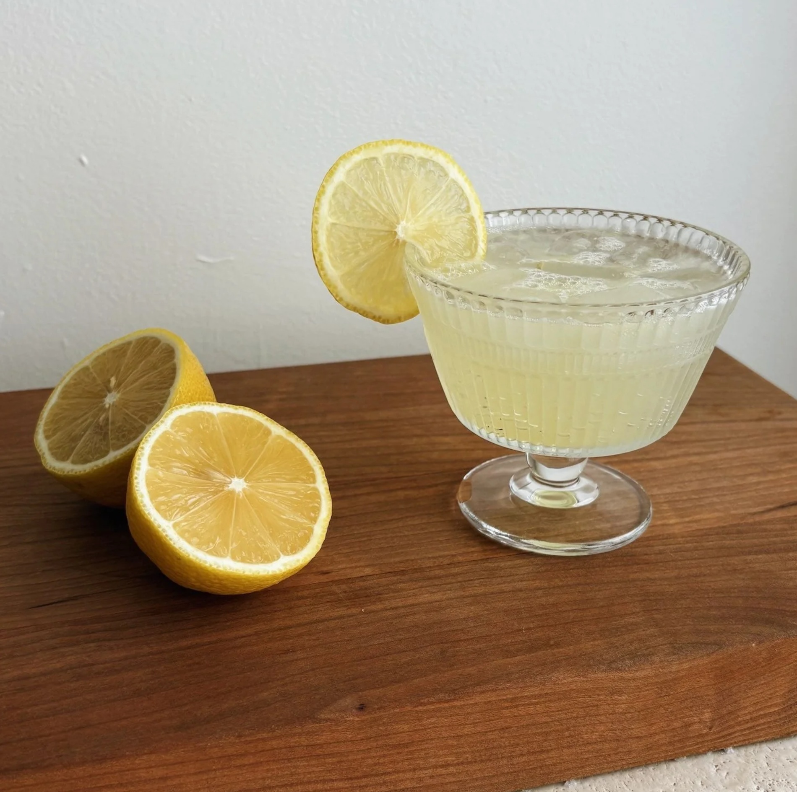

# Citron Pressé

*Fresh-squeezed lemon juice in a tall glass with a sugar bowl, a carafe of water and a long spoon: the French café answer to lemonade, where the drinker mixes their own pour at the table.*

**Serves:** 1

**Prep Time:** 3 minutes

**Cook Time:** 0 minutes

## Overview
Citron pressé is the French café lemon drink and a small ceremony of self-assembly. The waiter brings a tall glass containing the fresh juice of one or two lemons, a small bowl of caster sugar with its own spoon, a carafe of cold still water, and sometimes a jug of soda water alongside. You stir in as much sugar as you want, top up with as much water as you want, and adjust to taste over the course of the drink. The result tastes brighter and sharper than any pre-mixed lemonade — the proportions are personal and the lemon is properly fresh. Common at every French café on a hot day; the brasserie equivalent of the British pub's lime and soda.

## Ingredients

### Per glass
- 2 lemons (squeezed; about 70 to 80 ml juice)
- Caster sugar (in a small bowl with a spoon; 2 to 4 teaspoons typical)
- 200 to 300 ml cold still water (in a small carafe alongside)
- 100 ml chilled soda water (optional, for the fizzy variant)
- Plenty of ice cubes

### To serve
- A tall glass with lemon juice
- A small sugar bowl
- A long iced-tea spoon for stirring
- A water carafe
- A lemon slice on the rim

## Method

1. Squeeze the lemons into a tall glass; strain out the pips.
1. Add ice cubes to fill the glass three-quarters.
1. Set the glass on a small tray with the sugar bowl, the water carafe, and the long stirring spoon.
1. At the table: spoon 2 to 4 teaspoons of sugar into the glass, stir to dissolve, then top up with water to taste. Drink, taste, adjust.

## Notes
- **The assembly is the point.** Don't pre-mix at home if guests are around — bringing out the components on a tray feels more proper.
- **Use room-temperature lemons.** Rolled hard on the counter for 10 seconds; gives twice the juice yield.
- **Soda water variant.** Some Parisian cafés serve the option of sparkling water alongside still; both are fine.

## Storage
- Drink immediately. The squeezed juice can sit in the fridge for a few hours but oxidises and dulls quickly.
