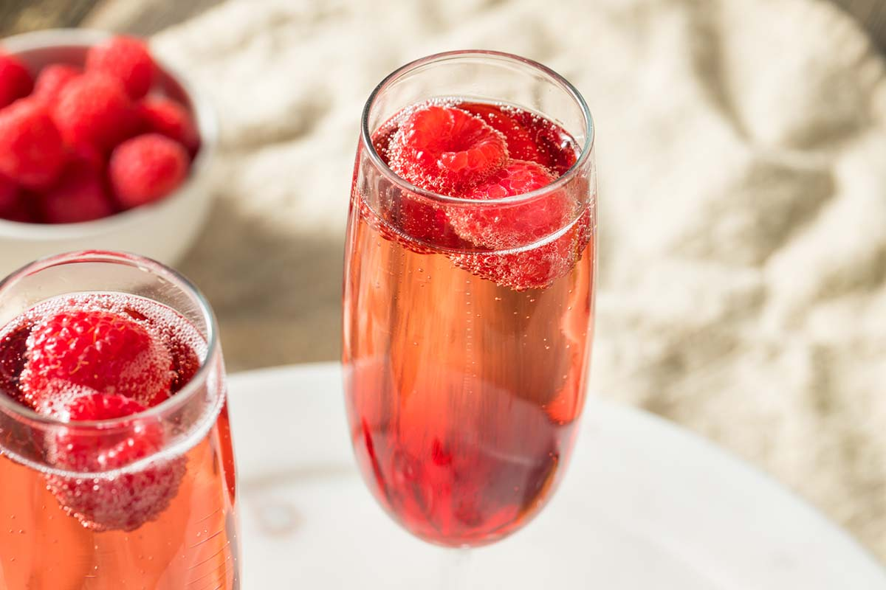

# Kir

*Crème de cassis topped with chilled dry white Burgundy: the French aperitif named for the Dijon mayor who served it at every reception, a small purple-rose glass that opens every meal in eastern France.*

**Serves:** 1

**Prep Time:** 1 minute

**Cook Time:** 0 minutes

## Overview
The Kir is the aperitif of Burgundy: a teaspoon of crème de cassis (blackcurrant liqueur) in the bottom of a small wine glass, topped with chilled dry white wine (Aligoté is the traditional Burgundy grape; any dry crisp white works). The cassis sinks to the bottom; you stir gently or just let it diffuse as you sip. The drink was popularised by Canon Félix Kir, mayor of Dijon from 1945 to 1968, who served it at every official reception. The Kir Royale variant replaces the white wine with Champagne; the Communard uses red wine. Always pre-dinner, always small, always cold.

## Ingredients

### Per glass
- 10 to 15 ml crème de cassis (Cassis de Dijon for the canon)
- 90 ml chilled dry white wine (Aligoté, Sauvignon Blanc, Chablis, any crisp dry white)

### To serve
- A small wine glass (chilled)

## Method

1. Pour the crème de cassis into the bottom of the chilled glass.
1. Top with the cold white wine, pouring slowly down the side of the glass.
1. Don't stir; the cassis sits at the bottom and diffuses gradually as you sip.

## Notes
- **Cassis-to-wine ratio.** The classic French ratio is roughly 1:9 (cassis to wine); some prefer slightly sweeter at 1:7. Avoid going above 1:5 - too much cassis dominates.
- **Dry wine, not sweet.** Sweet wine + cassis = cloying. The cassis IS the sweetness; the wine should be properly dry.
- **Cold matters.** Both the wine and the glass should be chilled. A warm Kir is a sad Kir.

## Variations
- **Kir Royale.** Replace the white wine with chilled Champagne or Crémant. The festive version.
- **Communard (Cardinal).** Replace the white wine with red Burgundy; deeper, less common.
- **Kir Pêche, Kir Mûre, Kir Framboise.** Replace cassis with peach (crème de pêche), blackberry (crème de mûre) or raspberry (crème de framboise) liqueurs.

## Storage
- Drink immediately. The pre-mix doesn't work; both halves want to be fresh.
