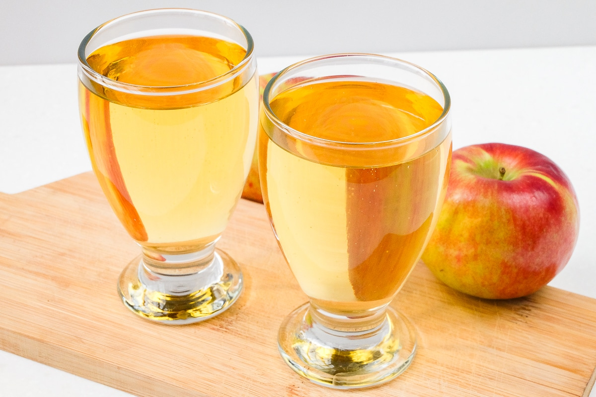

# Apfelschorle

*Cloudy apple juice and sparkling water, equal parts, served cold: the German everyday refresher, drunk at every petrol station, hiking break and Saturday lunch.*

**Serves:** 1

**Prep Time:** 1 minute

**Cook Time:** 0 minutes

## Overview
Apfelschorle is the German default soft drink - sold in 0.5-litre bottles at every petrol station, Imbiss and supermarket, ordered at every café and Biergarten where the alcohol isn't wanted. The build is the simplest possible: cloudy apple juice (Apfelsaft, properly the unfiltered type), mixed half-and-half with sparkling water (Mineralwasser mit Kohlensäure), served ice-cold. Lighter than straight apple juice (which Germans find too sweet), more substantial than plain sparkling water, exactly the right thing on a hot afternoon. The unsweetened "Schorle" suffix attaches to any fruit juice mixed with sparkling water; Apfel is the traditional version.

## Ingredients

### Per glass
- 200 ml cold cloudy apple juice (Apfelsaft naturtrüb; the unfiltered kind)
- 200 ml chilled sparkling water (with carbonation)
- Plenty of ice cubes (optional; some Germans skip ice)

### To serve
- A wedge of fresh apple (optional)
- A tall glass

## Method

1. Pour the apple juice into a tall glass.
1. Top with the chilled sparkling water.
1. Stir once gently to combine; add a few ice cubes if you want it colder.
1. Drink immediately.

## Notes
- **Cloudy apple juice, not clear.** "Naturtrüb" (naturally cloudy) is what Germans drink; the clear filtered apple juice gives a thinner, less interesting Schorle.
- **Half-and-half is the standard.** Some prefer 60% juice (sweeter), others 40% (drier). 50:50 is the canon.
- **Sparkling water with serious carbonation.** Soft fizz makes a flat-tasting Schorle. Use a proper mineral water with strong gas content.

## Variations
- **Saure Schorle.** A "sour" Schorle with extra sparkling water (30% juice, 70% water); drier, more popular among older Germans.
- **Süße Schorle.** Sweeter (70% juice, 30% water); kid-friendly.
- **Sauerkirschschorle.** Sour cherry juice in place of apple. Trbal.
- **Holunderschorle.** Elderflower cordial in place of apple juice; a small splash plus a bigger pour of sparkling water.

## Storage
- Drink immediately; the sparkling water goes flat in 15 minutes.
