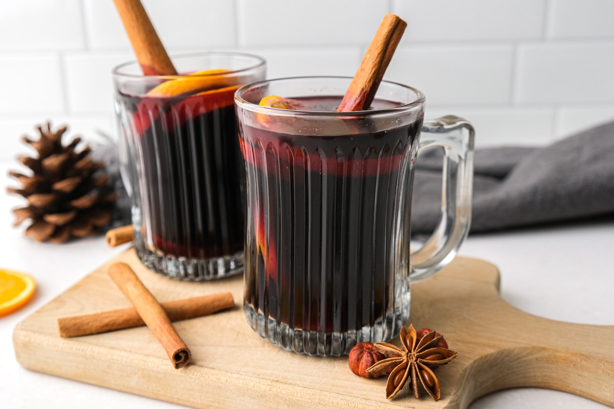

# Glühwein

*The Christmas-market drink of Germany and Austria: red wine warmed (never boiled) with whole cloves studded into an orange, a cinnamon stick, star anise, sugar and a long strip of lemon peel. Served steaming in heavy ceramic mugs at every Weihnachtsmarkt from Cologne to Vienna.*

**Serves:** 6 mugs

**Prep Time:** 10 minutes

**Cook Time:** 20 minutes (plus 10 minutes infusing off the heat)

## Overview
Glühwein literally means "glow wine" and it's the drink that holds German winter together. From mid-November to Christmas Eve every town square hosts a Weihnachtsmarkt (Christmas market) where you queue at wooden huts for a hot mug poured from steel kettles, then stand in the cold clutching it for the warmth as much as the drink. The build is straightforward: a medium-bodied red wine (Dornfelder, Spätburgunder, or a sturdy Italian table red), an orange studded with whole cloves like a pomander, a fat cinnamon stick, two star anise, a strip of lemon peel and just enough sugar to round the edges. The critical rule: never boil. Once the wine simmers around 70 to 75°C you kill the heat, let it infuse 10 minutes, then ladle straight into mugs. Boiling drives off the alcohol and turns the wine sharp. The market version is often spiked further with "mit Schuss", a shot of brown rum or Amaretto poured in, but the plain version is the proper starting point.

## Ingredients

- 1 bottle (750 ml) medium-bodied red wine (Dornfelder, Spätburgunder, Merlot, or a sturdy Italian table red)
- 1 unwaxed orange
- 12 whole cloves
- 1 large cinnamon stick
- 2 star anise
- 1 long strip of unwaxed lemon peel (use a peeler)
- 3 to 4 tablespoons soft brown sugar (to taste; some wines need more, some less)
- 1 small piece of fresh ginger, sliced (optional)
- 2 cardamom pods, lightly crushed (optional, Austrian-style)

### Optional shots (mit Schuss)
- Brown rum, Amaretto, or kirsch, 15 ml per mug, added at serving

### To serve
- 6 heatproof mugs (the heavier the better)
- Orange slices to garnish
- A cinnamon stick per mug (optional)

## Method

### Stage 1 - Stud the orange
1. Rinse and dry the orange. Press the whole cloves into the skin all over, roughly evenly spaced. About 12 cloves works for an average orange.
1. Slice the studded orange in half across the equator. The cut faces will release more juice and oil into the wine.

### Stage 2 - Warm the wine
1. Pour the wine into a non-reactive saucepan (stainless steel or enamel, not aluminium).
1. Add the studded orange halves, cinnamon stick, star anise, lemon peel, ginger and cardamom (if using).
1. Warm over a low heat. You're aiming for 70 to 75°C: gently steaming, wisps of vapour rising, but absolutely no bubbles or boil.
1. If you don't have a thermometer, the signal is the surface: a fine shimmer with steam, never a roll.

### Stage 3 - Sweeten and infuse
1. Once the wine is hot, stir in 3 tablespoons of soft brown sugar.
1. Taste. Add another tablespoon if it tastes harsh or too dry; the spices should sit on a soft sweet base.
1. Turn the heat off completely, cover the pan, and leave to infuse 10 minutes off the heat.

### Stage 4 - Serve
1. Lift out the orange halves, cinnamon stick, star anise, peel and ginger (a slotted spoon is easiest).
1. Ladle into warmed heavy mugs.
1. Garnish each with a fresh orange slice and (if you like) a fresh cinnamon stick to stir with.
1. For mit Schuss, splash 15 ml of brown rum or Amaretto into each mug before serving.

## Notes
- **Never boil.** This is the single rule that separates good Glühwein from harsh, headache-y Glühwein. Hot enough to steam, never a single bubble.
- **Wine choice.** A drinkable but everyday bottle is the right call. A £6 to £8 wine works beautifully; £20 is wasted (the spices flatten the nuance). Avoid heavily oaked wines; the spice clashes.
- **Stud the orange, don't slice the cloves in loose.** Loose cloves end up in your mug and bite hard. The pomander method holds them in the orange while still letting the oil leach into the wine.
- **Sugar to taste, not to a recipe.** Wines vary in residual sweetness. Start with 3 tablespoons, taste, add more.

## Variations
- **Weisser Glühwein (white Glühwein).** Use a dry white wine (Riesling Kabinett or Grüner Veltliner) with the same spices; the result is bright and lemon-forward instead of dark and brooding. Common in Bavaria and Austria.
- **Kinderpunsch.** Replace the wine with red grape juice and a splash of cranberry juice; same spices, same method, no alcohol. The German Christmas-market drink for children.
- **Feuerzangenbowle ("fire-tongs punch").** The theatrical Bavarian variant: rest a sugarloaf soaked in dark rum over the warmed wine in a metal cradle, set the rum alight, ladle the caramelised drip into the wine. A New Year's spectacle.
- **Apfel-Glühwein.** Replace half the wine with cloudy apple juice for a lighter, sweeter version. Common in Saxony.

## Storage
- Glühwein keeps 3 days in a sealed jug in the fridge, but the spices deepen and can turn slightly bitter. Best drunk the day it's made.
- Re-warm gently to 70°C, never boil. A second warming is fine; a third is not.
