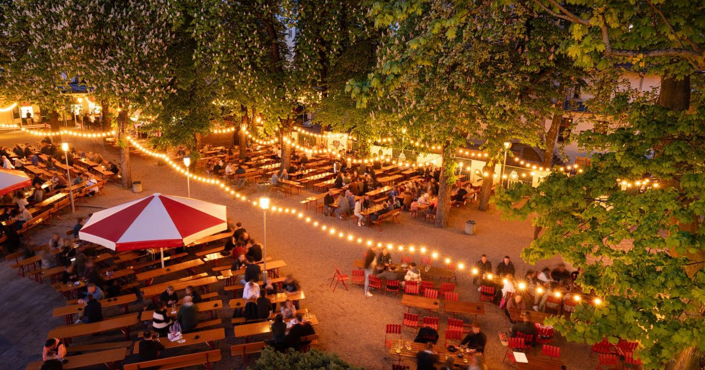

# Drinks of Germany

Apfelschorle in every school lunchbox, Glühwein at the Christmas market with a roasted chestnut on the side, Spezi (cola and orange) on the beer-garden bench in summer, and the regional Riesling fizz of the Rhine.
