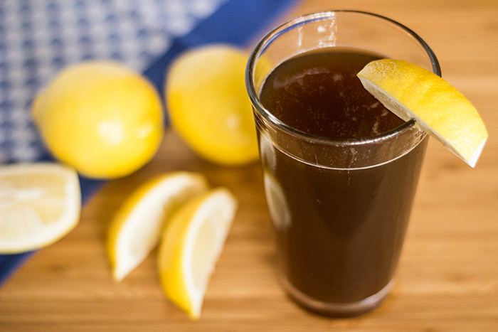

# Spezi

*The Bavarian cult mix: half cola, half orange soda (Fanta in most kitchens), poured over ice in a tall glass with a lemon slice. Sweeter than cola alone, less sticky than Fanta, the everyday Mischgetränk of southern Germany.*

**Serves:** 2 tall glasses

**Prep Time:** 2 minutes

**Cook Time:** 0 minutes

## Overview
Spezi is one of those drinks that started as a hack and graduated into an institution. The name comes from a 1950s Augsburg brewer who trademarked "Paulaner Spezi" for his bottled cola-and-orange mix; the trademark still belongs to Paulaner, but the generic name (and the home preparation) is shared across Bavaria and Austria. The build couldn't be simpler: equal parts cola and orange soda, poured over a tall glass of ice with a wedge of lemon. The result is rounder than either component alone: the cola gives the deep caramel and acid, the orange gives a fruity sweetness, and the two together taste somehow less artificial than either on its own. Order it at any Bavarian beer garden and they'll pour from two taps simultaneously. At home you can do it from two bottles or cans. Available bottled in Germany (Mezzo Mix is Coca-Cola's version, Paulaner Spezi the original) but the homemade version costs a third of the bottled one and tastes identical.

## Ingredients

- 250 ml cola (Coca-Cola is the classic; any decent cola works)
- 250 ml orange soda (Fanta is standard; Schwip Schwap or any orange fizz)
- 2 lemon wedges, plus extra to garnish
- Plenty of ice cubes

### To serve
- 2 tall glasses, chilled
- A long-handled spoon or straw

## Method

### Stage 1 - Build over ice
1. Fill the chilled glasses three-quarters full with ice cubes.
1. Squeeze a small wedge of lemon into each glass and drop it in.

### Stage 2 - Pour both at once
1. Holding the cola bottle in one hand and the orange soda in the other, pour them simultaneously into each glass at about the same rate. The simultaneous pour is half the point: it stops one from settling on top of the other and gives an even amber-orange colour straight away.
1. Fill to about 2 cm from the rim.
1. Don't stir. The carbonation does the mixing.

### Stage 3 - Serve
1. Garnish each glass with a fresh wedge of lemon clipped on the rim.
1. Serve immediately, while the fizz is at its peak.

## Notes
- **The ratio is 50/50.** Some prefer 60/40 cola-to-orange for a deeper drink, or 40/60 for a sweeter one. Adjust to taste, but the classic is half and half.
- **Cold ingredients.** Both bottles straight from the fridge. Lukewarm components hit the ice and dilute fast.
- **Don't pre-mix in a jug.** Pre-mixed Spezi goes flat within ten minutes; build to order, glass by glass.
- **Lemon is non-negotiable.** A squeeze of fresh lemon brightens the otherwise sweet drink and stops it tasting one-note. Bottled Spezi has the citric acid for this reason; the homemade lemon is the same lift, but fresher.

## Variations
- **Diet Spezi.** Use diet cola and an orange soda labelled "zero" or "light". Surprisingly close to the original.
- **Spezi mit Schuss.** A 25 ml shot of vodka or white rum added at the bottom of the glass before the soda. The German beer-garden alcoholic version.
- **Cherry Spezi.** Add 30 ml cherry syrup to the bottom of each glass before pouring; popular at Christmas markets.
- **Lemon-lime variant ("Mezzo Mix Light" style).** Replace the orange soda with Sprite or 7Up for a lighter, more citrus-forward drink.

## Storage
- Doesn't store: the cola and orange go flat fast once combined. Build to order.
