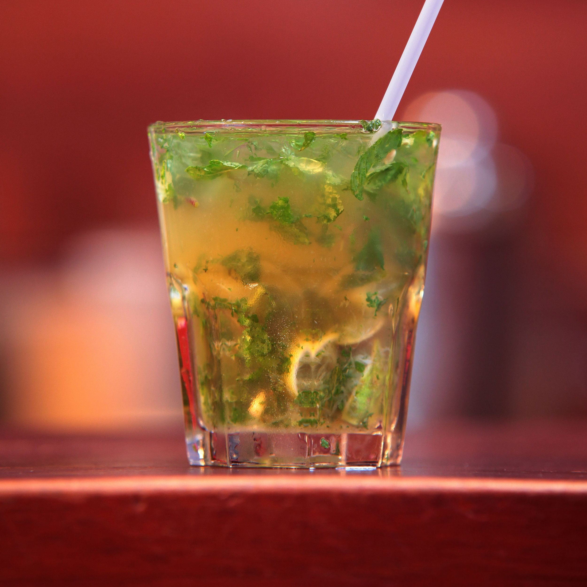

# Akpeteshie

*Ghanaian palm-wine-distilled local gin, clear and fiery and around 40 percent ABV, drunk neat in a small glass, with bitters, or stirred into a sobolo cocktail at any drinking spot in the country.*

**Serves:** 4 (as a serving guide; this recipe is for drinking, not for distilling)

**Prep Time:** 2 minutes

**Cook Time:** None

## Overview
Akpeteshie is the everyday spirit of Ghana, a clear distillate made from fermented palm wine or sugarcane juice that runs around 40 percent ABV. Sometimes called "kill-me-quick" or "apio", it is sold at drinking spots in small bottles, plastic sachets or by the shot from a counter jar. The smell is sharp, the burn is real, the flavour is somewhere between grappa and a young white rum. It is drunk neat in a small glass with a chase of cold water, with a few dashes of bitters, or mixed into the iconic akpeteshie-and-bitters served with a slice of lime. This is a serving guide, not a how-to-distill recipe; distilling spirits without a licence is illegal in most jurisdictions.

## Ingredients

For the akpeteshie pour:
- 200 ml akpeteshie (or substitute a strong unaged white rum or grappa, around 40 percent ABV)
- 200 ml cold water (for the chaser)
- 4 small slices of lime

For akpeteshie and bitters:
- 200 ml akpeteshie
- 4 dashes Angostura bitters (per glass)
- 4 small slices of lime

For akpeteshie-sobolo (the long drink):
- 100 ml akpeteshie
- 400 ml chilled sobolo (see recipe)
- 1 lime, juiced
- 4 dashes bitters
- Ice

## Method

### Stage 1 - The neat pour
1. Chill the akpeteshie 30 minutes (a cold bottle is friendlier to the burn).
2. Pour 50 ml into a small straight-sided glass.
3. Hand round with a small glass of cold water as a chaser, and a slice of lime per drinker.
4. Sip slowly; the burn fades and a faint vegetal sweetness takes over.

### Stage 2 - Akpeteshie and bitters
1. Pour 50 ml akpeteshie into a tumbler with one ice cube.
2. Add 1 dash of Angostura bitters per glass.
3. Drop in a slice of lime; squeeze gently to release the oils.
4. Stir once; sip.

### Stage 3 - Akpeteshie-sobolo (the long drink)
1. Fill four highball glasses with ice.
2. Pour 25 ml akpeteshie into each.
3. Top with 100 ml chilled sobolo.
4. Squeeze a quarter of lime into each; stir once.
5. Finish with a dash of Angostura bitters in each glass.

## Notes
- **The burn is part of the drink:** Neat akpeteshie burns. The chaser is for the burn, not because the drink needs water added.
- **Substitute carefully:** Outside Ghana, a strong unaged white rum (such as a 40 percent rhum agricole blanc) or a young Italian grappa is the closest pour. Vodka is too smooth.
- **Bitters bring it together:** A few dashes of Angostura tame the rawness and bring out the spirit's faint fruit.

## Variations
- **Akpeteshie sour:** 50 ml akpeteshie, 25 ml lime juice, 15 ml sugar syrup, shaken with ice.
- **Hot akpeteshie:** A small pour stirred into a cup of hot water with honey, ginger and lemon as a winter warmer.
- **Akpeteshie-ginger:** Top 25 ml with ginger ale and a slice of lime.
- **Sobolo-akpeteshie punch:** Scale the long drink up to a jug for a party.

## Serving
- Pour neat into small glasses · serve with a slice of lime and a glass of cold water · at funerals, libations and weddings · as the long drink at a bar with friends.

## Storage
- The spirit itself keeps indefinitely sealed
- Open bottles keep months at room temperature
- Mixed drinks are best made and drunk immediately
