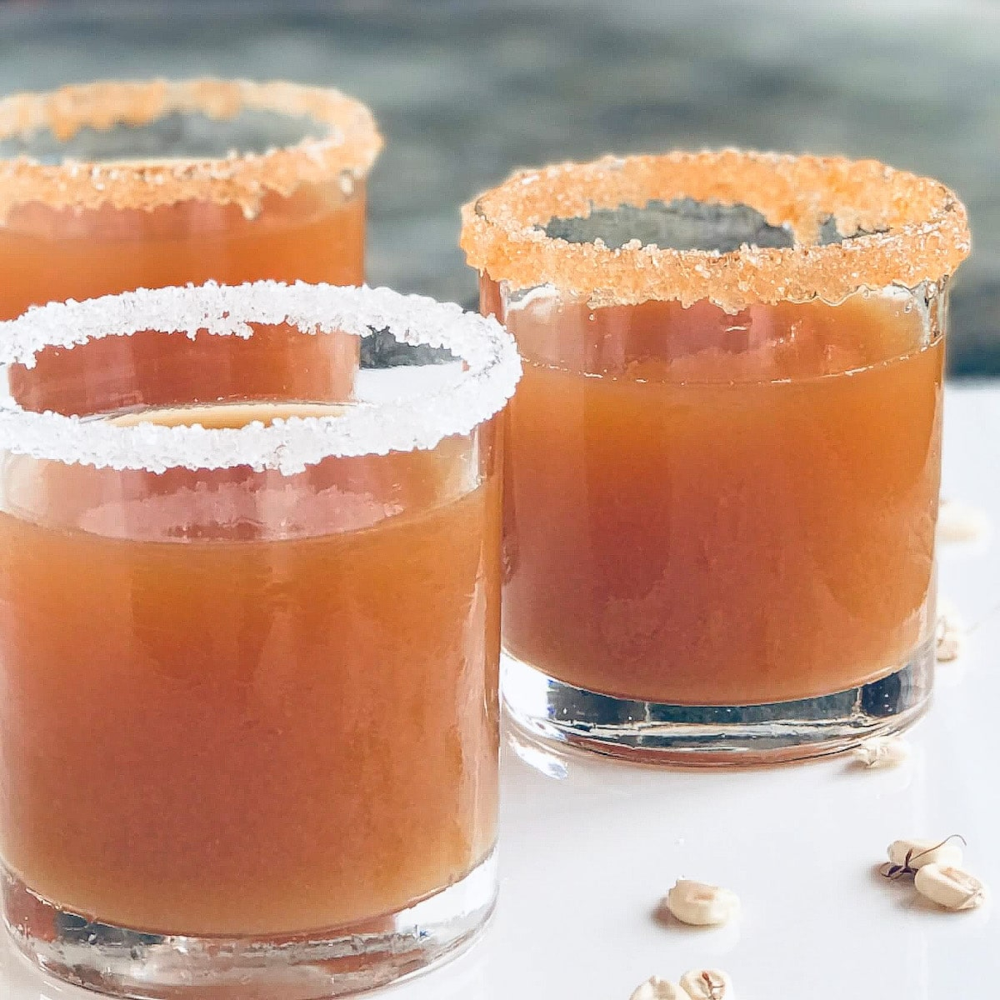

# Asaana

*A fermented corn drink, faintly sweet and faintly sour, scented with ginger and clove and tinted brown by caramelised sugar, poured at funerals, weddings and family gatherings across Ghana.*

**Serves:** Makes 1.5 litres

**Prep Time:** 15 minutes (plus 2-3 days fermentation)

**Cook Time:** 25 minutes

## Overview
Asaana is the fermented corn drink of southern Ghana, traditionally made from fermented corn dough (the same dough that makes kenkey and banku), cooked with caramelised sugar for the colour and ginger and clove for the aroma. The drink is faintly sweet, faintly sour, slightly tangy from the fermentation, and the caramel gives it a deep brown colour. It is poured at funeral and wedding processions, served at family gatherings and sold in plastic bags at markets and lorry parks. The fermentation is the key, properly fermented corn gives the gentle tang; un-fermented corn gives a flat sugary drink. Often made the day before to let the flavour settle.

## Ingredients

- 200 g fermented corn dough (from African grocers, or use 150 g cornmeal soaked 2-3 days with 1 tsp lemon juice in 400 ml water to ferment)
- 1.5 litres water
- 150 g caster sugar
- 6 cm ginger, peeled and bruised
- 6 cloves
- 1 stick cinnamon (optional)
- 1 tsp lime juice

## Method

### Stage 1 - Loosen the dough
1. Whisk the fermented corn dough with 500 ml of the water until smooth and free of lumps.
2. Strain through a fine sieve into a bowl, pressing to extract as much liquid as possible. Discard the solids (or use for porridge).

### Stage 2 - Caramelise the sugar
1. In a heavy pot, sprinkle 100 g of the sugar in a single layer.
2. Heat over medium heat without stirring; let the sugar melt and turn deep amber. Swirl the pan gently.
3. The moment the sugar is deep amber and smells caramel-y (not burnt), pour in 200 ml of the remaining water carefully (it will splutter). Stir until the caramel dissolves.

### Stage 3 - Build the drink
1. Add the rest of the water (about 800 ml), the ginger, cloves, cinnamon if using and the remaining 50 g sugar to the caramel pan.
2. Bring to a simmer; cook 10 minutes for the spice to infuse.
3. Pour in the strained corn liquid; whisk well.
4. Cook gently for 8-10 minutes, stirring constantly, until the drink thickens slightly (it should coat the back of a spoon but still pour freely). Do not boil hard; the starch breaks.

### Stage 4 - Cool and finish
1. Take off the heat; strain into a jug to catch the spices.
2. Stir in the lime juice.
3. Cool to room temperature, then refrigerate at least 4 hours.

### Stage 5 - Serve
1. Stir before pouring (the corn starch settles at the bottom).
2. Pour over ice into tall glasses.

## Notes
- **The fermentation is non-negotiable:** Fermented corn dough is what gives asaana its tang. African grocers sell it ready-made; the cornmeal soak is a stop-gap and gives a less developed flavour.
- **Watch the caramel:** Caramel goes from amber to burnt in seconds. Pull off the heat the moment it is deep amber.
- **Stir before pouring:** The starch settles. A good shake or stir keeps each glass even.

## Variations
- **Hausa-koko style:** Skip the caramel, add millet flour instead of fermented corn, and double the ginger for a closer-to-porridge breakfast drink.
- **Sweeter asaana:** Add another 50 g sugar to taste.
- **Without cloves:** Use 4 cardamom pods and a pinch of nutmeg.
- **Adult version:** Stir in 50 ml dark rum per litre.

## Serving
- Serve very cold in tall glasses over ice · poured into plastic cups at family gatherings · alongside bofrot or kose at a funeral · with a meat pie for a snack pair.

## Storage
- Keeps 3 days refrigerated
- Shake or stir before serving; the starch settles
- Does not freeze well; the corn starch separates
