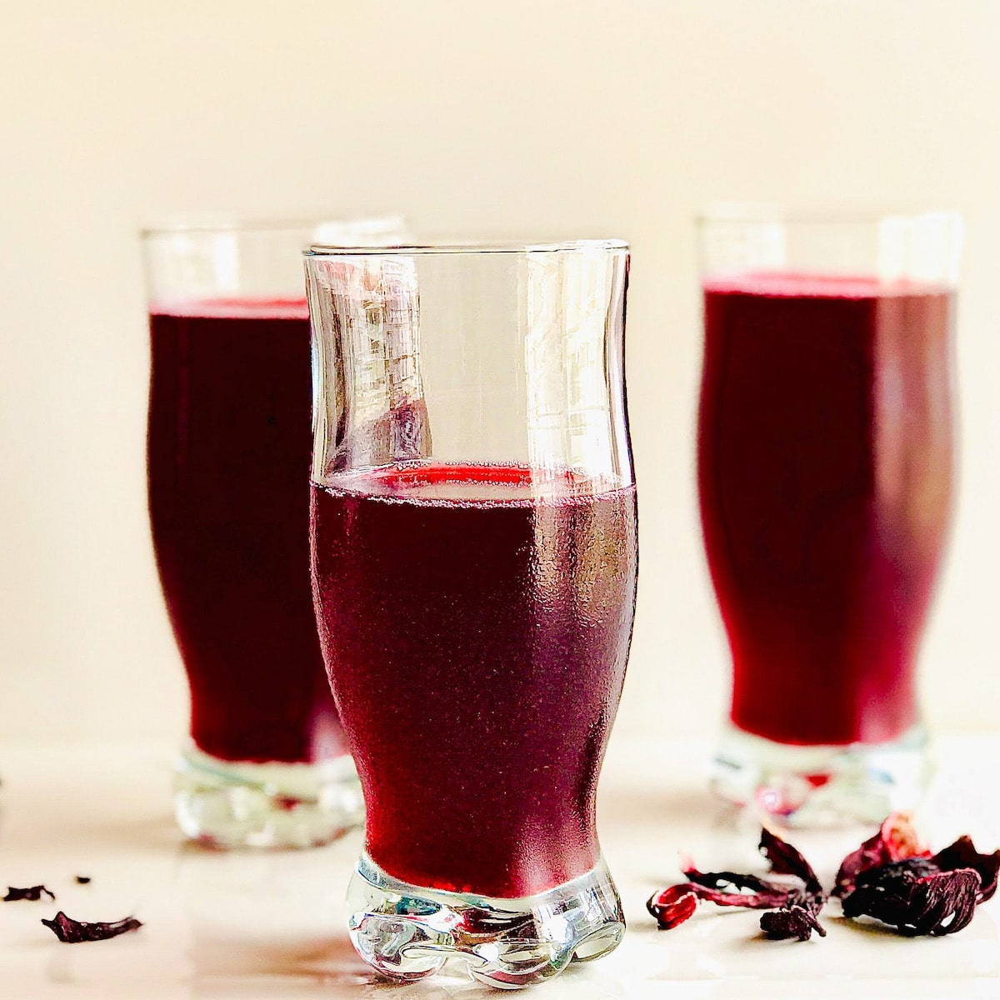

# Sobolo

*Dried hibiscus calyces steeped with ginger, clove and pineapple skin into a deep ruby-red drink, sweetened lightly, served ice-cold from a chest-cooler at every Ghanaian road-side stand.*

**Serves:** Makes 2 litres

**Prep Time:** 10 minutes

**Cook Time:** 20 minutes (plus overnight chill)

## Overview
Sobolo is the Ghanaian name for the West-African hibiscus drink (zobo in Nigeria, bissap in Senegal), the deep-red infusion of dried hibiscus calyces steeped with ginger, cloves and pineapple skin for the floral edge. It is sold ice-cold in 500 ml plastic bottles or sachets at every Ghanaian road-side stand, especially during the December heat and Christmas season. The tartness of the hibiscus, the burn of the ginger and the sweetness of the pineapple combine into something thirst-quenching and faintly medicinal at once. Best made the day before so the flavours marry; sweetness is to taste but should be light enough to keep the tartness in front.

## Ingredients

- 80 g dried hibiscus calyces (sobolo flowers)
- 2 litres water
- 6 cm ginger, sliced
- 6 cloves
- 1 stick cinnamon (optional)
- Skin and core of 1 ripe pineapple (or 200 g pineapple chunks)
- 3-4 tbsp sugar (or to taste; or 4 tbsp honey)
- 1 tsp grenadine or beetroot juice (optional, for deeper colour)
- 1 lime, juiced (to brighten before serving)

## Method

### Stage 1 - Steep
1. Rinse the hibiscus calyces in a sieve briefly to remove dust.
2. Place in a large pot with the water, ginger, cloves, cinnamon if using and the pineapple skin and core.
3. Bring to a boil; reduce to a simmer.
4. Cook 15 minutes, until the liquid is a deep ruby red.

### Stage 2 - Sweeten and steep further
1. Take off the heat.
2. Stir in the sugar while still hot, until dissolved.
3. Cover; leave to steep at room temperature for 1 hour, then refrigerate overnight (or at least 4 hours).

### Stage 3 - Strain and finish
1. Strain through a fine sieve into a jug, pressing the solids to release the colour.
2. Stir in the lime juice and the grenadine if using.
3. Taste; adjust sweetness.

### Stage 4 - Serve
1. Pour over ice in tall glasses.
2. Garnish with a slice of pineapple or a wedge of lime if you want.

## Notes
- **Pineapple skin is the secret:** Most stand-makers use the skin (and the core) for the faint fermented-fruit edge; it is the difference between bare hibiscus and proper sobolo.
- **Steep overnight:** Hot extraction gets the colour out fast; cold steep is where the depth and roundness develop. Plan a day ahead.
- **Sweetness:** Start light. Sobolo should be tart and refreshing, not soft-drink sweet.

## Variations
- **Spiced sobolo:** Add 4 black peppercorns and a star anise for a Christmas version.
- **Sobolo cocktail:** Pour over rum or gin with a squeeze of lime.
- **Coconut sobolo:** Stir in 100 ml coconut milk into each glass for a creamy version.
- **Hot sobolo:** Skip the chill, serve warm on a cool evening with a slice of orange.

## Serving
Serve over ice in tall glasses · with kelewele or jollof rice · at parties and weddings in a large jug · with a wedge of lime.

## Storage
- Keeps 5 days refrigerated in a sealed bottle
- The flavour deepens after a day and starts to fade after 4
- Freezes into ice cubes for adding to fresh batches
