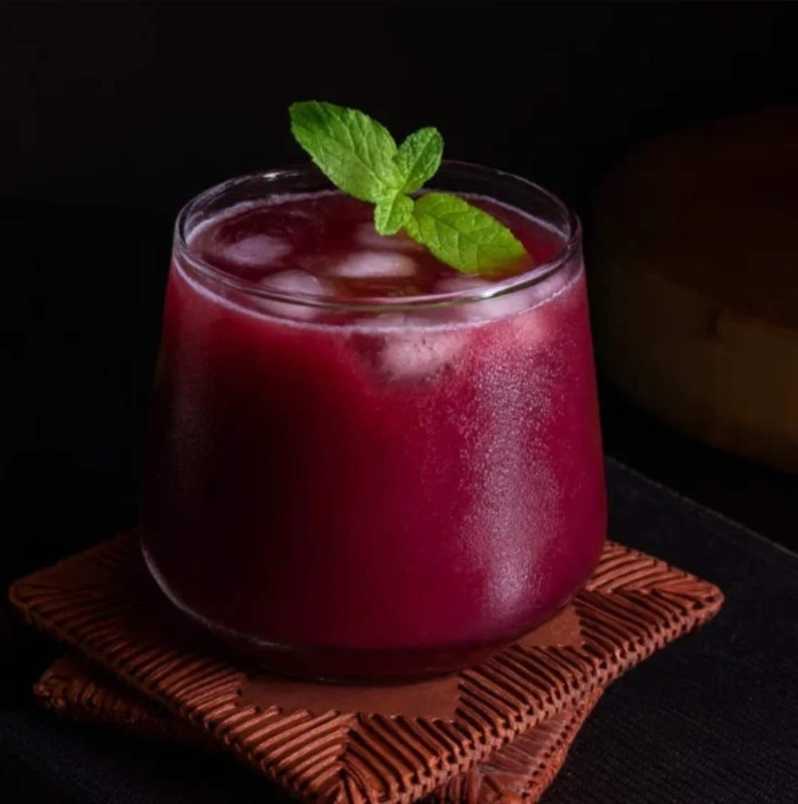

# Kokum Sharbat

*Goan summer cooler: dried kokum (Garcinia indica) steeped in water with sugar, cumin and a touch of salt, served ice-cold against the Konkan-coast heat.*

**Serves:** 4

**Prep Time:** 10 minutes (plus 30 minutes steeping)

**Cook Time:** 5 minutes

## Overview
Kokum is the dried, sun-cured fruit of Garcinia indica, a Konkan-coast tree whose fruit ripens deep purple. Sliced and dried in the sun, kokum turns into hard, almost-black, leathery wedges that release a deep ruby-pink colour and a slightly sour-fruity flavour when soaked. Kokum sharbat is the simplest expression: kokum steeped in water with sugar, salt, sometimes a pinch of roasted cumin and a few mint leaves, then chilled and served over ice. The drink is intensely refreshing on a Goan summer afternoon, sour-sweet-savoury all at once, mildly cooling on the palate. A folk remedy for heatstroke and indigestion; also just a great summer drink.

## Ingredients

- 30 g dried kokum (10 to 12 wedges; from any Indian grocery)
- 1 litre cold water
- 80 g caster sugar (or to taste)
- 1 teaspoon fine salt
- ½ teaspoon black salt (optional, but classic)
- 1 teaspoon ground roasted cumin
- 10 fresh mint leaves
- Plenty of ice cubes

### To serve
- Lime wedges
- Extra mint sprigs
- A pinch of toasted cumin per glass

## Method

1. Rinse the dried kokum briefly in cold water; soak in 500 ml of warm water for 30 minutes. The water turns deep ruby-pink.
1. After 30 minutes, squeeze the kokum pieces against the bowl to release more colour and flavour; strain through a fine sieve, discarding the spent kokum.
1. In a jug, combine the kokum infusion with the remaining 500 ml cold water, sugar, fine salt, black salt, roasted cumin and mint leaves.
1. Stir until the sugar dissolves.
1. Refrigerate at least 1 hour.
1. Pour over ice in tall glasses; garnish with a lime wedge and a mint sprig; sprinkle a tiny extra pinch of cumin on top.

## Notes
- **Dried kokum, not fresh.** The dried wedges are what's used; sun-curing concentrates the flavour. Sold cheaply at Indian groceries.
- **Black salt makes it.** Kala namak's mineral note transforms the drink. Skip and it tastes flat.
- **Adjust sweetness to taste.** Some prefer the savoury edge stronger; cut the sugar to 50 g for that.

## Storage
- Refrigerate up to 3 days in a sealed jug. The dried kokum keeps in a sealed jar for a year.
