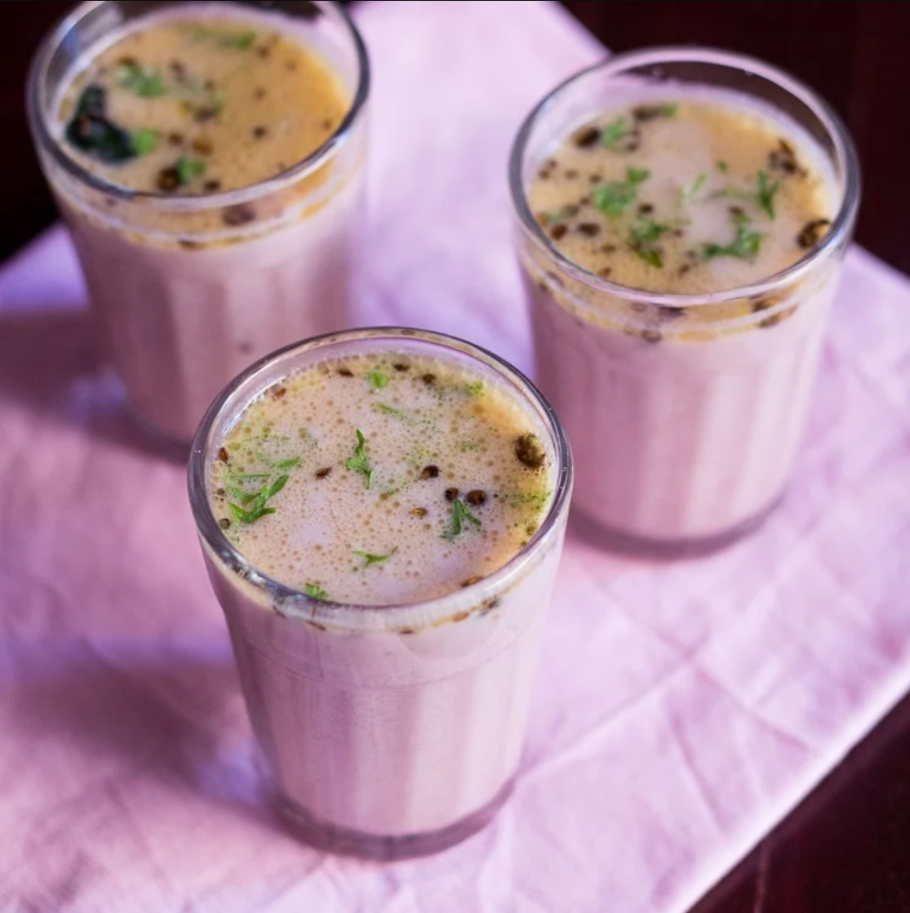

# Sol Kadhi

*The pale-pink Goan digestive: dried kokum rinds steeped in warm water, blended with thin coconut milk and a small temper of garlic, green chilli, cumin and coriander. Sipped at the end of every Goan and coastal Konkan meal to settle the stomach after a heavy fish curry.*

**Serves:** 4 small glasses

**Prep Time:** 10 minutes (plus 30 minutes for kokum soak)

**Cook Time:** 5 minutes

## Overview
Sol kadhi (sometimes spelled solkadhi) is the unofficial palate cleanser of the Konkan coast: Goa, coastal Maharashtra and Karnataka all serve it as the last thing on the table after a long lunch of fish curry, rice and prawn balchão. The colour is the giveaway: a soft dusty pink that comes from kokum (the dried rind of the Garcinia indica fruit, the same sour-fruit that gives kokum sharbat its colour and flavour). Unlike the sweet sharbat, sol kadhi is unsweetened, savoury and creamy: coconut milk gives the body, kokum gives the gentle tartness and that signature pink, and a fine temper of garlic, green chilli, cumin and coriander runs through it for warmth. The result is something between a drink and a thin soup; tradition says it cuts the oiliness of the meal and settles your stomach for an afternoon nap. It's also surprisingly drinkable on its own with a few pieces of pao bread on a hot Goan afternoon.

## Ingredients

### For the kokum infusion
- 8 to 10 dried kokum rinds (about 15 g; sold at any South Asian grocery)
- 250 ml warm water
- 1 teaspoon fine salt

### For the coconut base
- 400 ml tin of coconut milk (or 200 g grated fresh coconut blended with 400 ml warm water then strained)
- 100 ml cold water (to thin)

### For the tempering / blending
- 3 garlic cloves, peeled
- 1 green chilli, deseeded
- 1 teaspoon cumin seeds, dry-toasted
- A small handful of fresh coriander leaves
- Pinch of asafoetida (hing, optional)

### To serve
- Fresh coriander leaves
- Small glasses or katoris (small bowls)

## Method

### Stage 1 - Soak the kokum
1. Rinse the kokum rinds briefly under cold water, then put them in a heatproof bowl.
1. Pour over 250 ml of warm (not boiling) water and add the salt.
1. Press the rinds gently with your fingers to bruise them; they will start releasing their dark pink colour into the water.
1. Leave to soak 30 minutes. The water turns a deep maroon-pink and tastes pleasantly tart.

### Stage 2 - Blend the temper
1. In a small blender (or mortar and pestle), grind the garlic, green chilli, cumin seeds, coriander leaves and asafoetida (if using) into a smooth paste with a tablespoon of the kokum water.

### Stage 3 - Combine
1. Strain the kokum water through a fine sieve into a large jug, pressing the rinds to extract every last drop, then discard the rinds.
1. Whisk the coconut milk into the kokum water until smooth.
1. Stir in the temper paste.
1. Add the 100 ml cold water to thin (sol kadhi should be light, not thick like a curry).
1. Taste and adjust: more salt if flat, more kokum water if you want extra tartness, a pinch more cumin if you want extra warmth.

### Stage 4 - Chill briefly and serve
1. Refrigerate 15 to 30 minutes before serving; sol kadhi is best lightly chilled, not ice-cold.
1. Pour into small glasses or katoris.
1. Garnish each with a few fresh coriander leaves.
1. Serve at the end of a meal, or with a few pieces of bread for sipping.

## Notes
- **Dried kokum, not kokum syrup.** The dried purple rinds (sometimes called aamsul) are the proper base. Kokum syrup is sweet and gives a different drink.
- **Coconut milk thickness.** Tinned coconut milk varies; if yours is very thick, thin with a little more water. The right texture is pourable like single cream, not double.
- **The temper makes it.** Without the garlic-cumin-coriander grind, sol kadhi is just pink coconut water. The temper is what gives it depth.
- **Don't boil.** Sol kadhi is never cooked: the kokum is steeped, the temper is raw-ground, the coconut milk is stirred in cold. Heat would split the coconut and dull the kokum.

## Variations
- **Without garlic.** A milder version omits the garlic for a gentler, more dessert-like drink.
- **With curry leaves.** Crush 4 to 5 fresh curry leaves into the temper paste; gives a slightly more aromatic, Konkani style.
- **Mangalorean style.** Use thick coconut milk and skip the thinning water for a thicker, more pudding-like version.
- **With ginger.** Add a 1 cm piece of fresh ginger to the temper paste; adds warmth, useful in cooler months.

## Storage
- Sol kadhi keeps 2 days in a sealed jug in the fridge. The coconut can separate; give it a stir before pouring. Don't freeze: the coconut texture is wrecked.
