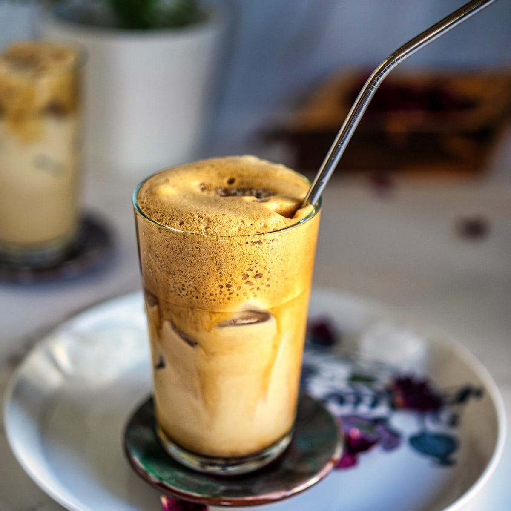

# Greek Frappé

*Instant coffee, cold water and sugar whipped into a tall thick foam, poured over ice in a tall glass, drunk through a straw for two hours over a Greek-island afternoon: the iced coffee invented by a Nescafé rep at the 1957 Thessaloniki trade fair.*

**Serves:** 1

**Prep Time:** 3 minutes

**Cook Time:** 0 minutes

## Overview
The Greek frappé is one of the great accidental drinks. Dimitris Vakondios, a Nescafé sales rep at the 1957 Thessaloniki International Fair, couldn't find hot water for his coffee break, so he shook instant Nescafé with cold water in a shaker. The resulting foamy iced coffee took off in Greece and is now the national drink — sold at every kafenio and beach bar from Athens to the smallest Cycladic island. The build is two heaped teaspoons of instant coffee (Nescafé Classic is the canonical brand), 1 to 4 teaspoons of sugar (Greeks name the sweetness levels: sketo = no sugar, metrios = medium, glykos = sweet), a small splash of cold water, all shaken or whisked into a thick caramel-coloured foam, then topped up with more cold water and milk (optional) over ice. Drunk slowly through a straw — the whole point of a frappé is that it lasts 90 minutes.

## Ingredients

### Per glass
- 2 heaped teaspoons instant coffee (Nescafé Classic; OR any decent instant coffee)
- 1 to 4 teaspoons caster sugar (1 = sketo-leaning, 2 = metrios, 3-4 = glykos)
- 3 tablespoons cold water (for the shake)
- Plenty of ice cubes
- 200 ml additional cold water (for topping up)
- 30 to 50 ml cold milk (optional, "me gala")

### To serve
- A tall glass
- A straw (a wide one — frappé foam clogs thin straws)

## Method

### Stage 1 - Make the foam
1. In a small jar with a lid OR a tall glass, combine the instant coffee, sugar and 3 tablespoons of cold water.
1. Shake hard (or whisk with a small frother) for 30 to 45 seconds. The mixture should turn into a thick caramel-coloured foam with stiff peaks — like a stiff hot-chocolate froth.

### Stage 2 - Build the drink
1. Fill a tall glass with ice cubes.
1. Pour the foam over the ice.
1. Top with cold water; pour slowly so the foam sits on top.
1. Add a splash of cold milk if going for "me gala"; stir very briefly.

### Stage 3 - Drink slowly
1. Add a wide straw.
1. Drink at a pace of one sip every minute or two over the next 90 minutes; frappés are explicitly slow drinks. The foam slowly collapses, the ice melts, the temperature stays cold all the way through.

## Notes
- **Nescafé Classic is the canon.** The Greek frappé was invented with it and Greek bars universally use it. Other instant coffees work but read slightly different.
- **The shake matters more than the ingredient.** Hard shaking is what creates the iconic thick foam. Half-shake = thin frappé. Full 30-second shake = thick stable foam that lasts.
- **Order in Greek.** "Frappé metrios me gala" = medium-sweet with milk. "Frappé sketos" = no sugar, no milk. Memorise these two and you can order anywhere in Greece.

## Variations
- **Freddo espresso.** A different drink, often confused with frappé. Made from real espresso shaken with ice (no foam), then strained over ice. Drier, more bitter, the third-wave evolution.
- **Cappuccino freddo.** Espresso shaken with sugar to form a foam, then topped with cold milk and frothed milk on top.

## Storage
- Drink immediately (well, over the next 90 minutes). Doesn't store.
