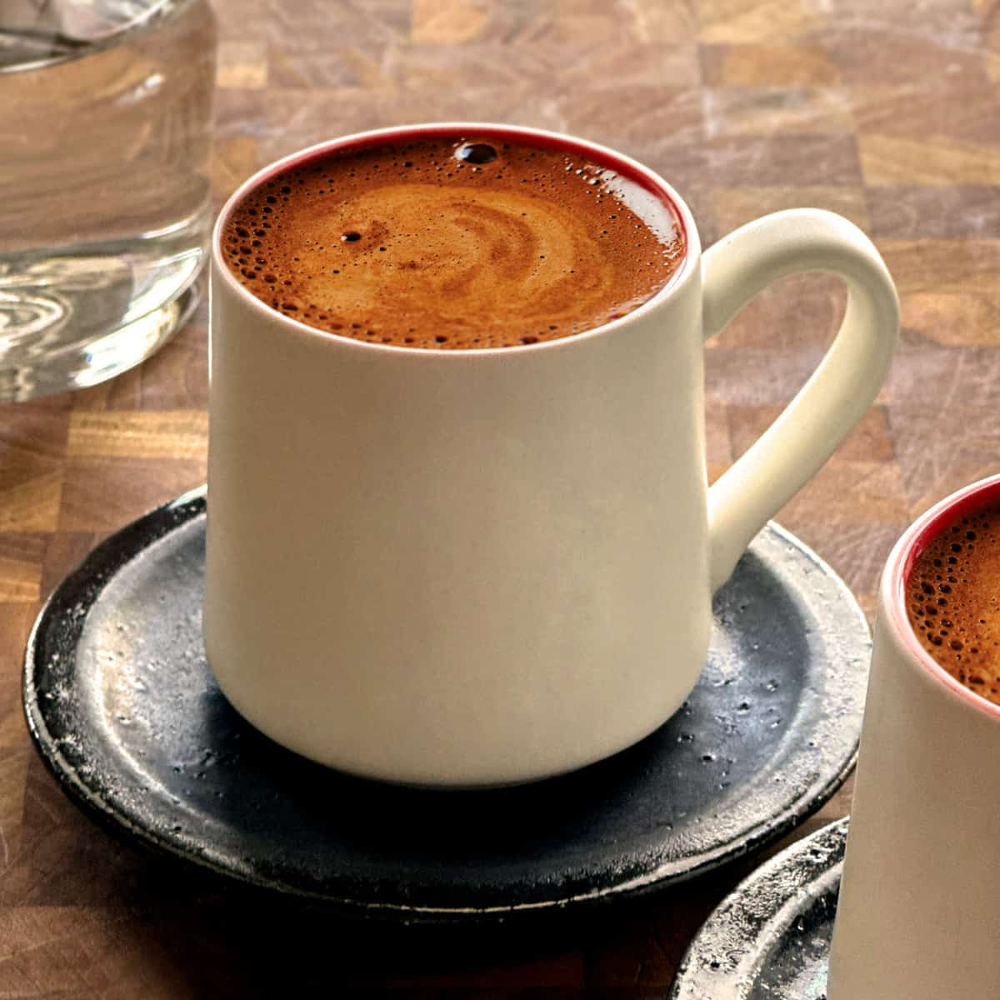

# Greek Coffee

*Finely-ground coffee simmered with sugar and water in a small long-handled briki, poured grounds-and-all into a demitasse cup with a thick foam (kaimaki) on top: the small cup that Greeks drink slowly over an hour on a kafenio terrace.*

**Serves:** 1

**Prep Time:** 2 minutes

**Cook Time:** 5 minutes

## Overview
Greek coffee (ellinikós kafés) - historically identical to Turkish coffee, called by different names due to political history - is brewed in a small long-handled copper or brass pot called a briki. Very finely ground coffee is mixed with cold water and sugar in the briki, brought up slowly to the boil, removed the moment a foamy "kaimaki" forms at the top, and poured grounds-and-all into a tiny demitasse cup. The grounds settle at the bottom; you drink the coffee from the top, leaving the grounds (or, optionally, reading them when you're done - Greek coffee fortune-telling is a thing). Sweetness is named: sketos (no sugar), metrios (medium, 1 tsp), glykos (sweet, 2 tsp). Served with a glass of cold water and often a small piece of loukoumi (Turkish delight) on the saucer.

## Ingredients

### Per cup
- 1 heaped teaspoon very finely ground coffee (the Greek/Turkish grind, finer than espresso - almost powder)
- 70 ml cold water (the demitasse cup, plus a little extra)
- Sugar to the level of sweetness ordered:
  - Sketos: no sugar
  - Metrios: ½ to 1 teaspoon
  - Glykos: 1.5 to 2 teaspoons
  - Variglykos (very sweet): 2.5 teaspoons

### Equipment
- A briki (small long-handled coffee pot, copper or stainless steel; from any Mediterranean grocery)
- A demitasse cup (60 to 70 ml)

### To serve
- A small glass of cold water
- A small piece of loukoumi (Turkish delight) or a biscotto

## Method

### Stage 1 - Combine in the briki
1. Pour the cold water into the briki (measure by filling the demitasse cup you'll be drinking from).
1. Add the sugar to taste; stir to dissolve.
1. Add the ground coffee; stir briefly to wet the grounds, then leave alone.

### Stage 2 - Slow heat
1. Place the briki over LOW heat. Greek coffee is brewed slowly - no rushing.
1. After 2 to 3 minutes, you'll see the grounds rise as a dark foam forms on the surface ("kaimaki").
1. The moment the foam threatens to bubble over the rim of the briki, take it off the heat. Do NOT let it boil over - you'll lose the foam.

### Stage 3 - Pour
1. Pour the coffee into the demitasse cup, foam first, then the rest.
1. The grounds settle to the bottom over 30 seconds; let it stand.

### Stage 4 - Serve
1. Set the cup on a small saucer with the glass of cold water and a small piece of loukoumi alongside.
1. Drink the coffee from the top of the cup; stop when you reach the muddy grounds.

## Notes
- **Grind finer than espresso.** Properly Greek/Turkish coffee needs powder-fine grind. Most pre-ground coffees won't be fine enough; either get specifically Greek/Turkish-ground coffee or grind extra-fine in a burr grinder.
- **The foam (kaimaki) is the point.** A Greek coffee without a foam crown is a failed brew. Watch the briki carefully - pull at the first sign of bubbling.
- **Sketos, metrios, glykos.** Memorise these three; ordering correctly in Greek is its own small pleasure.

## Storage
- Drink within 10 minutes. Cooled Greek coffee tastes flat.
