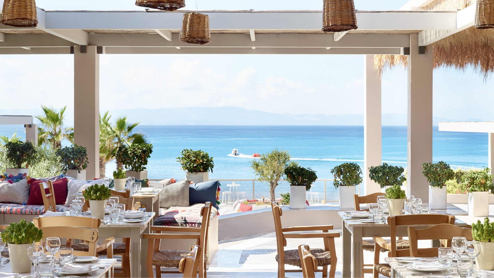

# Drinks of Greece

Frappé, the shaken iced instant coffee invented at the 1957 Thessaloniki Trade Fair, now ordered at every kafenion. Greek coffee from a briki on hot sand, ouzo with mezze, retsina from the barrel, and mountain tea (tsai tou vounou) for the cold.
