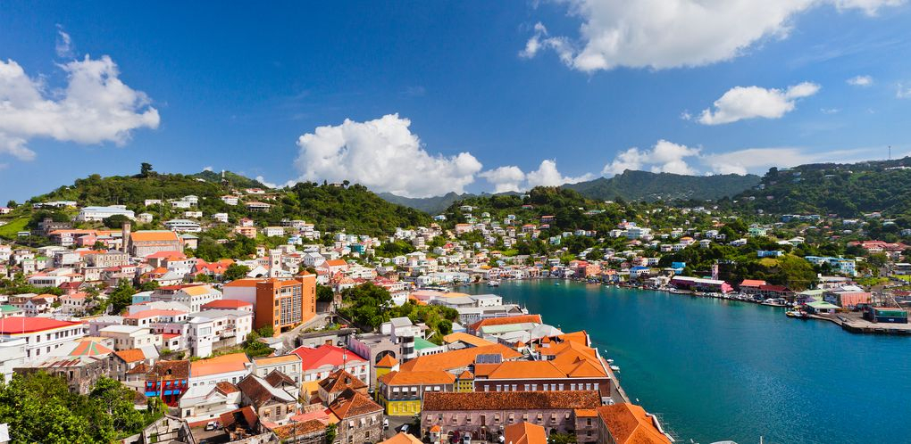

# Grenadian Drinks

Grenada drinks like an island that grows its own spice and distils its own rum. The Spice Island reputation runs straight through the glass: fresh-grated nutmeg floats on the top of every rum punch, cinnamon and clove perfume the sorrel at Christmas, and ginger root crushed by hand goes into everything from mauby to the morning sea-moss. Rum is the spirit (Clarke's Court and Westerhall, both distilled on the island), and the local 1-2-3-4 punch formula (one sour, two sweet, three strong, four weak) is the bar drink of every beach lime and yard limelight. The non-alcoholic side is just as deep: cold sorrel from boiled hibiscus, peanut punch, sea-moss thickened with condensed milk, and fresh nutmeg lemonade. Whatever is in the glass, a small grate of nutmeg over the top is the Grenadian signature.
