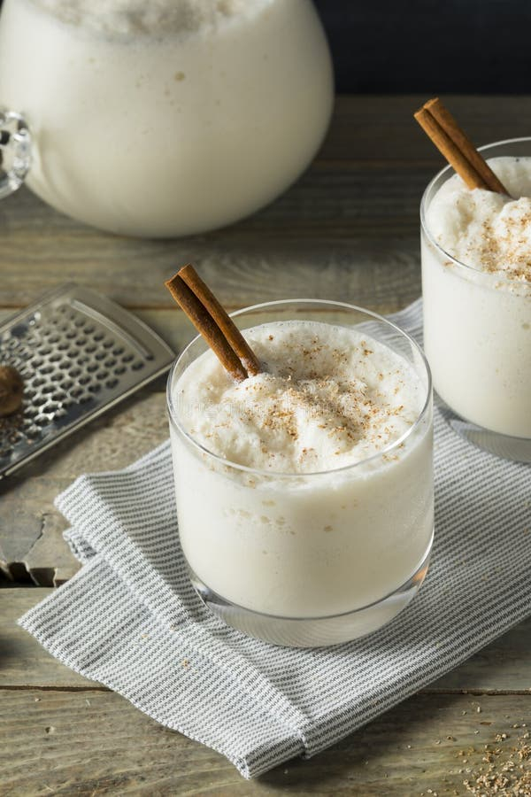

# Nutmeg Punch

*A creamy spiced rum-and-condensed-milk shaker drink built around heavy grated Grenadian nutmeg: the Christmas-morning glass, the Sunday-lunch glass, the warm-evening dessert in a tumbler.*

**Serves:** 2 generous tumblers

**Prep Time:** 5 minutes

**Cook Time:** None

## Overview
Nutmeg punch is the Grenadian creamy spiced cocktail, sat somewhere between an eggnog and a pina colada and unmistakably built around the island's signature spice. The base is sweetened condensed milk and whole milk shaken with dark rum, then heavily perfumed with fresh-grated nutmeg, cinnamon and a touch of vanilla. The drink goes pale beige with dark flecks of spice running through it, served very cold over ice in a small tumbler with one more grate of fresh nutmeg over the top. It carries a serious rum kick (the dairy and the sweet condensed milk hide the strength) and a deep warm-spice finish. The Christmas-morning glass, the Sunday-lunch refresher, and the most-asked-for drink at any Grenadian wedding or 'cool down'.

## Ingredients

- 200 ml whole milk
- 100 ml sweetened condensed milk
- 100 ml double cream (or coconut cream)
- 60 ml dark rum (Clarke's Court, Westerhall, or any Caribbean dark rum)
- 1 tsp fresh-grated nutmeg, plus extra for the top
- 0.5 tsp ground cinnamon
- 0.5 tsp vanilla extract
- 1 tsp Angostura bitters (optional but classic)
- A pinch of salt
- Plenty of ice

## Method

### Stage 1 - Combine the base
1. Combine the whole milk, condensed milk, cream, rum, nutmeg, cinnamon, vanilla, bitters and salt in a cocktail shaker or large jar.
2. Shake hard for 30 seconds; the mixture should be foamy on top.

### Stage 2 - Chill
1. Refrigerate 15 minutes if you have the time (the spice flavour deepens).
2. Or shake again over ice straight away if you don't.

### Stage 3 - Serve
1. Fill two short tumblers with ice.
2. Pour the punch over.
3. Grate fresh nutmeg generously over each glass.
4. Serve with a short stirrer.

## Notes
- **Fresh-grated nutmeg only:** the oils in ground jarred nutmeg flash off within weeks; a whole nutmeg grated to order is the whole point of the drink.
- **Shake hard:** the foam on top is part of the texture.
- **Adjust the rum:** the classic Grenadian build is heavier on rum (90 ml for two glasses), but 60 ml is the friendlier pour.
- **Don't skip the salt:** a pinch of salt sharpens the spice and stops the dairy tasting flat.

## Variations
- **With coconut milk:** swap the double cream for coconut cream for a fully tropical version.
- **With egg yolk:** beat one yolk into the base for a thicker eggnog-style punch.
- **Iced (frozen):** blend the whole drink with crushed ice for a frosty version.
- **Strong (Christmas spec):** 90 ml of rum and an extra tablespoon of condensed milk.
- **Without bitters:** for a sweeter softer punch, leave the Angostura out.

## Serving
- On Christmas morning · at Sunday lunch · as a dessert in a glass · with a slice of fruit cake · in small glasses as a closing nightcap.

## Storage
- Best fresh.
- Keeps 24 hours refrigerated in a sealed jar; shake well before pouring.
- The dairy will separate after a day; one good shake brings it back.

