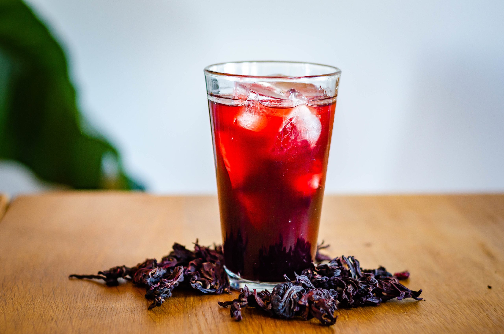

# Sorrel

*Deep-red Caribbean Christmas drink: dried hibiscus calyces steeped with ginger, clove and cinnamon, sweetened, strained, chilled and served over ice with a splash of rum at the festive table.*

**Serves:** 8 to 10 glasses (about 2 litres)

**Prep Time:** 10 minutes (plus 24 hours steeping)

**Cook Time:** 15 minutes

## Overview
Sorrel is the Caribbean's Christmas drink, brewed in every Grenadian kitchen from the first of December through to Old Year's Night. The base is dried sorrel (the calyces of Hibiscus sabdariffa, deep crimson and tart, sold in big bags at the market through the season), steeped in boiling water with fresh ginger, clove, cinnamon and a strip of orange peel, then left overnight to deepen colour and flavour. The strain is heavy, the sweetening is generous, and the rum (a serious splash of Clarke's Court or Westerhall) goes in for adults. The colour is jewel-deep ruby; the flavour is tart, warm-spiced and faintly floral. Served very cold over ice. The smell of Christmas in any Grenadian home.

## Ingredients

- 200 g dried sorrel (hibiscus) calyces
- 2 litres boiling water
- 1 large thumb fresh ginger, sliced into coins
- 6 whole cloves
- 1 large cinnamon stick
- 1 strip orange peel (no white pith)
- 1 strip lime peel
- 250 g caster sugar (adjust to taste)
- 4 tbsp dark rum per glass for the adult pour (optional)
- 1 tsp Angostura bitters (optional)

## Method

### Stage 1 - First steep
1. Rinse the dried sorrel briefly in cold water; tip into a large heat-proof bowl or jug.
2. Add the ginger coins, cloves, cinnamon stick, orange peel and lime peel.
3. Pour over the boiling water.
4. Cover; leave to steep at room temperature for 4 hours.
5. Transfer to the fridge; steep another 20 hours (24 hours total).

### Stage 2 - Strain
1. Strain through a fine sieve into a clean jug; squeeze the sorrel gently to extract.
2. Discard the spent calyces and spices.
3. The liquid should be deep ruby red.

### Stage 3 - Sweeten
1. Warm the strained sorrel gently in a saucepan.
2. Stir in the sugar; taste as you go.
3. Add the bitters if using.
4. The sweetness should sit just behind the tartness; keep it sharp, not syrupy.
5. Cool completely.

### Stage 4 - Serve
1. Fill tall glasses with ice.
2. Pour the cold sorrel over.
3. For adults, add 30-50 ml of dark rum per glass.
4. Garnish with a thin slice of lime.

## Notes
- **The 24-hour steep is the secret:** any less and the colour and flavour stay thin; any longer and it starts to taste woody.
- **Don't boil the sorrel:** boiling extracts bitterness; steeping in just-boiled water gives the cleanest flavour.
- **Adjust the sugar:** the dried calyces vary in tartness; taste before sweetening.
- **Skip the sieve squeeze:** pressing too hard releases tannins that turn the drink bitter.

## Variations
- **With pineapple peel:** add a strip of pineapple skin during the steep for a fruitier note.
- **With star anise:** add 2 star anise to the spices for a deeper warmth.
- **Lighter version:** halve the sugar and serve as a cold tea.
- **Concentrate:** steep with half the water, dilute to taste when pouring.
- **Fermented (Old Year's Night version):** sweeten heavier, seal in a jar with a piece of ginger, leave 4 days at room temperature; develops a slight fizz.

## Serving
- At Christmas lunch · on Boxing Day · poured straight from the fridge at the December lime · with a slice of black cake on the side · in a tall glass with a wedge of lime.

## Storage
- Keeps 2 weeks refrigerated in a sealed bottle.
- The colour deepens and the flavour mellows over the first 3 days.
- Freezes 3 months in sealed bottles (leave headspace for expansion).

