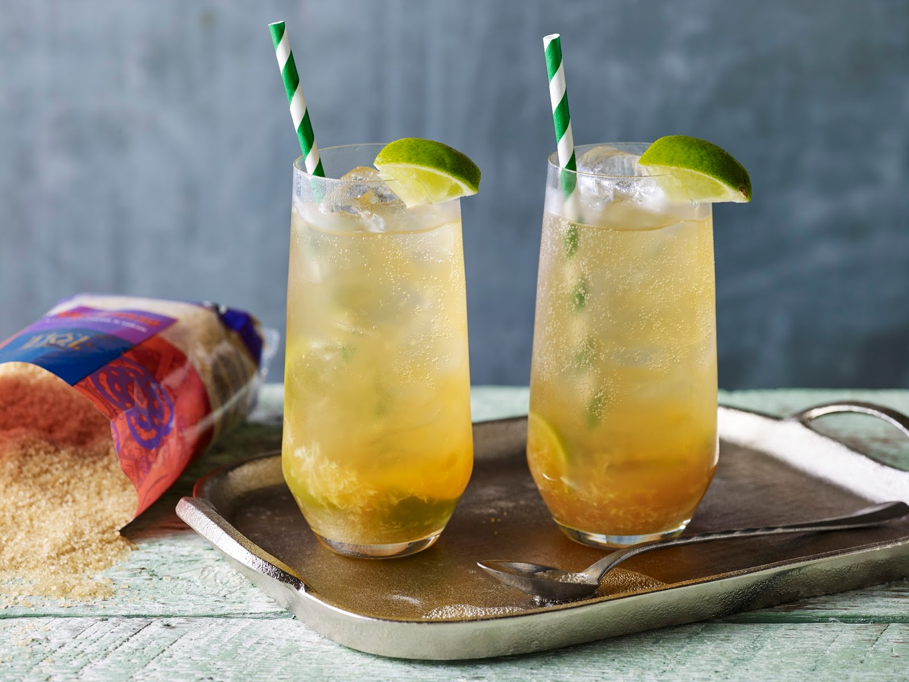

# Spice Island Rum Punch

*The Grenadian beach-bar classic, built on the 1-2-3-4 rule: one sour, two sweet, three strong, four weak, finished with Angostura bitters and a heavy grate of fresh nutmeg floating on the top.*

**Serves:** 4 tall glasses

**Prep Time:** 5 minutes

**Cook Time:** None

## Overview
The 1-2-3-4 rum punch is the Caribbean's bar formula, scratched onto the chalkboard of every Grenadian beach bar from Grand Anse to Sauteurs. One part sour (fresh lime juice), two parts sweet (sugar syrup or grenadine), three parts strong (dark Grenadian rum, Clarke's Court or Westerhall), four parts weak (fruit juice, usually orange and pineapple). Shaken hard over ice, poured into tall glasses, dashed with Angostura bitters and finished with a heavy grate of fresh-grated nutmeg floating on the foam. The colour is a glowing orange-pink, the flavour is bright and rummy with the warm-spice finish that marks every Grenadian drink. The most reliable cocktail in the southern Caribbean, and the one a Grenadian bartender will make you within thirty seconds of you sitting down.

## Ingredients

- 60 ml fresh lime juice (1 part sour)
- 120 ml sugar syrup or grenadine (2 parts sweet)
- 180 ml dark rum, Clarke's Court or Westerhall (3 parts strong)
- 240 ml fruit juice, half orange and half pineapple (4 parts weak)
- 1 tsp Angostura bitters
- Whole nutmegs for grating
- Plenty of ice
- Lime wedges and pineapple chunks to garnish

### For homemade sugar syrup (if not using grenadine)
- 100 g caster sugar
- 100 ml water

## Method

### Stage 1 - Make the sugar syrup (if needed)
1. Heat the sugar and water in a small pan until the sugar dissolves.
2. Cool completely before using.

### Stage 2 - Build the punch
1. Combine the lime juice, sugar syrup or grenadine, rum, orange juice and pineapple juice in a large jug.
2. Stir well.
3. Add the Angostura bitters.

### Stage 3 - Shake
1. Pour into a cocktail shaker (in batches if needed) with a small handful of ice.
2. Shake hard 15 seconds.
3. Strain back into the jug; this aerates the punch and chills it fast.

### Stage 4 - Serve
1. Fill four tall glasses with ice.
2. Pour the punch over.
3. Grate fresh whole nutmeg generously over the foam at the top of each glass.
4. Garnish with a pineapple wedge speared onto a lime slice.
5. Serve with a straw.

## Notes
- **The 1-2-3-4 ratio is the rule:** stick to it and the punch always balances; mess with it and the drink ends up either flat or fierce.
- **Fresh lime, not bottled:** bottled lime juice is sharp in the wrong way.
- **Dark rum, not white:** the deep molasses-rich rum is what gives the punch its colour and warmth.
- **The nutmeg is the Grenadian signature:** without the heavy fresh grate it's just a Caribbean punch; with it, it's Spice Island.

## Variations
**Coconut rum punch:** swap the orange juice for coconut water for a paler tropical version.
**Passion fruit rum punch:** swap half the orange juice for fresh passion fruit pulp.
**Frozen rum punch:** blend with crushed ice for a slushy bar version.
**Stronger (overproof):** use 90 ml of overproof rum and 90 ml of dark for the serious-drinkers' version.
**Punch bowl:** scale up x4 in a large jug with floating fruit slices for a party version.

## Serving
At a Grenadian beach bar · at a Sunday afternoon lime · poured from a jug at a wedding · with peanut nuts on the side · grated with extra nutmeg over the top to finish.

## Storage
- Best fresh; the lime juice goes flat within a few hours.
- The non-alcoholic mix (juices and syrup) keeps 2 days refrigerated; add the rum and lime to order.
- Do not freeze.
