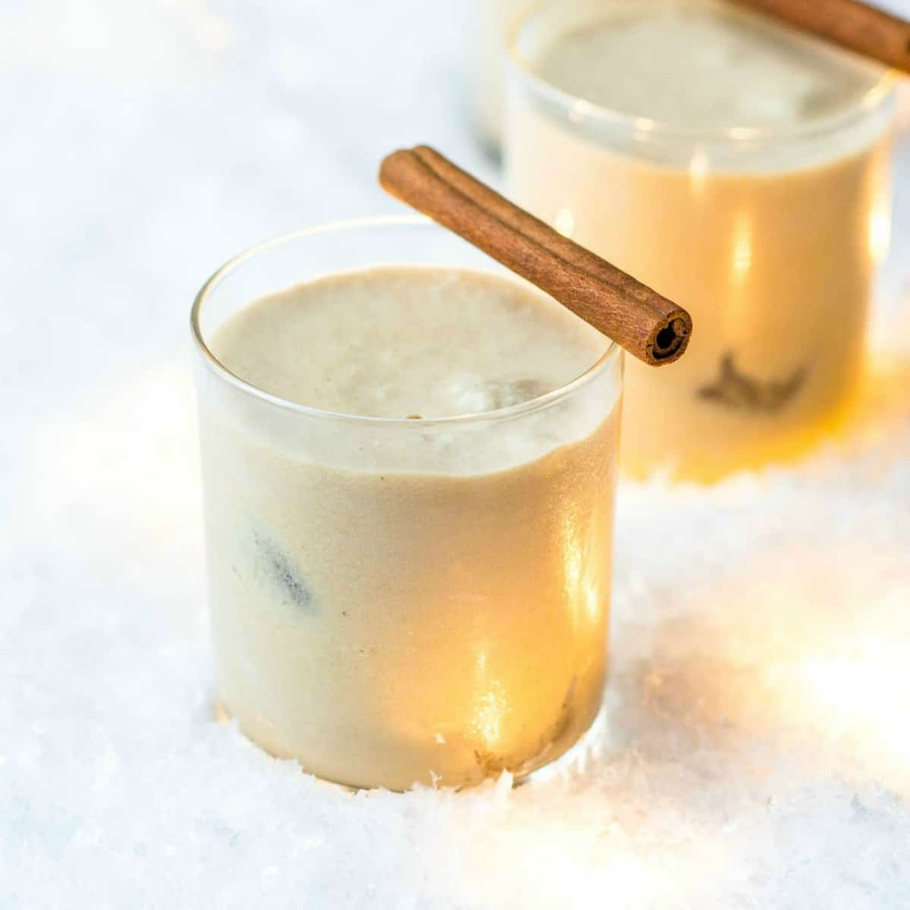

# Cremas

*Haitian coconut cream liqueur: white rum blended with coconut cream, evaporated milk, condensed milk, vanilla, cinnamon, nutmeg and almond extract: a thick eggnog-style drink served at every Haitian Christmas, wedding and birthday.*

**Serves:** 12 (makes 1 litre)

**Prep Time:** 10 minutes (plus 24 hours chilling)

**Cook Time:** 0 minutes

## Overview
Cremas (also spelled kremas, cremasse) is the Haitian Christmas drink and the most iconic celebration pour in Haitian-American kitchens: white Haitian rum (Barbancourt or Rhum Sirop) blended hard with coconut cream, evaporated milk, sweetened condensed milk, vanilla, ground cinnamon, ground nutmeg and a hit of almond extract or anise. The result is thick, creamy, sweet, around 10-14% alcohol, served in small shot glasses or cordial glasses chilled. Tastes like a Caribbean cousin of eggnog or coquito. Every Haitian family has a recipe; this is a baseline version. Made in big batches at Christmas and dribbled out across two weeks of family visits.

## Ingredients

- 250 ml white rum (Barbancourt 3-star is the traditional Haitian choice; Bacardi or Plantation 3 Stars work)
- 400 ml coconut cream (the thick top-of-the-tin layer; or "cream of coconut" like Coco Lopez for sweeter)
- 400 ml evaporated milk (Carnation full-fat)
- 250 ml sweetened condensed milk
- 200 ml coconut milk (full-fat tinned)
- 1 tablespoon vanilla extract
- 1 teaspoon almond extract (or 1 teaspoon anise extract; both are seen)
- 1 teaspoon ground cinnamon
- ½ teaspoon ground nutmeg
- Pinch of fine salt
- Optional: zest of 1 lime (some recipes add it for brightness)

### To serve
- Small shot glasses or cordial glasses (cold)
- A grating of fresh nutmeg on top

## Method

1. Combine all ingredients in a blender. Blend on high for 60 seconds until completely smooth and uniformly creamy.
1. Pour into a sealed bottle or jug.
1. Refrigerate at least 24 hours - the flavours need time to marry and the texture thickens slightly as the coconut cream solidifies.
1. Before serving, shake the bottle (the cream separates and rises to the top while sitting).
1. Pour into small chilled glasses; grate fresh nutmeg on top.

## Notes
- **Barbancourt is the canon.** Haitian rum specifically; other white rums work but the Haitian provenance is part of the dish.
- **Coconut cream vs cream of coconut.** Plain coconut cream gives a less-sweet drink; Coco Lopez-style sweetened cream of coconut gives the candy-sweet version most family recipes use. Either works.
- **Almond or anise - pick one.** Both are traditional in different families; almond is more common, anise is more polarising but distinctive.
- **Keep it cold.** Cremas served warm is just sweet milk. Cold from the fridge is the traditional serve.

## Storage
- Refrigerate sealed up to 3 weeks. The alcohol preserves it; the coconut cream may separate but blends back together when shaken.
