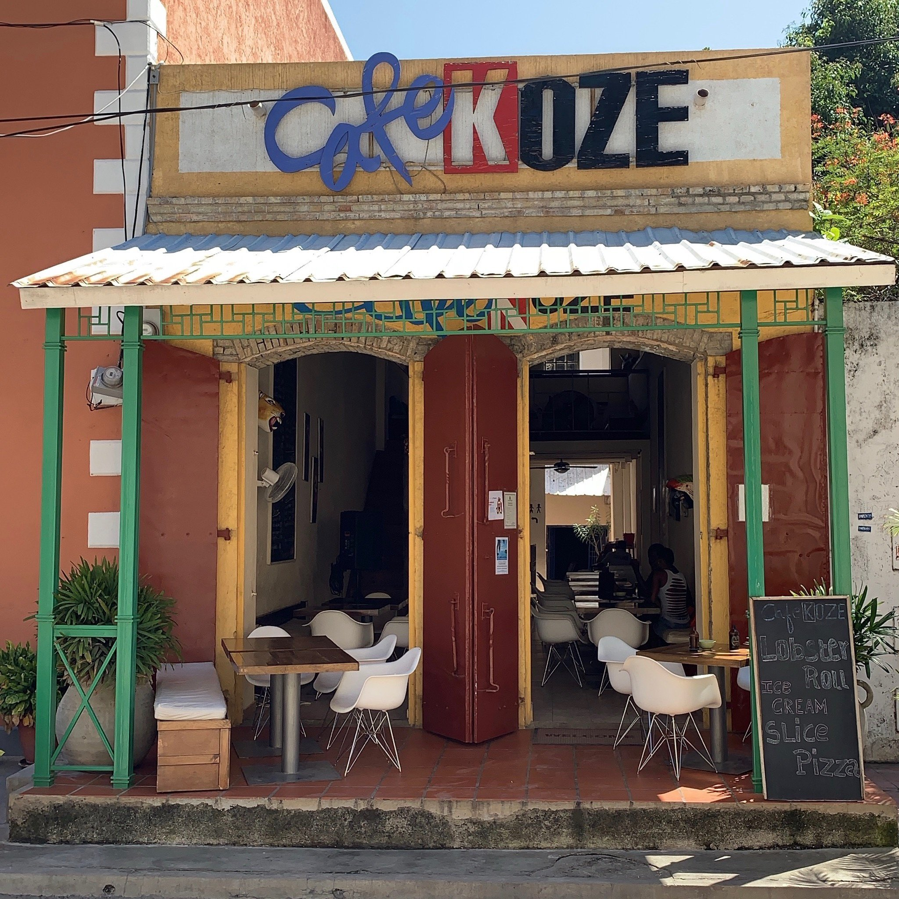

# Drinks of Haiti

Akasan, the thick spiced corn-flour drink that doubles as breakfast; cremas, the coconut-rum Christmas drink; tropical fruit punches built from soursop, mango and passionfruit; Barbancourt rum sipped neat or stirred into a 'ti punch.
