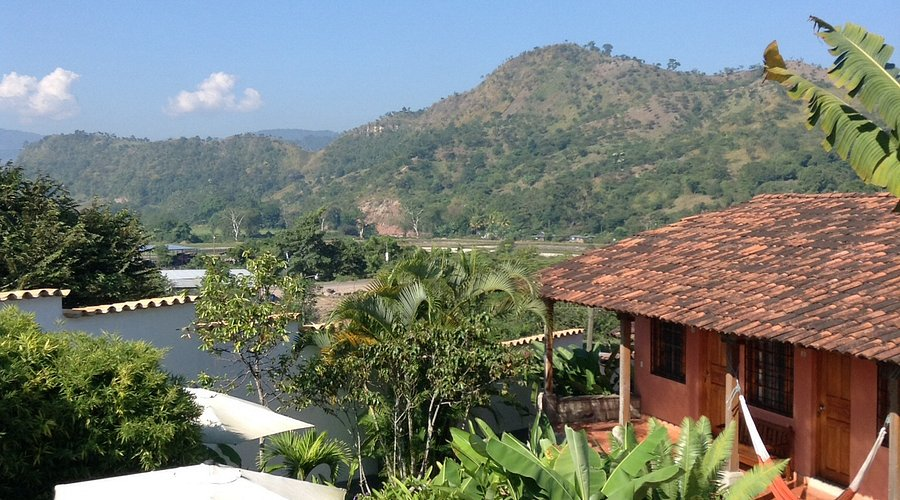

# Drinks of Honduras

Horchata with rice and cinnamon, atol de elote (the hot sweetcorn drink served at street stalls), limonada con chan (basil seeds bobbing in fresh lemonade), and Honduran coffee straight from the Marcala or Copán beans.
