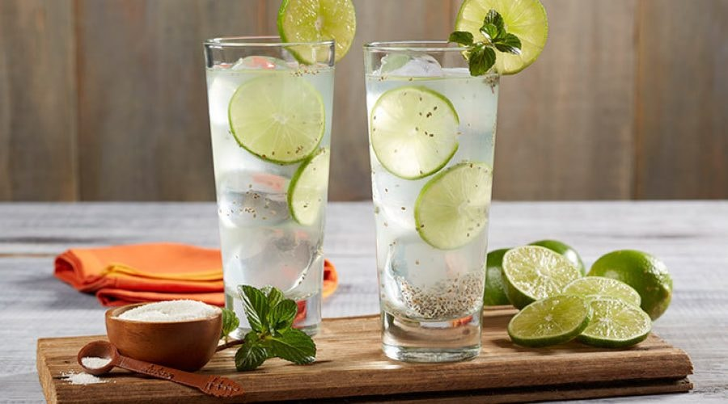

# Limonada con Chan

*Honduran limeade with chia seeds: fresh lime juice over ice with sugar, water and a tablespoon of soaked chia that swells into bubble-tea-like jelly pearls suspended through the drink.*

**Serves:** 4

**Prep Time:** 10 minutes (plus 30 minutes soaking)

**Cook Time:** 0 minutes

## Overview
Limonada con chan is the Honduran (and broader Central American) summer drink: a sharp-sweet limeade with chia seeds (called "chan" in Honduran Spanish) that have been soaked in water until they swell into small translucent pearls with a tapioca-like chew. Served over ice in tall glasses, the chia floats and sinks through the drink, giving every sip a texture between liquid and bubble tea. Cooling, light, slightly nutty from the chia. Especially welcome in the punishing late-spring Honduran heat. The Mexican version of this drink is called limonada con chia or agua de chia; the principle is identical.

## Ingredients

- 2 tablespoons chia seeds
- 200 ml cold water (for soaking)
- 150 ml fresh lime juice (from 8 to 10 small limes)
- 1.2 litres cold water
- 120 g caster sugar (or to taste)
- Pinch of fine salt
- Plenty of ice cubes

### To serve
- Lime slices
- A sprig of mint per glass

## Method

1. Soak the chia seeds in the 200 ml of cold water for 30 minutes. They'll swell to about 4 times their dry volume and develop a gel-like coating.
1. In a large jug, combine the soaked chia (with the soaking water), lime juice, 1.2 litres cold water, sugar and salt.
1. Stir well; the chia should distribute evenly through the liquid.
1. Taste and adjust sweetness or lime.
1. Refrigerate at least 30 minutes.
1. Pour over ice in tall glasses; stir each glass before drinking to redistribute the chia, which tends to settle. Garnish with lime and mint.

## Notes
- **Soak the chia first.** Adding dry chia to the drink right before serving means hard seeds that take ages to soften. 30 minutes of cold-water soak is the move.
- **Stir before each pour.** Chia settles to the bottom of the jug; whisk briefly before refilling glasses.
- **Lime varieties matter.** Small Mexican limes (Key limes) are closest to the Honduran original; standard Persian limes work fine.

## Storage
- Refrigerate up to 24 hours. Beyond that the chia gets gummy.
