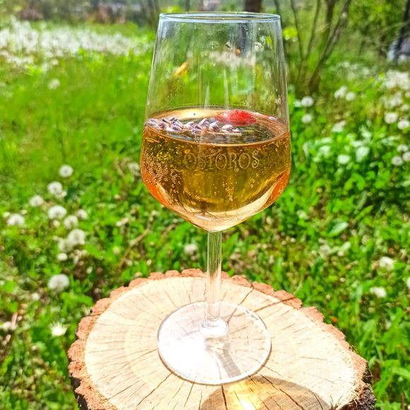

# Fröccs (Hungarian Wine Spritzer)

*Cold dry white wine cut with chilled soda water in tall glasses, served in named ratios that every Hungarian knows by heart. The everyday drink of Budapest summer terraces, Balaton boat docks and village porches.*

**Serves:** 2 tall glasses (this recipe is for nagyfröccs, the most common ratio)

**Prep Time:** 2 minutes

**Cook Time:** 0 minutes

## Overview
Fröccs is so embedded in Hungarian life that the language has its own taxonomy for it: a precise set of named ratios that everyone over the age of fifteen can recite. The base is always Hungarian dry white wine (Olaszrizling or Furmint are classics) and chilled soda water, but the proportions matter. *Kisfröccs* is 1 dl wine to 1 dl soda (a small spritz, the lunchtime version). *Nagyfröccs*, the most common, is 2 dl wine to 1 dl soda. *Hosszúlépés* (literally "long step") flips it: 1 dl wine to 2 dl soda. *Házmester* (the building caretaker) is the serious 3 dl wine to 2 dl soda. *Polgármester* (the mayor) is the largest, 6 dl wine to 4 dl soda. The ratios let you order with precision: a quick early-evening drink versus an all-night porch session. The serve is always the same: a tall glass, plenty of ice, the wine poured first, the soda poured fast from a high pressurised siphon so it foams. Hungarians prefer their fröccs colder than most British drinkers think possible.

## Ingredients

### For two nagyfröccs (the everyday standard)
- 400 ml dry Hungarian white wine, very cold (Olaszrizling, Furmint, Hárslevelű, Cserszegi Fűszeres; a chilled supermarket pinot grigio works as a stand-in)
- 200 ml chilled soda water (Hungarian fröccs uses pressurised siphon water; tonic water is wrong, lemonade is wrong)
- Plenty of ice cubes

### To serve
- 2 tall glasses, chilled in the freezer for 10 minutes
- A small slice of lemon per glass (optional, not strictly traditional)

## Method

### Stage 1 - Chill everything
1. The wine should come straight from the fridge (about 8°C). Lukewarm wine ruins fröccs.
1. The soda water should be just as cold; keep the bottle in the fridge.
1. Stick the glasses in the freezer for 10 minutes before serving if you have time.

### Stage 2 - Build the glass
1. Fill each chilled glass two-thirds full with ice cubes.
1. Pour 200 ml (2 dl) of cold wine into each glass over the ice. The ratio for nagyfröccs is two parts wine to one part soda.
1. Top with 100 ml (1 dl) of soda water per glass, pouring from a high pressurised siphon if you have one, so it foams briefly on top. From a bottle, pour fast and from height for the same effect.

### Stage 3 - Don't stir
1. Don't stir; the bubbles do the mixing. Stirring kills the carbonation immediately.
1. Optional: a small slice of lemon clipped on the rim of each glass.

### Stage 4 - Serve
1. Serve immediately while the soda still has its fizz.

## Notes
- **The ratios matter.** Pick the right name for the time of day and company. *Kisfröccs* for lunch (drives well), *nagyfröccs* for an early evening, *hosszúlépés* for a long lazy afternoon when you want to keep drinking without getting wobbly. *Polgármester* is for the late evening when you've already given up driving.
- **Soda water, not tonic, not lemonade.** Tonic adds quinine bitterness; lemonade adds sugar. Fröccs is dry and clean, and only soda water gives that.
- **Wine quality matters less than wine temperature.** A drinkable everyday Hungarian white from the supermarket works fine; just make sure it's properly cold. Lukewarm £20 wine makes worse fröccs than ice-cold £5 wine.
- **Pressurised siphon.** If you're a Hungarian household with a soda siphon (szódagép), use it. The forced carbonation gives a much sharper, more energetic fizz than bottled soda. From a bottle, pour fast and from height.

## Variations
- **Kisfröccs (small spritz, 1 dl + 1 dl).** The lunchtime version, low alcohol, drives well.
- **Hosszúlépés ("long step", 1 dl wine + 2 dl soda).** Soda-heavy, for the long afternoons. Almost a teetotal drink.
- **Házmester ("caretaker", 3 dl + 2 dl).** Strong, the after-work-on-a-Friday version.
- **Vörös fröccs.** Made with red wine (Kékfrankos, Kadarka). Less common but appears in winter; same ratios apply.
- **Rosé fröccs.** Increasingly popular with Lake Balaton rosés.

## Storage
- Doesn't store. Build to order. The wine, however, keeps a couple of days in the fridge with the cork pushed back in.
