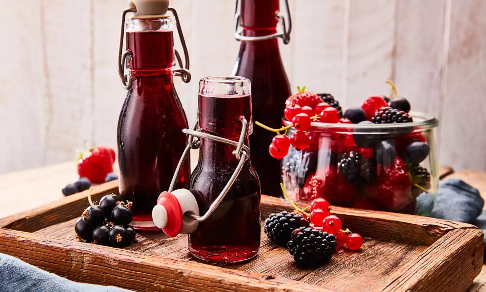

# Szörp (Hungarian Fruit Cordial)

*Hungarian fruit syrup made by macerating ripe summer fruit with sugar and a touch of citric acid, then diluting with cold water or soda for a refreshing kids' drink that adults secretly drink too.*

**Serves:** makes about 700 ml of cordial (each litre dilutes to roughly 8 glasses)

**Prep Time:** 15 minutes

**Cook Time:** 30 minutes (plus 24 hours steeping)

## Overview
Szörp is the Hungarian fruit cordial that fills every household pantry in summer: ripe seasonal fruit (elderflower, raspberry, sour cherry, blackcurrant) macerated with sugar and citric acid, simmered briefly, strained and bottled. Diluted with cold still water or soda water at the glass, it's the everyday non-alcoholic Hungarian drink, at every kids' party, every picnic, every aunt's kitchen. Particularly common: bodza szörp (elderflower), meggy szörp (sour cherry), málna szörp (raspberry). Sold commercially in 0.7-litre bottles at every Hungarian supermarket, but homemade is sharper and brighter.

## Ingredients

### Szörp base (raspberry version)
- 500 g fresh raspberries (or sour cherries, blackcurrants, elderflower heads)
- 500 g caster sugar
- 1 litre cold water
- 1 tablespoon citric acid (or 60 ml fresh lemon juice; citric acid is the Hungarian tradition and preserves better)
- Zest of 1 lemon (in wide strips)

### To serve
- Cold still or sparkling water (1 part szörp to 5 to 7 parts water)
- Plenty of ice cubes
- Fresh fruit and mint for garnish

## Method

1. Combine the raspberries, sugar, water and lemon zest in a saucepan over medium-low heat.
1. Stir gently until the sugar dissolves; bring to a simmer for 10 minutes. The fruit will collapse and release its colour and juice.
1. Off the heat, stir in the citric acid (or lemon juice).
1. Cover with a clean cloth and let steep at room temperature for 12 to 24 hours (the longer steep extracts more colour and flavour).
1. Strain through a fine sieve lined with muslin into a clean jug; press the fruit lightly to extract more liquid (don't press hard or the szörp goes cloudy).
1. Pour into sterilised bottles (rinsed with boiling water and dried); seal.

### To serve
1. Pour 50 to 70 ml of szörp into a tall glass.
1. Top with 300 to 400 ml cold still or sparkling water.
1. Add ice; garnish with fresh fruit and a mint sprig.

## Notes
- **Citric acid preserves better than lemon.** A tablespoon of citric acid gives the szörp 3-month shelf life; with just lemon juice it's 3 weeks. Hungarian supermarkets sell citric acid by the kilo.
- **Steep, don't boil down.** Long simmering destroys delicate fruit aromas; a brief simmer plus a long cold steep is the right shape.

## Storage
- Sealed bottles keep 3 months in a cool cupboard, longer in the fridge. Open bottles refrigerate for 6 weeks.
