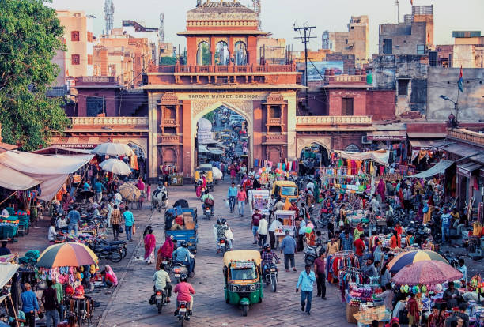

# Drinks of India

The cup that ten million Indians wake up to and the long cold glass that follows every Punjabi lunch. Lassi (sweet, salted, fruited) for the heat; masala chai simmered with cardamom and ginger for the cold; kahwa for the in-between. Yogurt, spices, milk and a serious sugar hand are the through-lines.
