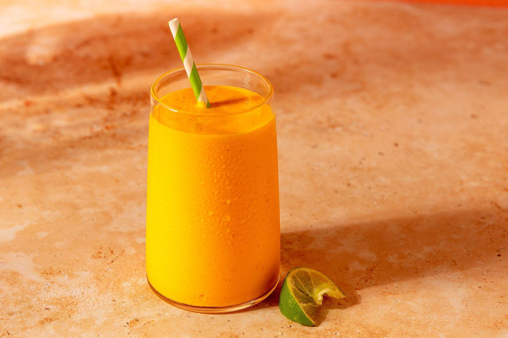

# Mango Lassi

*The drink that comes with the Indian takeaway: cold yogurt, ripe Alphonso mango, and just enough sugar to ride the curve of the fruit.*

**Serves:** 4

**Prep Time:** 10 minutes

**Cook Time:** 0 minutes

## Overview
Mango lassi is the Indian restaurant pour everyone in Britain knows, but at its best it's hardly a recipe at all: ripe Alphonso pulp blended with thick yogurt and a splash of milk, sweetened only enough to lift the fruit, perfumed with a whisper of cardamom. Alphonso is the mango that matters here, and tinned Alphonso pulp from any South Asian grocer is genuinely better than middling fresh mango for this drink, the colour deeper, the flavour resinous and floral and concentrated. The texture lands somewhere between a smoothie and a milkshake; thick enough that the straw stands up, but not so thick you can chew it. Pour into chilled glasses straight from the blender, dust with cardamom and a few chopped pistachios, and drink it cold with anything spicy on the table.

## Ingredients

### Lassi base
- 400 g tinned Alphonso mango pulp (or 600 g very ripe fresh Alphonso / honey mango, peeled and chopped)
- 500 g thick full-fat plain yogurt (Greek-style or whole-milk dahi)
- 150 ml cold whole milk (or cold water; milk gives a creamier finish)
- 2 to 4 tablespoons caster sugar (taste-dependent; tinned pulp is sweeter, may need none)
- 6 green cardamom pods (lightly crushed, seeds only)
- Pinch of fine salt (sharpens the fruit)

### To serve
- Plenty of ice cubes
- Pinch of ground cardamom (for dusting)
- 2 tablespoons pistachios (chopped fine)
- Saffron threads (optional, for the top)

## Method

### Stage 1 - Crush the cardamom
1. Lightly crush the green cardamom pods in a pestle and mortar to crack the husks.
1. Pick out the small black seeds and discard the green husks.
1. Grind the seeds to a coarse powder.

### Stage 2 - Blend
1. Tip the mango pulp, yogurt, milk, sugar (start with 2 tablespoons), cardamom and salt into a blender.
1. Blend on medium-high for 45 to 60 seconds until completely smooth and frothy.
1. Taste; add more sugar a tablespoon at a time if the fruit is under-sweet.
1. Check the consistency: it should pour but coat the back of a spoon thickly. Thin with more milk if needed.

### Stage 3 - Serve
1. Half-fill four chilled tall glasses with ice cubes.
1. Pour the lassi over the ice; the foam rises to the top.
1. Dust with ground cardamom, scatter chopped pistachios, and float a few saffron threads on top if using.
1. Serve immediately, ideally alongside something spicy that needs cooling down.

## Notes
- **Alphonso is the right mango.** Honey mangoes (Ataulfo) work too. Avoid stringy or bland mangoes; you can't blend flavour back in if it's not there.
- **Tinned beats average fresh.** Indian grocers stock Alphonso pulp tinned year-round, and the pulp is picked at peak ripeness and processed straight away. Don't apologise for it.
- **Sugar is a corrective, not a default.** Start with the smallest amount and only add more if the fruit needs the lift. A perfectly ripe mango barely needs any.
- **Cold ingredients matter.** Yogurt straight from the fridge, mango from the fridge, milk from the fridge; the blender warms things slightly so you want everything starting cold.

## Variations
- **Mango-rose lassi.** Add ¼ teaspoon rose water with the cardamom for a more aromatic, floral finish.
- **Mango-banana lassi.** Add one small ripe banana to the blender; reduces the need for sugar and gives an even creamier mouthfeel.

## Storage
- Best within an hour of blending; the lassi separates and the foam settles after that.
- Refrigerate up to 24 hours in a sealed jug; blend briefly or whisk hard before serving.
- Freezes 2 months as ice lollies in moulds, the kind of summer treat children request on rotation.
