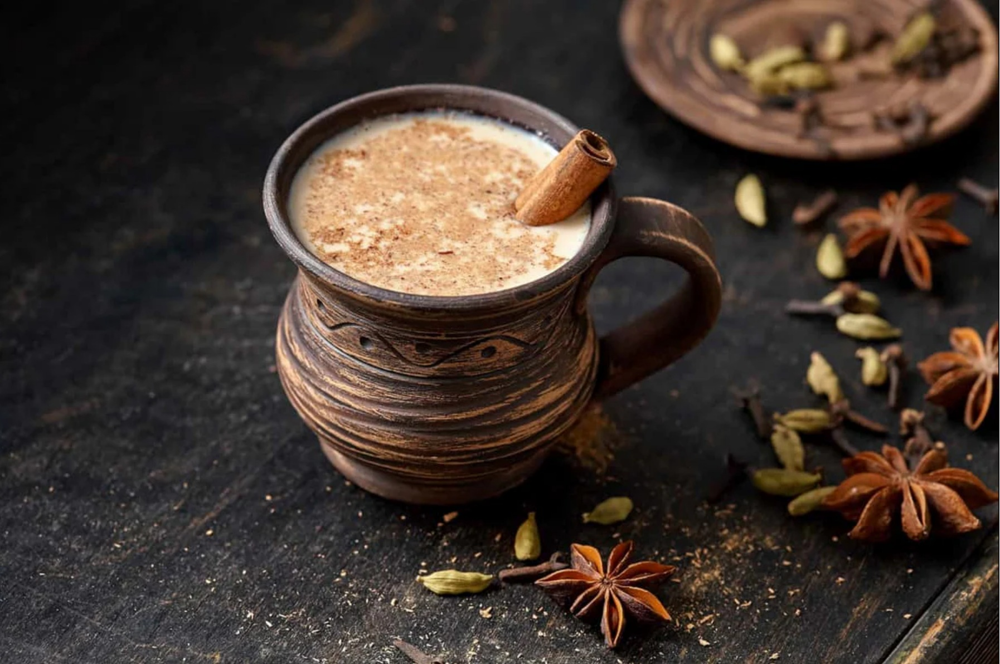

# Masala Chai

*Strong Assam tea simmered with whole spices, milk and sugar: the cup that ten million Indians wake up to and that every chai-wallah on a Mumbai street corner pours from a battered kettle.*

**Serves:** 2

**Prep Time:** 5 minutes

**Cook Time:** 10 minutes

## Overview
This is the chai of Indian kitchens and roadside stalls, and it bears very little resemblance to the "chai latte" syrup at western coffee chains. The technique is simmering, not steeping: water, freshly bashed whole spices and a piece of ginger come to a boil first, the loose-leaf tea (always loose, never bags; CTC Assam is the standard) goes in next, then the milk (whole, never skimmed; the tea is robust enough to handle the fat), and the lot simmers gently for several minutes while the colour deepens to the proper terracotta-brown. Sugar at the end, stirred until it dissolves. Pour through a strainer into small glasses or steel tumblers, the way it's served on every Indian platform, and drink it before it cools. Cardamom, cinnamon, cloves, black pepper and ginger are the traditional spice blend; some kitchens add fennel, star anise or nutmeg. There's no single right ratio, and every Indian grandmother will tell you hers is the best.

## Ingredients

### Spice blend
- 4 green cardamom pods (lightly crushed)
- 4 cloves
- 1 cinnamon stick (5 cm)
- ½ teaspoon black peppercorns
- 1 star anise (optional)
- ½ teaspoon fennel seeds (optional)
- 3 cm fresh ginger (peeled, thinly sliced or grated)

### Chai
- 350 ml cold water
- 2 heaped teaspoons loose-leaf strong black tea (CTC Assam is traditional; English Breakfast at a pinch)
- 250 ml whole milk
- 2 to 3 teaspoons sugar (taste-dependent; chai is supposed to be sweet)

### To serve
- Pour straight into small glasses or steel tumblers

## Method

### Stage 1 - Bash the spices
1. Tip the cardamom, cloves, cinnamon, peppercorns, star anise (if using) and fennel (if using) into a pestle and mortar.
1. Pound just enough to crack the pods and split the cinnamon stick; you don't want a powder, you want crushed spices that release flavour when simmered.

### Stage 2 - Boil the spice water
1. Put the crushed spices and the ginger slices into a saucepan with the cold water.
1. Bring to a boil over high heat, then reduce to medium-low.
1. Simmer for 4 to 5 minutes; the water should turn a pale amber and smell strongly of cardamom and ginger.

### Stage 3 - Add the tea
1. Tip in the loose-leaf tea (or open the bags if you must use bags; loose is better).
1. Bring back up to a simmer for 1 to 2 minutes; the colour will deepen to a rich brown.

### Stage 4 - Add the milk and sugar
1. Pour in the milk; stir gently as the temperature drops then rises.
1. Bring back to just below a boil (you'll see the milk start to foam at the edges); reduce heat the moment it threatens to boil over.
1. Simmer gently for 2 to 3 minutes; the chai should turn from dark to a proper milky-brown caramel colour.
1. Stir in the sugar; taste, adjust.

### Stage 5 - Strain and serve
1. Strain through a fine sieve into two small glasses or steel tumblers, holding back the spices and ginger.
1. Serve immediately while properly hot; chai cools fast in a small glass and is no good lukewarm.

## Notes
- **Loose-leaf CTC Assam is the right tea.** CTC stands for "crush, tear, curl" and is the granular black tea designed to simmer in milk; bagged tea works but gives a thinner, less concentrated drink.
- **Bash the cardamom, don't grind it.** Crushed pods release their flavour gradually as they simmer; ground cardamom releases everything in 30 seconds and tastes harsh.
- **Whole milk holds up.** Skimmed milk goes thin and chalky in chai; semi-skimmed is acceptable; whole milk is the canon.
- **Sweet chai is correct chai.** Most westerners under-sugar this drink. Two to three teaspoons per two cups is normal; chai-wallahs in India often use four or five.

## Variations
- **Adrak chai.** Heavy on the ginger: triple the ginger to 9 cm, drop the fennel. The morning chai for a cold throat.
- **Elaichi chai.** Cardamom-forward: double the cardamom to 8 pods, drop the cloves and cinnamon. Lighter, more aromatic, common in northern Indian households.
- **Kashmiri kahwa.** Green tea variant with saffron, almond and cardamom; no milk. Different drink entirely but worth knowing about.
- **Cutting chai.** A small half-cup of chai served between meals at a Mumbai chai stall; the everyday pour for a quick break.

## Storage
- Drink immediately; chai goes stale within 30 minutes of brewing.
- The dry spice mix (cardamom, cloves, cinnamon, peppercorns, fennel ground together coarsely) keeps in a jar for a month and saves 5 minutes per brew.
- Don't refrigerate: the milk separates and the spices over-extract on rewarming.
