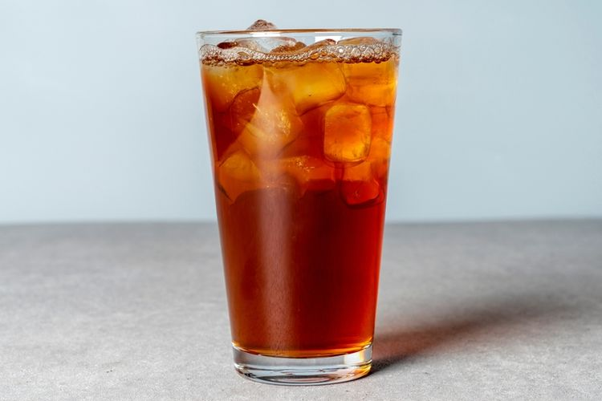

# Es Teh Manis

*Indonesia's default iced tea: strong black tea brewed hot, sweetened heavily while still warm, poured over a tall glass of crushed ice and drunk through a straw at every warung from Jakarta to Bali.*

**Serves:** 4

**Prep Time:** 3 minutes

**Cook Time:** 8 minutes

## Overview
Es teh manis ("sweet iced tea" in Indonesian) is what Indonesians actually order at warungs (small food stalls): even more than coffee. The build is strong black tea (Sariwangi or any Indonesian Ceylon blend) brewed hard, generously sweetened with sugar while still warm so it dissolves cleanly, then poured over a tall glass of crushed ice and finished with a paper or plastic straw. Sometimes a wedge of lime sits on the rim. Considered the universal accompaniment to spicy Indonesian food, the sweetness offsets the chilli, the ice cuts the heat. A glass at every meal.

## Ingredients

- 800 ml just-boiled water
- 4 tea bags (Indonesian Sariwangi, OR strong English Breakfast / Ceylon)
- 6 to 8 tablespoons caster sugar (Indonesians like it properly sweet)
- 200 ml cold water (for diluting)
- Plenty of crushed or cubed ice
- Lime wedges (optional)

### To serve
- Tall glasses
- Plastic or paper straws

## Method

1. Pour the just-boiled water over the tea bags in a teapot or heatproof jug. Steep 5 minutes.
1. Lift out the tea bags; stir in the sugar until completely dissolved.
1. Add the cold water to drop the temperature; cool to room temperature.
1. Fill tall glasses to the brim with crushed ice.
1. Pour the sweetened tea over the ice.
1. Add a wedge of lime and a straw.

## Notes
- **Properly sweet.** Indonesian palates expect this drink very sweet. Cut the sugar to 4 tablespoons if you want a milder version, but the original is glykos.
- **Crushed ice is traditional.** Cubed works but melts faster and dilutes more.

## Storage
- The sweetened tea base keeps in the fridge for 3 days; pour over fresh ice per glass.
