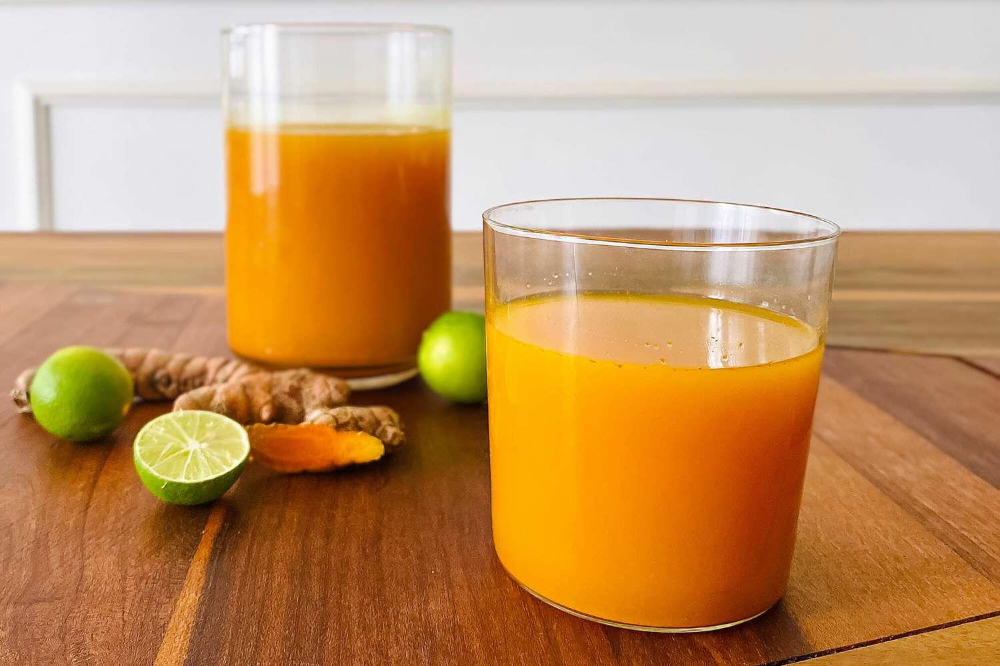

# Jamu

*Indonesian herbal tonic: fresh turmeric and ginger blitzed with tamarind, palm sugar and lime, simmered into a deep-orange drink sold from glass bottles by jamu gendong vendors carrying baskets on their backs across Java.*

**Serves:** 6

**Prep Time:** 15 minutes

**Cook Time:** 25 minutes

## Overview
Jamu is Indonesia's traditional herbal medicine-drink culture, a category encompassing hundreds of variants. The most common is jamu kunyit asam (turmeric-tamarind) — fresh turmeric and ginger, pounded and simmered with tamarind, palm sugar (gula merah), lime and a pinch of salt into a deep-orange tonic served hot or cold. Sold across Java by jamu gendong vendors who carry the bottles in woven baskets on their backs, walking neighbourhood routes each morning. Believed to support digestion, immunity and joint health; drunk for general wellness as much as for any specific ailment. Sharp, sweet-sour, gently warming.

## Ingredients

- 100 g fresh turmeric root (peeled, roughly chopped)
- 50 g fresh ginger (peeled, roughly chopped)
- 4 tablespoons tamarind paste (or 80 g wet tamarind pulp dissolved in hot water and strained)
- 80 g palm sugar (gula merah; or dark muscovado sugar)
- 1.5 litres cold water
- 2 tablespoons fresh lime juice
- ½ teaspoon fine salt
- 1 teaspoon black pepper (optional; helps turmeric absorption)

### To serve
- Lime wedges

## Method

1. Combine the turmeric, ginger and 500 ml of the water in a blender; blitz for 60 seconds into a smooth paste.
1. Pour the paste into a saucepan; add the remaining 1 litre of water, palm sugar, tamarind, salt and pepper (if using).
1. Bring to a simmer over medium-low heat; cook 20 minutes, stirring occasionally, until the sugar has dissolved and the liquid has deepened in colour.
1. Strain through a fine sieve into a clean jug; press the solids gently to extract the last of the liquid.
1. Stir in the lime juice.
1. Serve hot in mugs, or chill and pour over ice in tall glasses.

## Notes
- **Fresh turmeric stains everything.** Wear gloves; the orange colour gets onto fingers, cutting boards and counters. Wash work surfaces immediately.
- **Black pepper is the absorption trick.** Curcumin (turmeric's active compound) absorbs better with piperine (in pepper); the pinch isn't culinary, it's pharmacological.

## Storage
- Refrigerate up to 5 days in a sealed bottle.
