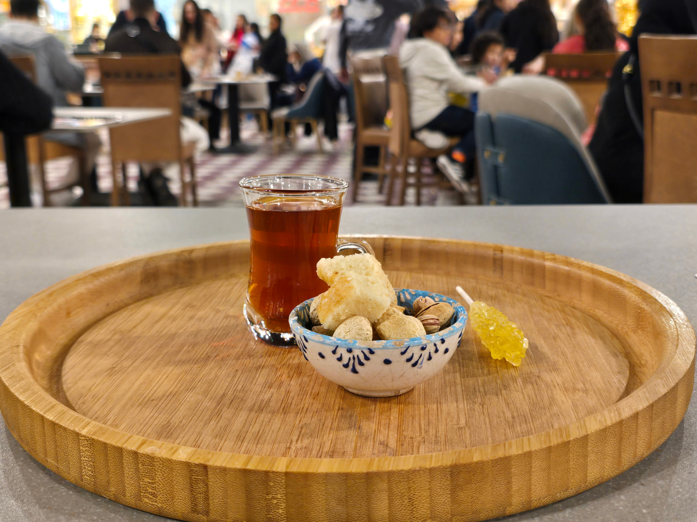

# Chai-e-Irani

*Persian black tea brewed strong in a samovar, poured into small slim-waisted estekan glasses, drunk through a sugar cube held between the teeth: the small cup that sustains every Iranian afternoon.*

**Serves:** 4

**Prep Time:** 3 minutes

**Cook Time:** 12 minutes

## Overview
Tea in Iran is the constant background of social life: brewed in a samovar (a tall metal urn with a small teapot on top), poured into hourglass-shaped small glasses called estekan, drunk slowly all day. Persian tea is unsweetened in the cup; sweetness comes from biting a sugar cube (qand) held between the teeth and drinking the hot tea through it, or from a small spoonful of a fruit preserve (morabba): quince, sour cherry, fig, or rose petal jam are the traditional choices. Served with a small plate of khormeh (dates) or sohan (saffron-pistachio brittle) on the side. The Persian tea ceremony is less ornate than the Japanese one and more constant than the Chinese, it just is, all day, every day.

## Ingredients

- 1 litre water (for the samovar's lower chamber)
- 3 tablespoons loose-leaf black tea (Ahmad Tea is the Iranian household standard; Assam works as substitute)
- 3 cardamom pods (lightly crushed; optional, common in winter)
- Optional: a small piece of orange peel for the brewing pot

### To serve
- 4 estekan glasses (slim-waisted small Persian tea glasses) OR small clear tea cups
- Saucers (the saucer is functional, sugar cubes sit on it for biting)
- A bowl of sugar cubes (qand)
- Small bowls of fruit preserves (morabba): quince, sour cherry, or rose petal
- Dates or saffron brittle on a side plate

## Method

### Stage 1 - Brew the concentrate
1. In a small teapot, add the loose-leaf tea and the cardamom pods if using.
1. Pour over 300 ml of just-boiled water (from the samovar or kettle). Steep covered for 10 minutes, Persian tea wants strong concentrate.

### Stage 2 - Serve in two parts
1. Pour an inch of the concentrated tea into each estekan glass (about a third full).
1. Top with hot water to the brim from the samovar (or any kettle); guests adjust their preferred strength themselves by asking for "kamrang" (light) or "porrang" (dark).

### Stage 3 - Drink Persian-style
1. Place a sugar cube on the saucer.
1. To drink, bite the sugar cube between the front teeth (don't bite through; just hold it between the teeth).
1. Sip the hot tea through the cube; the tea melts a little of the sugar with each sip.
1. One cube typically lasts 2 to 3 sips.
1. Alternatively: take a small spoonful of fruit preserve into the mouth and drink the tea through that.

## Notes
- **Loose leaf, not bags.** Persian tea is fundamentally about the leaf. Ahmad Tea and Golestan brands are common in Iranian shops.
- **Two-part pour matters.** Concentrate plus hot water in the glass lets each drinker calibrate. Pre-brewing to "ready" strength is a Western thing.
- **Don't sweeten in the cup.** Stirring sugar into Persian tea is not done; the cube-bite or preserve methods are how Persians do sweetness.

## Storage
- Drink within the session. The concentrate in the pot stays good for 30 minutes; beyond that it gets bitter.
