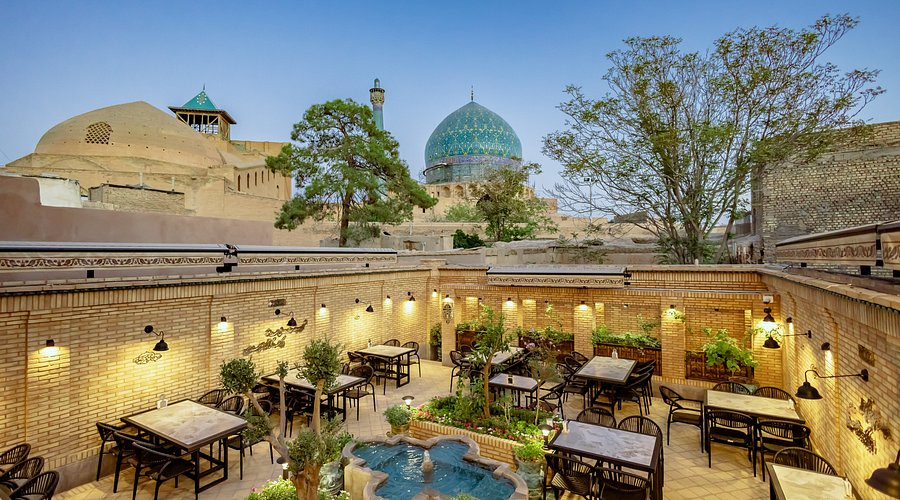

# Drinks of Iran

Chai brewed in a samovar and poured into small estekan glasses, served with a sugar cube held on the tongue. Sekanjabin (the ancient mint-vinegar cordial) in the heat, doogh with kebab, sharbat of sour cherry or rose at celebrations.
