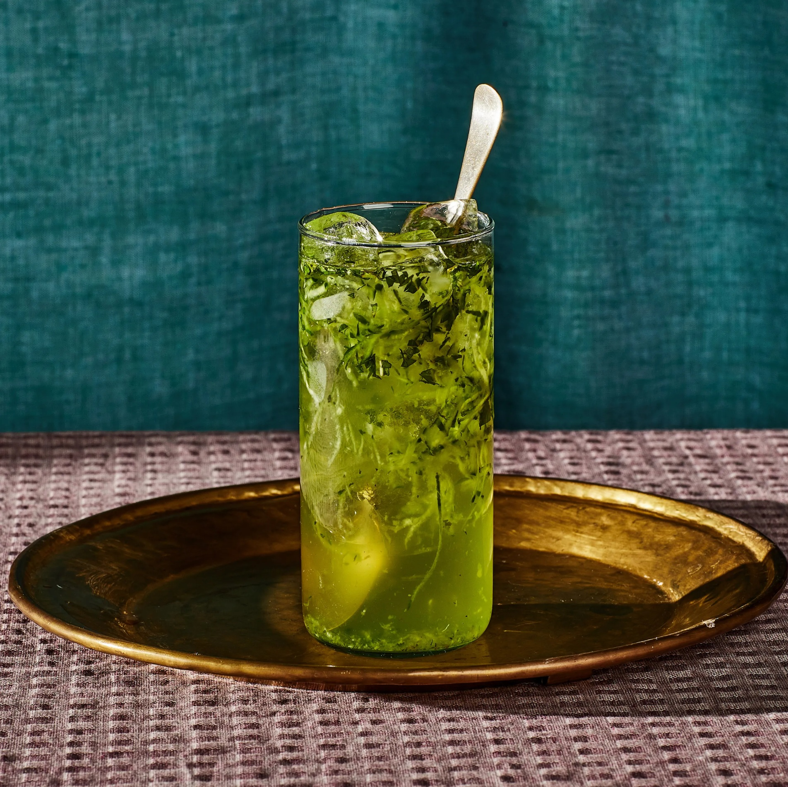

# Sekanjabin

*Ancient Persian mint-vinegar syrup: white wine vinegar and sugar reduced together with fresh mint, then diluted with cold water and grated cucumber for the summer drink that's been served in Iranian gardens for a thousand years.*

**Serves:** 4

**Prep Time:** 10 minutes

**Cook Time:** 30 minutes

## Overview
Sekanjabin (or sharbat-e-sekanjabin) is one of the oldest documented drinks still in active use: mentioned in medieval Persian medical texts, refined under the Safavids, served today at every Iranian summer gathering. The syrup is a mint-infused sweet-vinegar reduction (called oxymel in Greek/medieval European traditions, where it persisted as medicine), diluted with cold water and stirred into shaved or grated cucumber. The flavour is unlike anything else: sweet, sharply tangy, intensely minty, with the cucumber adding a fresh vegetal note. Cooling on a hot day in a way ordinary lemonade can't approach. Served at Nowruz (Persian New Year, March 21), at weddings, and at every garden gathering across Iran.

## Ingredients

### Sekanjabin syrup (makes 500 ml, enough for many drinks)
- 500 g caster sugar
- 250 ml water
- 250 ml white wine vinegar (or apple cider vinegar)
- 30 g fresh mint (a generous bunch, about 4 cups loosely packed)

### To serve (per glass)
- 4 tablespoons sekanjabin syrup
- 200 ml cold water
- ½ small cucumber (peeled and grated, OR cut into matchsticks)
- Plenty of ice cubes
- A sprig of fresh mint

## Method

### Stage 1 - Make the syrup
1. Combine the sugar and water in a saucepan over medium heat; stir until the sugar dissolves and the mixture is just simmering.
1. Continue simmering 8 minutes; the syrup should thicken slightly to a thin pourable consistency (not a thick caramel).
1. Stir in the vinegar; simmer 5 more minutes to reduce the sharp acidity.
1. Off the heat, add the fresh mint; submerge it in the hot syrup. Cover and steep 20 minutes.
1. Strain through a fine sieve; press the mint gently to extract the syrup. Discard the mint.
1. Cool to room temperature, then refrigerate.

### Stage 2 - Make a drink (per glass)
1. Pour 4 tablespoons of syrup into a tall glass.
1. Top with 200 ml cold water; stir to combine.
1. Add a generous handful of grated cucumber; stir.
1. Fill the glass with ice; garnish with a sprig of fresh mint.

## Notes
- **White wine vinegar is the canon.** Some recipes call for cider vinegar; both work. Distilled white vinegar is too harsh.
- **Grated cucumber is the texture.** The Iranian way is to grate it large; the cucumber suspends in the drink and you eat the strands as you sip.
- **The syrup is the keeper.** Make a big batch once; keeps in the fridge for 3 months.

## Storage
- Syrup: 3 months refrigerated in a sealed bottle.
- Mixed drink: drink within an hour.
