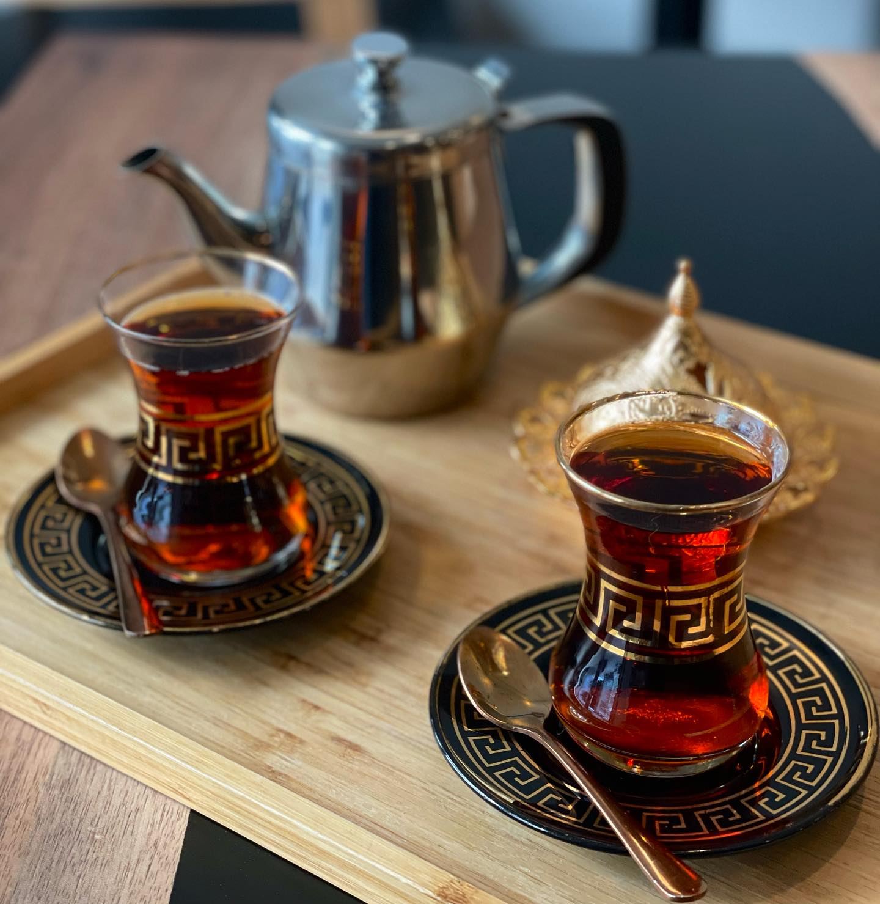

# Iraqi Chai

*Black tea brewed strong and dark in a stacked metal teapot, scented with crushed cardamom, sweetened heavily and served in small hourglass-shaped istikan glasses on the saucer alongside a sugar cube. The pulse of Iraqi social life.*

**Serves:** 6 small istikan glasses

**Prep Time:** 2 minutes

**Cook Time:** 10 minutes

## Overview
Chai is to Iraq what coffee is to Italy: the social currency, the welcoming gesture, the thing offered the second any guest walks through any door. Iraqi tea is brewed in a stacked two-tier pot (the bottom holds boiling water, the top concentrates a strong tea essence above the steam), then served in tiny clear hourglass-shaped glasses called istikan. The colour you want is mahogany-dark, almost the colour of a strong cola; sugar is added by the drinker, often two cubes per istikan, sometimes three. The defining scent is crushed green cardamom: usually three or four pods bruised and added to the brew, and sometimes a few cloves or a small piece of cinnamon for winter. You drink it loud and often: at the souq, in the office, before lunch, after lunch, while waiting for the bus, while watching football. A samawar or kettle is on the boil from morning to night in any traditional Iraqi household.

## Ingredients

- 4 heaped teaspoons strong black loose-leaf tea (Ceylon, or a robust Indian blend like Brooke Bond Red Label)
- 4 green cardamom pods, lightly crushed (use the side of a knife)
- 2 cloves (optional, for winter)
- A small piece of cinnamon stick (optional, for winter)
- 1.2 litres water (1 litre for the bottom kettle, 200 ml for the top pot)
- Sugar cubes or granulated sugar, to serve

### Equipment
- A stacked Middle Eastern tea pot (a small enamel or stainless pot that sits on top of a larger kettle) is traditional. A regular teapot also works.
- 6 small clear glasses (istikan) with saucers, or any small heatproof glasses

## Method

### Stage 1 - Boil the bottom water
1. Fill a kettle or the bottom of the stacked pot with 1 litre of water and bring to a hard boil.

### Stage 2 - Build the tea concentrate
1. Put the loose tea, crushed cardamom pods, cloves (if using) and cinnamon (if using) into the small top pot.
1. Pour just 200 ml of the boiling water from the bottom kettle into the top pot, just enough to wet and partially submerge the leaves.
1. Set the top pot back on top of the bottom kettle so the residual steam continues to heat it gently. Let it sit 6 to 8 minutes; the tea will turn very dark, almost black.

### Stage 3 - Serve
1. For each glass, pour about a third of the way full with the concentrate from the top pot, then top up with hot water from the bottom kettle. The colour should be a deep mahogany.
1. Place each glass on its saucer with one or two sugar cubes alongside. Most Iraqis drop the sugar straight into the glass and stir; some prefer to nibble the cube as they sip (the Russian way, which travelled into Iraqi habit via the Ottoman trade routes).

### Stage 4 - Repeat
1. The top pot stays on the kettle through the visit. Refill glasses as needed by pouring fresh concentrate and topping with hot water. The brew gets stronger as it sits; balance with more hot water for the later glasses.

## Notes
- **The stacked pot.** If you don't have one, brew in a regular teapot: same tea, same cardamom, the full 1.2 litres of water poured over directly. Steep 5 minutes only or it turns harsh.
- **Cardamom is non-negotiable.** A few pods, lightly bruised so the seeds inside scent the brew. Pre-ground cardamom powder works but is duller.
- **Sweet by default.** Iraqi tea is properly sweet: two sugars per small glass is standard. Adjust to taste but accept that the unsweetened version isn't the same drink.
- **Loose leaf over bags.** Tea bags work, but the strong-brew character that's iconic of Iraqi chai depends on a slightly over-strong loose-leaf base. Use 4 teaspoons of loose tea or 6 bags for the full effect.

## Variations
- **With saffron.** A few strands of saffron added to the top pot turn the tea a deep amber and add a subtle floral note. Festive variant.
- **Habak (sweet basil) chai.** A leaf or two of fresh sweet basil added to the brew, summer style.
- **Dried lime chai.** Replace half the cardamom with a small piece of crushed dried lime (loomi) for a sour-aromatic version popular in Basra.
- **Sade çay (plain).** No cardamom, no spices, just strong tea and sugar. The everyday option for fast service.

## Storage
- Doesn't store. The concentrate goes bitter and stewed within an hour. Brew to order; the stacked-pot system is designed precisely so you brew a fresh small pot rather than reheating an old big one.
