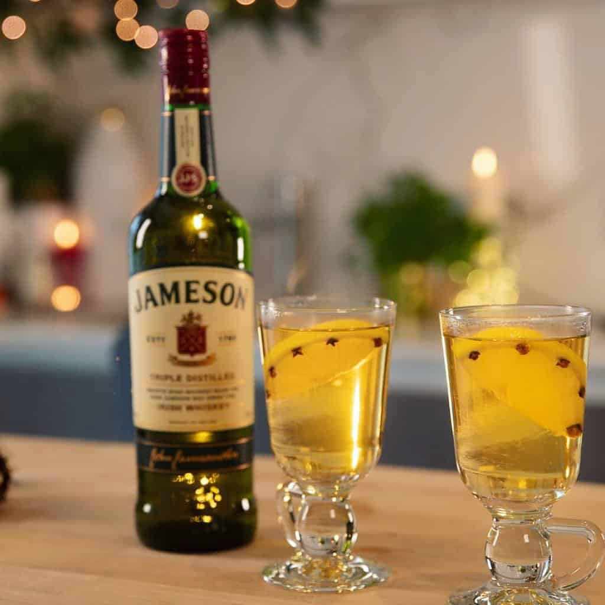

# Hot Whiskey (Hot Toddy)

*Irish whiskey, just-boiled water, brown sugar, a slice of lemon studded with cloves, and a stick of cinnamon: the warming drink Irish parents make their kids when they're sick and adults make themselves when they're cold.*

**Serves:** 1

**Prep Time:** 3 minutes

**Cook Time:** 5 minutes

## Overview
The Irish hot whiskey (or just "a hot one" if you're ordering at a Dublin pub on a winter evening) is the simpler, less-cream-laden cousin of the Irish coffee. The build is Irish whiskey topped up with just-boiled water in a heatproof glass, sweetened with brown sugar dissolved in, perfumed with cloves studded into a lemon slice and a cinnamon stick stirring in the glass. The whiskey heat hits the back of the throat; the lemon-and-clove aroma sits in the nose. Folk medicine for colds (no actual evidence it cures anything, but the ritual makes you feel better), and the standard "I just walked here in the rain" pub order. Closer to a mulled drink than a cocktail.

## Ingredients

### Per glass
- 40 ml Irish whiskey (Jameson, Bushmills, Powers - any decent blended Irish whiskey)
- 1 to 2 teaspoons soft brown sugar (or 1 tablespoon honey for the cold-cure version)
- 4 whole cloves
- 1 slice fresh lemon (about ½ cm thick)
- 1 cinnamon stick
- 200 ml just-boiled water

### To serve
- A heatproof glass with a handle (an Irish-coffee glass or any sturdy small mug)
- A long teaspoon for stirring

## Method

1. Stud the cloves into the rind side of the lemon slice - push them in so they stay put.
1. Place the clove-studded lemon slice in the heatproof glass.
1. Add the cinnamon stick.
1. Add the brown sugar (or honey).
1. Pour in the whiskey.
1. Top up with the just-boiled water; stir to dissolve the sugar.
1. Let stand 1 minute for the spices to bloom.
1. Serve with the cinnamon stick still in the glass as a stirrer.

## Notes
- **Just-boiled, not boiling.** Pouring boiling water onto whiskey kills the volatile aromatics. Wait 30 seconds after the kettle clicks off.
- **Honey for the sick version.** Brown sugar is the standard for a pub hot whiskey; honey is what Irish mothers use when actually treating a cold (more soothing on a sore throat).
- **Studded lemon matters.** Cloves stuck into the lemon's pith release their oils gradually into the hot water; cloves loose in the glass over-extract and turn the drink bitter.

## Variations
- **Hot Toddy (Scottish).** Replace Irish whiskey with Scotch (Famous Grouse, blended Scotch). Smokier; some prefer it.
- **Bourbon hot toddy.** With bourbon; sweeter, more American.
- **Non-alcoholic.** Skip the whiskey; double the lemon and honey. The Irish "lemon hot drink" cure-all.

## Storage
- Drink immediately while hot.
