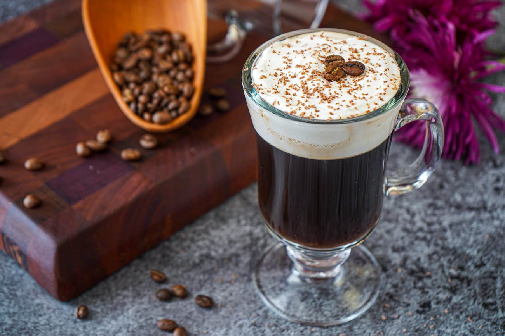

# Irish Coffee

*Hot strong coffee with Irish whiskey, brown sugar dissolved through, topped with a slow-poured layer of lightly whipped cream that floats and stays separate: the warming pour invented at Foynes Airport for cold transatlantic passengers in 1943.*

**Serves:** 1

**Prep Time:** 5 minutes

**Cook Time:** 0 minutes (assuming brewed coffee)

## Overview
Irish coffee was invented in 1943 by Joe Sheridan, head chef at Foynes Airport on the Shannon estuary (predecessor to Shannon Airport), to warm freezing transatlantic flying-boat passengers. A passenger asked if it was Brazilian coffee; Sheridan replied "no, it's Irish coffee." The build is hot strong coffee, brown sugar dissolved in, a generous pour of Irish whiskey, then a thick layer of lightly-whipped double cream poured over the back of a spoon so it floats on top. The right way to drink it is through the cream, never stir; the hot whiskey-sweetened coffee underneath should pull through the cool cream layer with each sip. Served in a footed Irish-coffee glass that's pre-warmed.

## Ingredients

### Per glass
- 30 ml Irish whiskey (Jameson, Bushmills, Powers)
- 1 to 2 teaspoons soft brown sugar (or demerara)
- 100 ml strong hot coffee (a cafetière or espresso lengthened with hot water; not American filter coffee, which is too thin)
- 30 ml double cream (very lightly whipped, to soft floppy peaks, NOT firm)

### To serve
- A footed Irish-coffee glass (or a small heatproof mug)

## Method

### Stage 1 - Pre-warm and dissolve
1. Pour hot water into the Irish-coffee glass; let stand 30 seconds; tip out.
1. Add the brown sugar and whiskey to the warmed glass.
1. Pour in the hot coffee; stir until the sugar is fully dissolved. Fill to about 2 cm below the rim.

### Stage 2 - Whip the cream lightly
1. Whip the double cream in a small bowl just until it forms soft, floppy peaks. It should still be pourable, not stiff. Over-whipping gives a "spoonable" cream that sits in lumps.

### Stage 3 - Float the cream
1. Hold the back of a teaspoon just above the surface of the coffee.
1. Slowly pour the cream over the back of the spoon; the cream should float as a distinct white layer about 1 cm thick on top of the dark coffee.

### Stage 4 - Serve and drink
1. Do NOT stir. The visual contrast is the point.
1. Drink by sipping the hot coffee THROUGH the cool cream layer, never around it. Each sip should pull hot and cool together.

## Notes
- **Lightly whipped, not stiff.** This is the most common mistake. The cream should be pourable, just thickened enough to float. Stiff whipped cream sits on top like a hat.
- **Brown sugar matters.** White sugar dissolves cleanly but lacks the molasses depth that complements the whiskey. Demerara or soft brown is right.
- **Strong coffee, not American drip.** The coffee needs to be punchy enough to stand up to the whiskey and cream. Cafetière or espresso lengthened with hot water both work.
- **Never stir.** Stirring destroys the layered structure that is the entire point of the drink.

## Storage
- Drink immediately while the coffee is hot and the cream is fresh.
