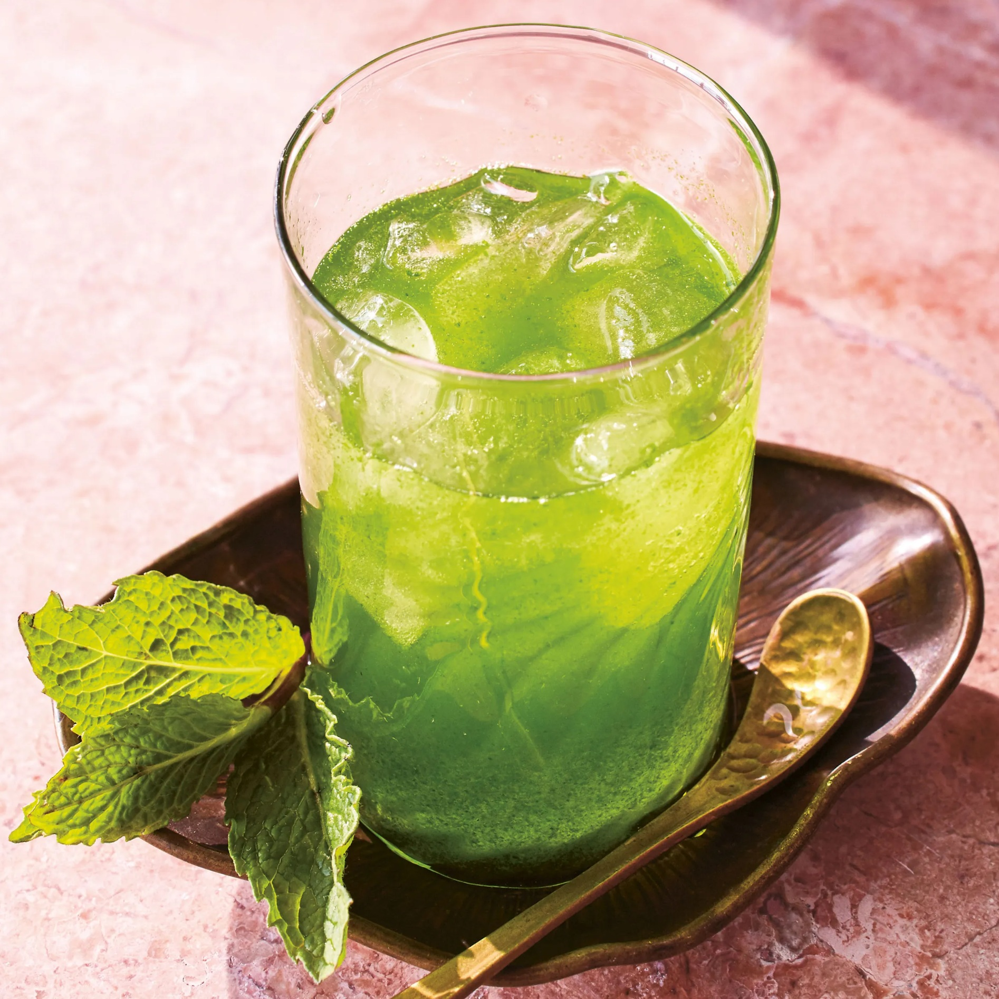

# Limonana (Israeli Frozen Mint Lemonade)

*A tall blender of fresh lemon juice, a generous bunch of mint, sugar and crushed ice, blitzed until pale-green and slushy. Invented in Tel Aviv in the 1990s as a marketing campaign and now ubiquitous across the Levant. The drink that defines an Israeli summer.*

**Serves:** 4 tall glasses

**Prep Time:** 5 minutes

**Cook Time:** 0 minutes

## Overview
Limonana (from "limon" plus "nana", lemon and mint) is one of the great accidental marketing successes in food history. In the mid-1990s a Tel Aviv ad agency invented the name and the drink for a bus-stop advertising campaign; the drink (which didn't really exist before) caught on so completely that Israelis assumed it was traditional. Within five years it had spread across Israel, Palestine, Lebanon, Jordan and Syria, where it now sits alongside drinks that genuinely are centuries old. The build is dead simple: fresh lemon juice, a fat handful of mint leaves, sugar, water and a generous pile of ice, all blitzed in a high-powered blender until you get a thick pale-green slush with a vivid mint nose. The Israeli version differs from the Lebanese in being slightly less sweet and more lemon-forward; sometimes Israeli cafés strain for clarity while Lebanese versions are typically rustic with mint flecks. Tall glass, sprig of mint, lemon wheel, thick straw.

## Ingredients

- 200 ml fresh lemon juice (from about 6 lemons; Israeli grocers favour the small thin-skinned Mediterranean lemon)
- 40 g fresh mint leaves (a packed cup; stems discarded)
- 80 g caster sugar (less than the Lebanese version)
- 400 ml cold water
- 4 large handfuls of ice cubes (about 500 g)

### To serve
- 4 mint sprigs
- 4 lemon wheels
- 4 tall glasses, chilled

## Method

### Stage 1 - Prep the mint
1. Pick the mint leaves from the stems. You should have a packed cup; if you have less, add more - the drink should taste assertively of mint.
1. Rinse and shake dry.

### Stage 2 - Blend
1. Put the lemon juice, mint leaves, sugar and water into a high-powered blender.
1. Blitz on high for 30 seconds until the mint is completely pulverised and the liquid is a vivid pale-green.
1. Add the ice cubes and blitz again on high for 45 to 60 seconds until you have a thick slush. Stop and scrape down the sides if needed.

### Stage 3 - Strain (optional, Israeli café style)
1. For the smooth Israeli café version: strain the slush through a fine sieve into a jug, pressing lightly to extract everything. This removes the mint flecks for a cleaner look.
1. For the rustic version: skip the strain. Both are valid.

### Stage 4 - Serve
1. Pour into chilled tall glasses.
1. Top each with a mint sprig and a lemon wheel.
1. Serve immediately with a thick straw.

## Notes
- **Mint quantity is the whole point.** 40 g of fresh mint leaves for 4 glasses; less and you've made green lemonade. Some Tel Aviv cafés use 50 g for a more aggressively minty version.
- **Sugar level.** The Israeli version is more lemon-tart and less syrupy than its Lebanese cousin. 80 g sugar is the standard; reduce to 60 g if you want it even sharper.
- **High-powered blender.** A weak blender won't pulverise the mint properly. Vitamix-class or Nutribullet works well. Pulse, don't sustain - sustained blending heats the mix and dulls the mint.
- **Cold lemon juice.** Use lemons straight from the fridge or chill the juice before blending. Warm lemon juice tastes flatter.

## Variations
- **Limonana with rose water.** Add 1 teaspoon of rose water to the blender. Subtle floral hint; popular in Israeli cafés that lean fancier.
- **Sparkling limonana.** Skip the water in the blender; pour the blended concentrate over ice in glasses and top with cold soda water for a fizzy version.
- **Limonana cocktail.** Add 30 ml vodka or gin per glass. The Israeli beach bar version.
- **Hot mint and lemon.** Same ingredients, blended without ice and served warm. The winter equivalent; closer to a tea than a lemonade.

## Storage
- Best fresh; the slush starts to separate within 30 minutes. The base (lemon juice + mint + sugar + water, pre-ice) keeps 24 hours in the fridge in a sealed jar - then add ice and blitz fresh at serving.
