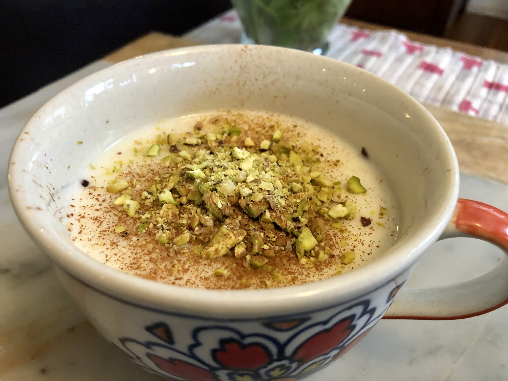

# Sahlab (Israeli Style)

*Israel's winter milk drink: hot milk thickened with sahlab powder (or cornflour), lightly sweetened, served in tall mugs piled high with toppings, crushed pistachios, desiccated coconut, cinnamon and a splash of rose water. Closer to a dessert than a drink, the steamy answer to a cold Tel Aviv January.*

**Serves:** 4 mugs

**Prep Time:** 2 minutes

**Cook Time:** 12 minutes

## Overview
Sahlab in Israel is a layered theatre as much as a drink, the hot milk base is fairly simple, but the topping ritual is the whole show. The base: whole milk thickened with sahlab powder (or a cornflour substitute), sweetened lightly with sugar, finished with vanilla and a drop of rose water. The topping: crushed unsalted pistachios, desiccated coconut, ground cinnamon, sometimes raisins or chopped nuts, occasionally a pinch of saffron. The drinker sees a mug of pale-cream sahlab with a cap of green pistachios, white coconut and rust-brown cinnamon, three distinct layers, and eats / drinks the assembled thing with a long spoon. Where Turkish salep leans on the orchid-root for that uniquely stretchy mouthfeel and the cinnamon dusting, Israeli sahlab leans on the toppings: less sweet base, more aggressive garnish, served as a winter street-food drink alongside borekas or bourekas (Israeli pastries) at every Tel Aviv juice bar from November to March.

## Ingredients

### For the milk base
- 2 tablespoons sahlab powder (Levantine brand from Israeli / Middle Eastern grocery) OR 2 tablespoons cornflour + 1 tablespoon milk powder (substitute when sahlab unavailable)
- 1 litre whole milk
- 60 g caster sugar (less than the Turkish version, Israelis prefer a less-sweet base because the toppings sweeten)
- 1 teaspoon vanilla extract
- 1 teaspoon rose water

### For the topping (each ingredient is a layer)
- 4 tablespoons crushed unsalted pistachios
- 4 tablespoons desiccated coconut
- 2 teaspoons ground cinnamon
- 2 tablespoons sultanas or raisins (optional)
- A small pinch of saffron strands (optional)

### To serve
- 4 small heatproof mugs, warmed
- Optional: a thin biscuit on the saucer

## Method

### Stage 1 - Make a slurry
1. In a small bowl, whisk the sahlab powder (or cornflour + milk powder substitute) with 100 ml of the cold milk until completely smooth, with no lumps.

### Stage 2 - Warm the milk
1. Pour the remaining milk into a heavy-bottomed saucepan.
1. Warm over medium-low heat until just steaming, about 65°C. Don't boil.

### Stage 3 - Combine and thicken
1. While whisking the warm milk continuously, pour in the slurry in a steady stream.
1. Add the sugar.
1. Continue whisking on medium heat for 8-10 minutes until the mixture thickens to a velvety consistency that coats a spoon and falls in slow ribbons. The Israeli sahlab is slightly thinner than the Turkish, about the texture of a thin custard.
1. Whisk in the vanilla extract and rose water just before removing from heat.

### Stage 4 - Layer the toppings
1. Pour the warm sahlab into the warmed mugs, filling each about two-thirds full.
1. Sprinkle the toppings in distinct layers:
   - First: 1 tablespoon of crushed pistachios per mug (green)
   - Second: 1 tablespoon of desiccated coconut per mug (white)
   - Third: 1/2 teaspoon of ground cinnamon per mug (rust-brown)
   - Optional: a few sultanas / raisins scattered on top
   - Optional: a few saffron strands

### Stage 5 - Serve
1. Serve immediately, hot, with a long spoon. The drinker mixes the toppings into the sahlab as they eat / drink.

## Notes
- **Less sweet than Turkish salep.** Israeli versions assume the toppings add sweetness; the base alone tastes only lightly sweet. Don't over-sugar at the brew stage.
- **Topping layers matter visually.** The three distinct stripes of green / white / brown are what makes this Israeli sahlab feel theatrical. Add toppings one layer at a time, not all mixed together.
- **Rose water at the end.** Rose water dissipates with heat; add it just before pouring, not at the start.
- **Whisk constantly during thickening.** Lumps form fast once the slurry hits the warm milk. Keep moving until the mixture thickens.

## Variations
- **Without rose water.** Skip for a cleaner vanilla-led version. Some Israeli households prefer it.
- **Saffron-sahlab.** Steep a generous pinch of saffron strands in the milk while warming. Golden tint, slightly more aromatic.
- **Banana-sahlab.** Slice 1 ripe banana into the bottom of each mug before pouring; the warm milk softens the banana. Modern street-food variant.
- **Vegan.** Replace the milk with oat milk; the texture is slightly different but works. Use maple syrup instead of vanilla extract.

## Storage
- Best fresh. Keeps 1 day in the fridge; the texture thickens further as it cools, so thin with hot milk on reheating. Don't microwave, it can break the texture; reheat gently in a saucepan.
- Toppings stored separately (sealed in small jars) keep indefinitely.
