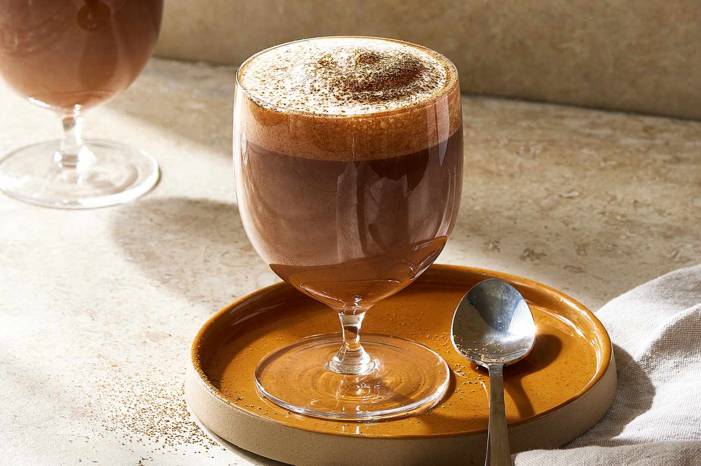

# Bicerin

*The Turin layered hot drink: a thick layer of dark chocolate at the bottom, a layer of strong espresso in the middle, a final layer of unwhipped warm cream on top, served in a small glass with the layers staying separate until you sip.*

**Serves:** 2

**Prep Time:** 5 minutes

**Cook Time:** 10 minutes

## Overview
Bicerin (pronounced bee-cher-IN, "small glass" in Piedmontese) is Turin's signature hot drink, served since the 1700s at the Caffè Al Bicerin in the city's Piazza della Consolata. Three distinct layers in a small glass: thick chocolate at the bottom (a hot-chocolate-style preparation made with cocoa powder, water, sugar and milk, reduced until pourable), strong espresso in the middle, and warm unwhipped cream gently floated on top. The layers must stay visually distinct — bicerin without its three-band stratification is a failed pour. Drunk slowly without stirring, so each sip pulls together cream, espresso and chocolate from the top down. Cavour, Dumas, Nietzsche and Puccini all drank it at the original café; the recipe has been protected by Turin authorities since 2001.

## Ingredients

### Chocolate base
- 80 g dark chocolate (70% cocoa solids, finely chopped)
- 200 ml whole milk
- 2 tablespoons caster sugar
- 1 tablespoon cocoa powder (for depth)

### Espresso
- 2 fresh espresso shots (60 ml total, just-pulled)

### Cream layer
- 80 ml double cream (warm but NOT whipped; about body temperature)

### To serve
- 2 small heatproof glasses (about 180 ml capacity)

## Method

### Stage 1 - Make the chocolate base
1. Combine the milk, sugar and cocoa powder in a small saucepan over low heat; whisk until smooth.
1. Add the chopped chocolate; whisk gently until completely melted.
1. Continue cooking 3 to 4 minutes, stirring, until the mixture is thick and glossy.
1. Keep warm.

### Stage 2 - Warm the cream
1. In a separate small pan or microwave, warm the double cream to body temperature — DO NOT whip and DO NOT boil. It should feel just warmer than room temperature.

### Stage 3 - Pull the espresso
1. Just before assembling, pull two fresh espresso shots.

### Stage 4 - Layer
1. Divide the hot chocolate between the two glasses, filling each about a third.
1. Slowly pour the espresso over the back of a teaspoon held just above the chocolate layer. The espresso should float on the chocolate due to crema's slightly lighter density. Fill each glass about another third.
1. Slowly pour the warm cream over the back of the spoon onto the espresso. The cream floats on top.

### Stage 5 - Serve
1. The three layers should be visible: dark brown at the bottom, lighter brown in the middle, pale cream on top.
1. Serve immediately. Do not stir — the layers are the entire point. Drink slowly so the cream-espresso-chocolate combine in each sip from the top.

## Notes
- **Pour speed matters.** Each layer goes in slowly, over the back of a spoon. Too-fast pour and the layers merge.
- **Chocolate must be thick.** If it's too liquid, the espresso and cream sink. Reduce the chocolate to spoonable-but-pourable.
- **Cream not whipped.** Whipped cream sits on top like a hat. Warm liquid cream floats as a layer — that's the trick.
- **Drink at the right pace.** Sip slowly, the layers staying mostly separate until the last quarter. Stirring is for tourists.

## Storage
- Drink immediately. Doesn't store; the layers collapse within minutes.
