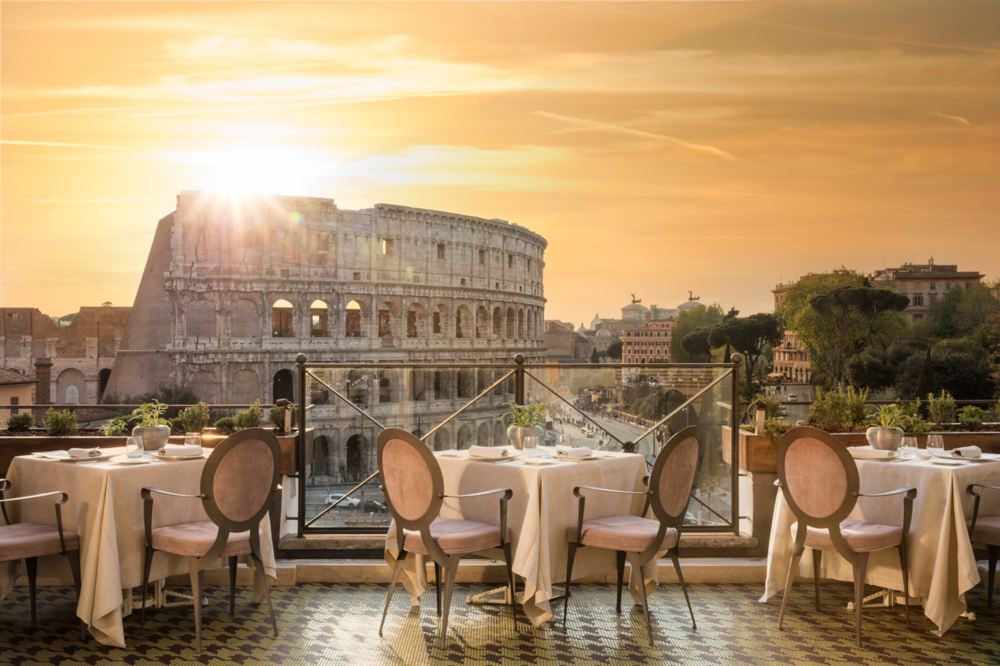

# Drinks of Italy

Espresso standing at the bar, cappuccino strictly before 11am, the aperitivo hour with Aperol spritz or Negroni sbagliato, bicerin in Turin (coffee, chocolate and cream layered cold), limoncello from the freezer after dinner, granita di caffè con panna in summer.
